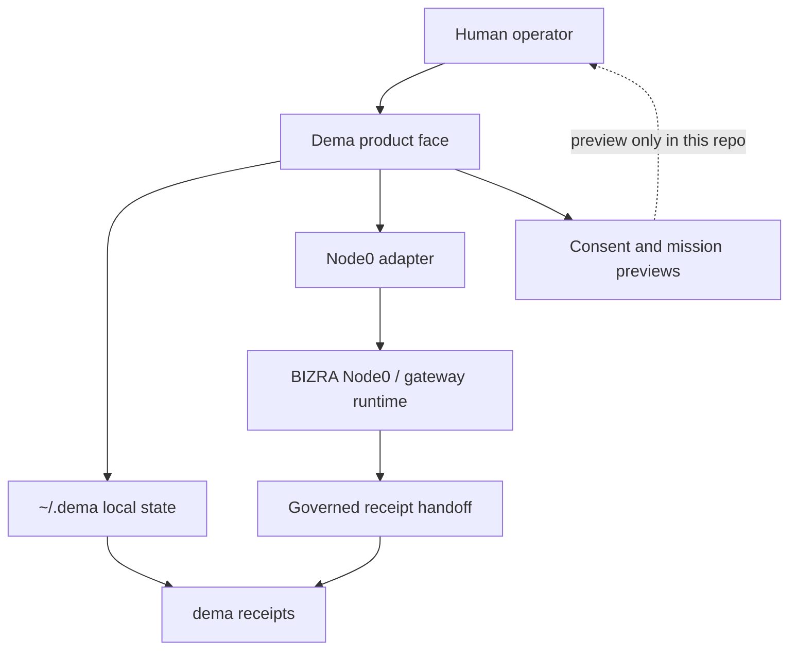
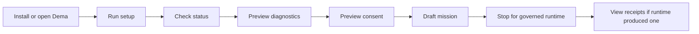

# Dema

**The local-first face of the BIZRA node.**

Dema helps a person see what is ready on their own computer, what is blocked, what can be safely previewed, and what must wait for exact consent and governed runtime execution.

It is built for a simple rule:

```text
No claim without proof.
No action without consent.
No memory without boundary.
No monetization without verified benefit.
```

BIZRA is the wider ecosystem. Dema is the door a human can open.

---

## What Dema is

Dema is a local command-line product face for BIZRA Node0. It reads local state, shows readiness, drafts consent scopes, previews missions, lists receipts, and explains the next safe action.

Dema does **not** hide a background process. It does **not** start federation. It does **not** run an action just because a user typed an idea. Runtime execution and receipt issuance belong behind the governed Node0 path outside this repo.

```text
You
-> Dema
-> local setup and status
-> consent preview
-> mission preview
-> governed Node0 runtime handoff
-> local receipt viewer
```



---

## Start here if you are not technical

If someone has already installed Dema on your computer, open a terminal and copy these commands one at a time:

```bash
dema welcome
dema onboard
dema setup
dema status
dema diagnostics plan
dema consent plan "Check my local node health"
dema mission draft "Check my local node health"
dema report safety
dema roadmap preview
dema receipts
```

What to expect:

1. `welcome` explains the local-first boundary.
2. `setup` creates your local Dema folder.
3. `status` shows what is ready and what is blocked.
4. `diagnostics plan` previews a health-check plan without running it.
5. `consent plan` shows what permission would be needed.
6. `mission draft` turns your intent into a draft, still without execution.
7. `report safety` explains the current safety posture.
8. `roadmap preview` shows the advisory optimization roadmap.
9. `receipts` lists local proof records if any exist.

For a slower walk-through, read [docs/USER_LIFECYCLE.md](docs/USER_LIFECYCLE.md).

---

## Install for this repository

This repo currently supports the developer/lighthouse path. It requires Node.js 20 or newer.

```bash
git clone https://github.com/BizraInfo/Dema
cd Dema
npm install
npm test
npm run check
```

Run Dema directly from the repo:

```bash
node apps/cli/src/index.js welcome
node apps/cli/src/index.js setup
node apps/cli/src/index.js status
```

The packaged installer and nontechnical desktop flow are product targets documented in [docs/FIRST_RUN_WIZARD.md](docs/FIRST_RUN_WIZARD.md) and [docs/INSTALLER_ARCHITECTURE.md](docs/INSTALLER_ARCHITECTURE.md). Until release assets are published, do not treat installer URLs as live.

---

## The complete safe local loop



The loop is intentionally conservative. Dema can complete the local preview lifecycle, but the effectful runtime lifecycle is gated elsewhere.

| Step | Command | What it does | What it does not do |
|---|---|---|---|
| Welcome | `dema welcome` | Explains Dema in plain language. | Does not configure or run anything. |
| Setup | `dema setup` | Creates local folders and skeleton files. | Does not overwrite profile/config or start a daemon. |
| Status | `dema status` | Shows Node0 readiness through the adapter. | Does not repair or execute. |
| Diagnostics | `dema diagnostics plan` | Previews a self-check harness. | Does not run tests or shell commands. |
| Consent | `dema consent plan "<intent>"` | Drafts a micro-consent scope. | Does not approve consent or mint capability. |
| Mission | `dema mission draft "<intent>"` | Creates a mission draft from intent. | Does not run the mission. |
| Safety | `dema report safety` | Shows current safety posture. | Does not certify production readiness. |
| Network | `dema network blueprint` | Previews Node1/Node2 handoff gates and phase-gated multi-node readiness. | Does not connect, federate, or open sockets. |
| Offline fixture | `dema network fixture preview` | Previews a 5-slot lab-bench schematic with micro-compliance and micro-consent gates. | Reports 0 live nodes; does not connect, mint, or simulate runtime. |
| MCP | `dema mcp blueprint` | Previews MCP integration points, auth boundaries, validation, retries, and redaction rules. | Does not call MCP tools or access external APIs. |
| Roadmap | `dema roadmap preview` | Previews prioritized architecture, security, performance, documentation, DevOps, and ethics work. | Does not execute roadmap items or enforce gates. |
| Design emulation | `dema design emulate-loop` | Models PAT/SAT loop assumptions across hardware, performance, data, and impact lenses. | Does not run agents, mint receipts, or write local state. |
| Receipts | `dema receipts` | Lists local receipt handoffs. | Does not create receipts. |

The MCP blueprint, roadmap preview, and release-readiness report are professional management, DevOps, and QA planning surfaces. They are advisory and read-only: they do not deploy, execute work, enforce gates, certify readiness, or make token/economic claims.

---

## Command reference

```text
dema welcome
dema onboard [--json]
dema setup
dema status
dema status:json
dema today
dema doctor
dema ambient
dema ambient:json
dema diagnostics plan [--json]
dema consent plan [--json] "<intent>"
dema mission draft [--json] "<intent>"
dema mission propose [--consent "GO: Node0 bounded diagnostic activation only"]
dema receipts [ID|unique-filename|path]
dema memory
dema memory show NAME
dema models
dema report safety [--json]
dema network blueprint [--json]
dema network fixture preview [--json]
dema mcp blueprint [--json]
dema roadmap preview [--json]
dema evidence receipt preview [--json]
dema ihsan floor preview [--score N] [--json]
dema behavior modulation preview [--consent TEXT] [--score N] [--json] "<intent>"
dema design emulate-loop [--json]
dema task [NAME]
dema sovereign
dema monetize
dema help
```

Machine-readable surfaces carry schema tags such as `bizra.dema.<surface>.v0.1`.

---

## What setup creates

`dema setup` writes local state under `DEMA_HOME` or `~/.dema`:

```text
~/.dema/
  profile.json
  config.local.json
  receipts/
  memory/
  logs/
  skills/
```

Setup is idempotent. If `profile.json` or `config.local.json` already exists, Dema leaves it in place.

Setup does not start a background process. Setup does not execute a mission. Setup does not issue ARTIFACT-011.

---

## The wider BIZRA ecosystem

Dema is not the whole system. It is the visible face of a longer BIZRA build:

```text
BIZRA founding documents
-> proof-of-priority anchor
-> bizra-data-lake / bizra-omega core truth
-> Node0 governed runtime
-> Dema local product face
-> future Node1 / Node2 and phase-gated multi-node readiness, still gated
```

The current repo keeps those boundaries clear:

- **Dema**: local product face, previews, setup, status, receipts viewer.
- **Node0**: governed runtime and first receipt path.
- **bizra-data-lake / bizra-omega**: core truth substrate named by ADR-003.
- **FATE / consent**: exact consent boundary.
- **Receipts**: local evidence records shown by Dema, minted by governed runtime paths.
- **Node1 / Node2**: future handoff expansion, currently preview-only.
- **phase_3 / phase_4**: canonical multi-node pilot and public-network directions, currently blocked.

Read [docs/ECOSYSTEM.md](docs/ECOSYSTEM.md) for the fuller map.

---

## Proof-of-priority root

BIZRA's proof-of-priority in this repo binds three founding files:

```text
themassage.pdf
bizra.pdf
BIZRA_Third_Fact_v0_1_FINAL.pdf
```

The canonical pin is [proof-of-priority/PIN.md](proof-of-priority/PIN.md). It records the deterministic Merkle root, the manifest, and the OpenTimestamps status. The current pin says the root was upgraded into Bitcoin block-header attestations.

Reproduce the repo root:

```bash
npm run priority-anchor:verify
```

This proves the current files still match the committed manifest and root. It does not replace independent review of the documents or the wider BIZRA claims.

---

## Receipts

A Dema receipt answers:

```text
what happened,
what did not happen,
what evidence exists,
and what the next safe action is.
```

Use:

```bash
dema receipts
dema receipts ARTIFACT-011
```

ARTIFACT-011 is a governed gateway receipt handoff captured in [SPROUT_PIN.md](SPROUT_PIN.md). Dema can list and show the local handoff. Issuance did not happen inside this repo.

Learn more in [docs/RECEIPTS.md](docs/RECEIPTS.md).

---

## Safety boundaries

Dema is intentionally strict:

- no hidden daemon,
- no automatic runtime action,
- no fuzzy consent,
- no silent profile overwrite,
- no Node1/Node2 federation or multi-node pilot from this repo,
- no token, passive-income, AGI, or guaranteed-security claim,
- no receipt minting inside Dema preview commands.

The exact consent phrase for the first bounded diagnostic preview is:

```text
GO: Node0 bounded diagnostic activation only
```

That phrase is not a reusable password. Future effectful missions require their own explicit consent.

---

## Quality and local checks

The repo is a Node.js ESM monorepo with zero runtime dependencies and no build step.

Run:

```bash
npm test
npm run check
npm run release:readiness
git diff --check
```

Current release-readiness is a professional risk report and is allowed to show launch blockers. Known examples include modified workflow files that still need explicit authorization, missing release artifact hashes before broad release, or advisory installer dry-run promotion. Those are not hidden; they are tracked as explicit risks, not treated as deployment approval or certification.

---

## Troubleshooting

| Symptom | Meaning | Next step |
|---|---|---|
| `Node0 adapter not connected` | Safe developer-machine default. | Continue with previews, or connect the governed gateway when intentionally testing Node0. |
| `doctor` exits nonzero | At least one readiness predicate is blocked. | Read the printed status; Dema stops instead of pretending readiness. |
| No receipts listed | No local receipt handoff exists in `~/.dema/receipts`. | Run `dema setup`, then check whether a governed runtime produced a handoff. |
| No local models found | Dema did not detect Ollama, LM Studio, or model files. | Install/configure a local model separately; Dema will not download one silently. |
| Network blueprint says blocked | Node1/Node2 or phase-gated multi-node expansion is not ready. | Complete Step 7 and repeatable local Node0 proof first. |

---

## Documentation map

Start with:

- [docs/INDEX.md](docs/INDEX.md) — clean map of every major doc area.
- [docs/USER_LIFECYCLE.md](docs/USER_LIFECYCLE.md) — step-by-step local user journey.
- [docs/ARCHITECTURE.md](docs/ARCHITECTURE.md) — component and boundary map.
- [docs/ECOSYSTEM.md](docs/ECOSYSTEM.md) — how Dema fits into BIZRA.
- [docs/TESTING.md](docs/TESTING.md) — test and smoke-check coverage matrix.
- [docs/DELIVERY_BLUEPRINT.md](docs/DELIVERY_BLUEPRINT.md) — release-readiness and quality discipline.

---

## License

See [LICENSE](LICENSE).
