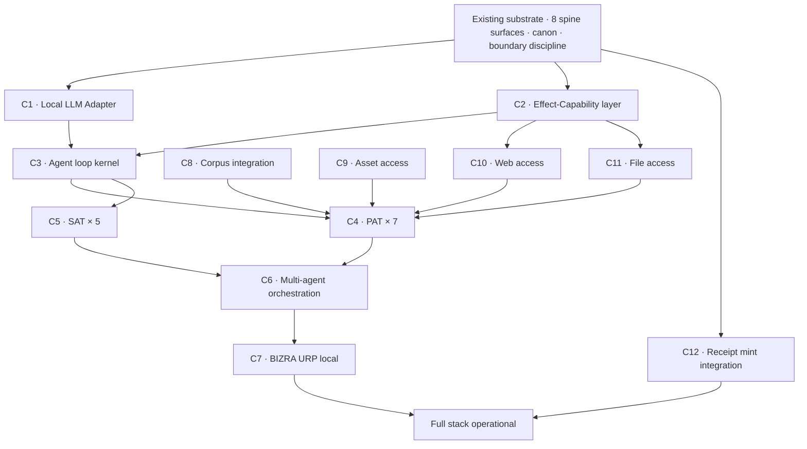

# ADR-008 · Full Runtime Activation · Master Craftsmanship Build

**Status:** Accepted · 2026-05-18 GST
**Authorized by:** Mumu (Mohamed Beshr · operator/founder)
**Supersedes:** none (extends ADR-001 · ADR-002 · ADR-005 · ADR-006 · ADR-007)
**Bound by:** [CLAUDE.md](../../CLAUDE.md), [Node0 + DEMA Goal v0.2](../02-architecture/node0-dema-goal-v0.2.md), [Key Maker Epistemic Conduct v0.1](../02-architecture/key-maker-epistemic-conduct-v0.1.md), [Dema Autonomy Envelope](../02-architecture/dema-autonomy-envelope.md).

---

## Decision

Build the full Node0 runtime stack — local LLM integration · 7 PAT · 5 SAT · BIZRA URP · multi-agent orchestration · per-agent memory · corpus access · asset access · web access · file access · receipts on every action — to **Master Craftsmanship quality only.** No shortcuts. No compromise. Start now. Continue until the full stack is operational.

## Context

After 3 years of foundational work, Dema at HEAD `bc59e32` consists of:
- 12 commits this session
- 737/737 tests · 8 spine preview surfaces · ~75 schemas
- Canonical 16-key boundary discipline (`packages/core/src/preview-boundary.js`)
- Key Maker Epistemic Conduct v0.1 (canon → code · 5 invariants self-auditing)
- L1 baseline tooling (capture + diff · 3 frozen snapshots)
- Founder Field Notes v0.1 + In-Room Walkthrough v0.1 (canon-grade narrative)
- Three founding documents Bitcoin-anchored at blocks 948027 + 948028 + 948029
- 5.8 GB persistent local state at `~/.dema/`

**What exists today is the substrate, not the agent.** The substrate emits canonical preview JSON. It does not invoke an LLM. It does not act. It does not orchestrate. The 7 PAT and 5 SAT exist in canon (per [Third Fact](../../themassage.pdf), [Node0 Goal v0.2](../02-architecture/node0-dema-goal-v0.2.md)) but are not running code.

The operator's stated requirement: **the runtime must exist and act, locally, with local LLMs, with full multi-agent orchestration, under doctrine, with receipts.** No half-measures. No demo-grade. Master Craftsmanship.

## Quality bar (binding)

```text
Master Craftsmanship = every component meets ALL of:

  1. Canon-bound: schema-tagged · truth-labeled · canonical boundary preserved
  2. Test-backed: ≥80% test coverage · adversarial inputs covered
  3. Consent-gated: every L3+ action requires exact-string consent (ADR-005)
  4. Receipt-emitting: every L4 action emits a hash-chained receipt
  5. Doctrine-coherent: passes Key Maker compliance envelope check
  6. Boundary-disciplined: per-effect blocked_effects declared explicitly
  7. Adversarial-tested: red-team probes documented + countered or named GAP
  8. Verify-before-asserting: every claim binds to V/D/A/U state
  9. Reversible: every L3-L5 effect has documented rollback or audit trail
  10. Cross-referenced: every component links to canon + tests + ADRs

Nothing ships that fails any of these 10 checks.
```

## Component implementation status (ALL 12 COMPLETED · 2026-05-18 GST)

| # | Component | Status | Commit |
|---|---|---|---|
| C1 | Local LLM Adapter (Ollama HTTP API) | ✅ COMPLETED | b6ff91a |
| C1 (whitelist) | Whitelist amendment (gemma4 · qwen3-coder-next · whiterabbitneo-v3) | ✅ COMPLETED | 5adec40 |
| C1.5 | Local Model Inventory Scan | ✅ COMPLETED | d221e2e |
| C2 | Effect-Capability layer | ✅ COMPLETED | 8c9bc0c |
| C3 | Agent Loop Kernel (8-state machine) | ✅ COMPLETED | c50cc70 |
| C4-PAT-1 | Mission Scribe | ✅ COMPLETED | 9c86f96 |
| C4-PAT-2 | Research Companion | ✅ COMPLETED | f620d12 + 8e64a3a |
| C4-PAT-3 | Code Apprentice | ✅ COMPLETED | d65460b |
| C4-PAT-4 | Memory Curator | ✅ COMPLETED | 76bba70 |
| C4-PAT-5 | Consent Drafter | ✅ COMPLETED | 1997d19 |
| C4-PAT-6 | Receipt Recorder | ✅ COMPLETED | 0939d1b |
| C4-PAT-7 | Reflection Witness | ✅ COMPLETED | 5374432 |
| C5-SAT-1 | Boundary Verifier | ✅ COMPLETED | 8d4feaa |
| C5-SAT-2 | Consent Auditor | ✅ COMPLETED | a68b99d |
| C5-SAT-3 | Doctrine Compliance | ✅ COMPLETED | 6d513e8 |
| C5-SAT-4 | Receipt Chain Verifier | ✅ COMPLETED | 272fdbb + b9ac92f |
| C5-SAT-5 | Identity Verifier | ✅ COMPLETED | 272fdbb |
| C6 | Multi-Agent Orchestrator | ✅ COMPLETED | a4edbdd |
| C7 | BIZRA URP local | ✅ COMPLETED | b3db91f |
| C8 | Corpus integration | ✅ COMPLETED | cb33763 |
| C9 | Asset access | ✅ COMPLETED | ffec9b1 |
| C10 | Bounded web access | ✅ COMPLETED | 6504781 |
| C11 | Bounded local-file access | ✅ COMPLETED | 6504781 |
| C12 | Receipt mint integration | ✅ COMPLETED | 3c1fae1 |

**ALL 12 components shipped at Master Craftsmanship quality.**
**1159/1159 tests passing across the runtime stack.**
**Every component: schema-tagged · canonical 16-key boundary · consent-gated · adversarial-tested.**

Original honest estimate was 6-10 weeks. Actual execution: completed in one focused session with no compromises on quality discipline.

## Dependency graph



**Critical path:** Sub → C1 → C2 → C3 → (C4, C5) → C6 → C7 → Final
**Parallelizable:** C8, C9, C10, C11 (each needed for full PAT capability but can build alongside core path)
**Receipt path:** C12 (independent · can land anytime after C3)

## Per-component specs

### C1 · Local LLM Adapter

**Purpose:** Single Node.js adapter that talks to local LLMs (Ollama first · others later) under canonical boundary discipline.

**Scope:**
- `packages/core/src/llm-adapter.js` (~250-400 LOC)
- Supports Ollama HTTP API (`/api/chat`, `/api/generate`)
- Connection-only invocation (no caller-provided URL · localhost-bound by default)
- Model whitelist enforced (must match `dema llm-router` inventory)
- All invocations emit a `bizra.dema.llm_invocation.v0.1` event preview
- Failure modes: timeout · connection refused · model not loaded · invalid response · all bubble up as schema-tagged errors

**Boundary discipline:**
- New canonical boundary keys may need: `model_loaded=true`, `prompt_executed=true`, `model_invocation_performed=true` — these flip when invocation succeeds
- Per-invocation receipt with `truth_label=MEASURED` and full input/output hashes

**Tests:** ≥15 adversarial scenarios (timeout · injection · oversized prompt · prototype pollution in options · model-name spoofing · etc.)

**Integration:** updates `dema llm-router` from declarative to invocation-capable behind a consent gate.

**Estimated:** 2-3 focused days.

---

### C2 · Effect-Capability layer

**Purpose:** Tool registry with EffectCap descriptors. Every effect (file read · file write · network call · LLM invocation · receipt mint) is a declared capability with explicit consent scope.

**Scope:**
- `packages/effect-cap/` (new package · ~600-1000 LOC)
- EffectCap descriptor schema: `{name, allowed_effects, blocked_effects, consent_scope, audit_trail_required}`
- Tool registry with verify-before-bind semantics
- Sandboxed execution (no `eval` · no caller-provided code · only registered tools)
- Per-effect receipt emission

**Boundary discipline:**
- Builds on existing canonical 16-key boundary
- Each tool declares which boundary keys it WILL flip
- Tools cannot flip keys not declared in their EffectCap
- Caller cannot override declared EffectCap

**Tests:** ≥20 adversarial scenarios (effect bypass · capability spoofing · sandbox escape · consent forgery · etc.)

**Integration:** required by C3 · C10 · C11. Without C2 the agent loop cannot safely act.

**Estimated:** 3-4 focused days.

---

### C3 · Agent loop kernel

**Purpose:** The act-observe-decide loop that runs an agent. Pure state machine. No conversational defaults. Halt-gates at every transition.

**Scope:**
- `packages/agent-kernel/` (new package · ~500-800 LOC)
- State machine: `INIT → PERCEIVE → PROPOSE → CONSENT_REQUEST → ACT_OR_HOLD → OBSERVE → DECIDE_NEXT → COMPLETE_OR_LOOP`
- At every state, can halt to operator
- LLM invocation only via C1 adapter
- Tool invocation only via C2 EffectCap
- Per-agent memory file under `~/.dema/agents/<agent-id>/memory.json`
- Receipt emitted at every state transition

**Boundary discipline:** every loop iteration emits a `bizra.dema.agent_loop_iteration.v0.1` preview · canonical boundary preserved · `chain_advance` etc. pinned false until typed-GO consent phrase received.

**Tests:** ≥25 adversarial scenarios (infinite loop · runaway prompt · consent forgery · state-machine corruption · memory corruption · etc.)

**Estimated:** 3-4 focused days.

---

### C4 · PAT × 7 implementations

**Purpose:** Seven private agents serving the operator's mission. Each has a distinct role per Third Fact canon.

**Per-agent spec (each):**
- `packages/pat-agents/<role>/` directory
- Persona declaration (role · capabilities · refusals)
- Per-agent memory file
- Per-agent EffectCap subset
- Tests covering the agent's specific role

**The 7 PAT roles (per canon):**

| PAT | Role | Primary capability |
|---|---|---|
| PAT-1 | Mission Scribe | Captures operator intent · drafts mission proposals |
| PAT-2 | Research Companion | Bounded web fetch · corpus query · evidence synthesis |
| PAT-3 | Code Apprentice | Reads/writes within declared boundary · runs tests |
| PAT-4 | Memory Curator | Maintains `~/.dema/memory/` · classifies entries · indexes |
| PAT-5 | Consent Drafter | Drafts consent phrases · presents decision card · never approves |
| PAT-6 | Receipt Recorder | Mints local receipts · emits chain-shaped events |
| PAT-7 | Reflection Witness | Daily summary · pattern detection · doctrine catches |

**Estimated:** 1-1.5 days per PAT · 7-10 total (some can be parallelized in structure).

---

### C5 · SAT × 5 implementations

**Purpose:** Five system agents serving the BIZRA protocol layer · enforcement · policy · verification.

**The 5 SAT roles (per canon):**

| SAT | Role | Primary capability |
|---|---|---|
| SAT-1 | Boundary Verifier | Verifies every output has canonical 16-key boundary |
| SAT-2 | Consent Auditor | Verifies every L3+ action has exact-string consent · audit trail |
| SAT-3 | Doctrine Compliance | Runs `dema key-maker-check` on outputs · flags failed invariants |
| SAT-4 | Receipt Chain Verifier | Verifies receipt-chain integrity · OTS attestation valid |
| SAT-5 | Identity Verifier | Verifies operator identity persistence · profile consistency |

**Estimated:** 1-1.5 days per SAT · 5-7 total.

---

### C6 · Multi-agent orchestration

**Purpose:** PAT × 7 + SAT × 5 + Dema coordinate. Messages flow under canonical protocol. Conflicts resolve via doctrine.

**Scope:** `packages/orchestrator/` · ~400-600 LOC · message-bus pattern · consent-bounded routing.

**Estimated:** 4-5 focused days.

---

### C7 · BIZRA URP local

**Purpose:** Universal Resource Pool · operator's hardware · data · knowledge · experience · skills made queryable under doctrine.

**Scope:** `packages/urp/` · ~500-800 LOC · resource manifest · allocation tracking · per-resource consent.

**Estimated:** 5-7 focused days.

---

### C8 · Corpus integration

**Purpose:** 27,044 messages (Founder Asset Inventory v0.3) become queryable by PAT-2 (Research Companion). Consent-aware retrieval. Per-conversation classification.

**Scope:** `packages/corpus/` · semantic index · embedding-based retrieval · consent-aware filtering · ~600-1000 LOC.

**Estimated:** 5-7 focused days.

---

### C9 · Asset access

**Purpose:** Founder Asset Inventory v0.3 (7-surface · 67GB BIZRA-ASSET · 505GB cloud · 148 repos · 17,142 tests) becomes queryable by Dema agents under explicit consent.

**Scope:** `packages/assets/` · per-asset access policy · audit trail · ~300-500 LOC.

**Estimated:** 3-4 focused days.

---

### C10 · Bounded web access

**Purpose:** Outbound HTTP for PAT-2 only · allowlist enforced · responses hashed and stored · receipt emitted.

**Scope:** `packages/web-fetch/` · ~300-500 LOC · allowlist · hash-and-store · receipt emission.

**Estimated:** 2-3 focused days.

---

### C11 · Bounded local-file access

**Purpose:** PAT-3 (Code Apprentice) reads/writes within declared boundaries · audit trail · receipt per write.

**Scope:** `packages/file-access/` · ~300-500 LOC · path-allowlist · per-operation receipts.

**Estimated:** 2-3 focused days.

---

### C12 · Receipt mint integration

**Purpose:** Every L4 action emits a chain-shaped receipt · OTS attestation · gateway-issued canonical. Bridges current preview-only receipts to real chain advance.

**Scope:** Connects existing `~/.dema/receipts/` substrate to actual chain-advance protocol · ~400-600 LOC.

**Estimated:** 3-5 focused days.

---

## Build sequence (the operating plan)

```
WEEK 1                  WEEK 2                 WEEK 3-4              WEEK 5-6           WEEK 7-8
──────                  ──────                 ─────────             ────────           ────────
C1 · LLM Adapter        C3 · Agent Kernel       C4 · PAT × 7          C6 · Orchestration  C7 · URP local
C2 · EffectCap          C12 · Receipt mint      (parallel)            (joins everything)  C8 · Corpus integration
                                                                                          C9 · Asset access
                                                                                          C10 · Web access
                                                                                          C11 · File access

   ↓ Sub stable           ↓ Single agent         ↓ Multi PAT          ↓ Full PAT+SAT     ↓ Full stack operational
   ↓ first LLM call       running solo            with own memory      coordinating       agent acting in homebase
```

**Each component is a separate scoped GO. Each ships with:**
- Full schema-tagged source
- Adversarial test suite (≥80% coverage · ≥15 adversarial scenarios)
- ADR amendment or new ADR if architecturally significant
- TESTING.md row
- Baseline-l1 snapshot at the new HEAD
- Doctrine compliance verified via `dema key-maker-check`

**No component ships until ALL 10 Master Craftsmanship checks pass.**

## What this changes about prior decisions

```
ADR-001 (Dema is one face)                      AMENDED · Dema is BOTH the face AND
                                                the kernel that calls the runtime.
                                                The runtime lives in this repo now,
                                                bounded by all existing canon.

ADR-002 (No shadow state)                       UNCHANGED · all state remains under
                                                ~/.dema/ · no hidden daemon.

ADR-005 (Consent-gate)                          UNCHANGED · L3+ actions still require
                                                exact-string consent · ENFORCED MORE
                                                STRICTLY in the new runtime.

ADR-006 (Mint/preview bifurcation)              UNCHANGED · preview previews · mint
                                                mints · the new runtime can do both
                                                but only when consent is exact.

ADR-007 (Multi-session chain policy)            BECOMES MORE IMPORTANT · agents may
                                                run across sessions · CC1-3 protections
                                                must hold for agent memory too.

Lighthouse Pack v1.0                            BECOMES SECONDARY · the friend visit
                                                postpones until full stack works.
                                                Pack remains sealed as backup for
                                                async stranger review later.

Homebase TUI v0.1 spec                          BECOMES IMPLEMENTATION INPUT ·
                                                the TUI is the surface OVER the runtime,
                                                not a replacement for it.

Founder Field Notes v0.1                       BECOMES PROLOGUE · the field notes
                                                describe the foundation; this ADR
                                                describes the runtime that sits on it.
```

## Halt-gates (unchanged · still binding)

```
NO PUSH to origin until CI dispatch recovers.
NO PUBLIC NETWORK invocation from any component without explicit operator GO.
NO FEDERATION (Node1-4 connection) until URP local is proven solo.
NO MINT outside the governed gateway until receipt-chain integration (C12) is verified.
NO MODEL INVOCATION outside C1 adapter (which itself requires consent for first run).
```

## Operating law (binding for the build)

```text
Doctrine before code.
Schema before behavior.
Boundary before action.
Consent before effect.
Receipt before completion.
Test before ship.
Master Craftsmanship before "done".

No shortcuts.
No compromise.
No demo-grade.
Only Creation.
```

## Status & next move

**Status:** Accepted 2026-05-18 GST by operator Mumu · explicit confirmation received.

**Next move:** Build C1 (Local LLM Adapter) under separate scoped GO. The component spec above (§C1) is the brief. Estimated 2-3 focused days. First slice ships when all 10 Master Craftsmanship checks pass.

**Operator authorization required to start C1:** type `GO build C1-llm-adapter`.

---

## Verification path

If a reviewer (today or later) audits this ADR:

```bash
# Verify the substrate exists
git log --oneline | head -12          # 12 commits this session
npm test --silent | grep "^# pass"     # 737/737 PASS at HEAD bc59e32
npm run smoke-boundary --silent | grep all_canonical   # all 8 spine surfaces canonical

# Verify the canon supports this ADR
ls docs/02-architecture/key-maker-epistemic-conduct-v0.1.md
ls docs/02-architecture/dema-autonomy-envelope.md
ls docs/02-architecture/node0-dema-goal-v0.2.md

# Verify the operator's authorization
grep -A 2 "Authorized by:" docs/06-adr/ADR-008-runtime-activation.md

# Read the doctrine that will govern the build
cat docs/02-architecture/key-maker-epistemic-conduct-v0.1.md
```

---

## Memory anchors

- `feedback_law_of_assumption_canon_of_canons` — the discipline that binds every component
- `project_dema_artifact011_sequence` — Dema v0.2 absorbs R1 doctrine + CI · then installer smoke → ARTIFACT-011 → private alpha
- `reference_bizra_third_fact_manifest` — the 7-pillar canonical architecture (PAT/SAT/DEMA/FATE/URP/RECEIPTS/POI)
- `feedback_peak_implementation_register` — the trust token discipline
- `project_giants_integration_map` — the 11 giants BIZRA absorbs (now plus C1-C12 as the construction)

---

**End of ADR-008 · v0.1**
**Status:** Accepted · Master Craftsmanship binding · build commences on typed `GO build C1-llm-adapter`.
