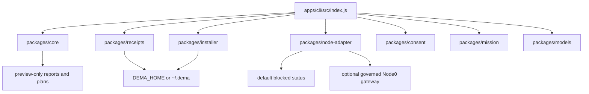

# Dema Architecture

Dema is the local-first product face for BIZRA Node0. It is intentionally small: a Node.js CLI, pure modules, local state, adapter boundaries, and receipt viewing.

## Core shape



## Runtime boundary

```text
Dema CLI
-> local preview / status / consent draft
-> Node0 adapter
-> governed runtime outside this repo
-> local receipt handoff
-> Dema receipt viewer
```

Dema does not own dangerous execution. It talks to adapters. Adapters talk to governed runtime. Receipts decide what can be inspected after the fact.

## Command-to-surface map

| Command | Primary surface | Effect boundary |
|---|---|---|
| `dema welcome` | CLI shell text | No state change. |
| `dema onboard` | `packages/core/src/onboarding.js` | Preview-only guide; no state change. |
| `dema setup` | `packages/installer` | Creates local skeleton only. |
| `dema status`, `dema status:json` | `packages/node-adapter`, `packages/core/status.js` | Reads adapter status. |
| `dema today` | `packages/core/today.js` | Records local continuity, not runtime pulse. |
| `dema doctor` | CLI readiness predicates | Exits nonzero when safety gates fail. |
| `dema ambient`, `dema ambient:json` | `packages/core/src/ambient.js` | Preview-only boundary report. |
| `dema diagnostics plan` | diagnostics plan surface | Preview-only; does not run checks. |
| `dema consent plan` | `packages/consent` | Drafts micro-consent; does not approve. |
| `dema mission draft` | `packages/mission` | Drafts intent; does not execute. |
| `dema mission propose` | `packages/core/mission.js` + FATE | Previews ARTIFACT-011 readiness only. |
| `dema receipts` | `packages/receipts` | Reads local receipt files. |
| `dema memory`, `dema memory show` | `packages/memory` | Reads local memory/profile entries only. |
| `dema models` | `packages/models` | Inventories local model surfaces; no inference. |
| `dema report safety` | safety report surface | Preview-only; not certification. |
| `dema network blueprint` | `packages/core/src/network-blueprint.js` | No sockets, handshakes, or federation. |
| `dema mcp blueprint` | `packages/core/src/mcp-blueprint.js` | MCP integration contract only; no MCP tool call or credential access. |
| `dema roadmap preview` | `packages/core/src/optimization-roadmap.js` | Advisory roadmap only; no execution or gate enforcement. |
| `dema evidence receipt preview` | `packages/verifier/src/evidence-receipt-preview.js` | Receipt-shaped preview only; no mint, signature, chain advance, or write. |
| `dema ihsan floor preview` | `packages/verifier/src/ihsan-floor-preview.js` | Externally supplied scalar check only; no certification or runtime gate. |
| `dema behavior modulation preview` | `packages/core/src/behavioral-modulation.js` | Visible reversible guidance preview under exact consent; applies no behavior change. |
| `dema design emulate-loop` | `packages/core/src/loop-emulator.js` | Design emulation only; no agents, runtime, receipts, or local writes. |
| `dema task` | `packages/tasks` + verifier placeholder | Lists or runs registered local tasks behind autonomy gates. |
| `dema sovereign` | `~/.dema/kernel/sovereign_tui/sovereign.py` | View-only local scaffold render; no daemon or federation. |
| `dema monetize` | CLI shell text | Proof-safe offer boundary; no token, reward, or economic mint. |

## Professional blueprint surfaces

Dema includes professional management, DevOps, and QA blueprint surfaces for planning only:

- `dema mcp blueprint` describes MCP integration boundaries, validation, retry, and redaction expectations without calling tools or accessing credentials.
- `dema roadmap preview` organizes advisory architecture, security, performance, documentation, DevOps, QA, and ethics work without executing tasks or enforcing gates.
- `dema evidence receipt preview` demonstrates canonical hashing and placeholder verification without minting receipts, signing payloads, or advancing a chain.
- `dema ihsan floor preview` checks an externally supplied scalar against the floor without claiming canonical scoring, certification, or SAT admissibility.
- `dema behavior modulation preview` models visible, reversible guidance modulation under exact consent while rejecting covert persuasion, manipulation, and other unsafe shaping.
- `npm run release:readiness` reports release risks and launch blockers without deployment, certification, runtime execution, or token/economic claims.

## Behavioral modulation preview

Dema can model a consent-bound behavioral modulation as a preview artifact. This means a visible, reversible change to guidance behavior, such as tone, prioritization, safety-boundary emphasis, interface guidance, or recommendation style.

The preview is gated by exact local consent, rejects covert or manipulative shaping, and links to a no-mint evidence receipt preview. It does not record approval, change runtime behavior, mint receipts, bind identity, or certify SAT admissibility.

See [02-architecture/behavioral-modulation-preview.md](02-architecture/behavioral-modulation-preview.md).

## Local state

All Dema-managed local state lives under:

```text
DEMA_HOME
```

or, by default:

```text
~/.dema/
```

Expected layout:

```text
~/.dema/
  profile.json
  config.local.json
  receipts/
  memory/
  logs/
  skills/
```

No hidden state location should be introduced.

## Adapter model

The default developer-machine state is blocked. If no Node0 adapter is connected, Dema should say so clearly instead of pretending readiness.

The current adapter path can shell out through `DEMA_NODE0_STATUS_COMMAND`; ADR-003 points the longer-term path toward the `bizra-cognition-gateway` HTTP surface inside the wider BIZRA substrate.

Adapter input is untrusted. Normalization must coerce values and preserve unknowns safely.

## Consent model

Consent is exact, narrow, and action-specific.

`dema consent plan` may produce a proposed scope and commitment hash, but that is not approval. `dema mission propose` may check the exact bounded-diagnostic phrase, but it still returns preview behavior in this repo.

## Receipt model

Dema reads receipts from local files. The governed runtime path creates receipt handoffs. This distinction is binding:

```text
Dema lists and shows.
Governed runtime issues.
```

## Node1 / Node2 boundary

`dema network blueprint` is a readiness map only. It must not:

- connect nodes,
- open sockets,
- perform a handshake,
- start federation,
- issue identity artifacts,
- mint receipts,
- execute runtime work.

## Engineering constraints

- Node.js >=20.
- ESM modules.
- Zero runtime dependencies.
- No build step.
- No npm workspaces.
- Package imports use relative paths.
- Tests use `node:test`.

## Verification commands

```bash
npm test
npm run check
npm run release:readiness
git diff --check
```

Docs-only changes should still keep these commands true unless explicitly documented otherwise.
