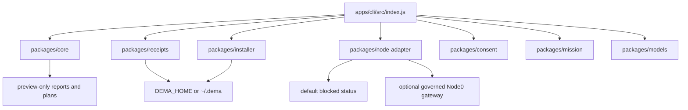

# Dema Architecture

Dema is the local-first product face for BIZRA Node0. It is intentionally small: a Node.js CLI, pure modules, local state, adapter boundaries, and receipt viewing.

## Core shape



## Runtime boundary

```text
Dema CLI
-> local preview / status / consent draft
-> Node0 adapter
-> governed runtime outside this repo
-> local receipt handoff
-> Dema receipt viewer
```

Dema does not own dangerous execution. It talks to adapters. Adapters talk to governed runtime. Receipts decide what can be inspected after the fact.

## Command-to-surface map

| Command | Primary surface | Effect boundary |
|---|---|---|
| `dema language` / `dema language show` / `dema language show --json` | `packages/core/src/homebase-language-picker.js` + `packages/core/src/operator-profile.js` | ADR-011 Phase-2: Language picker for first-run and reset-language flows. `dema language` → interactive picker (TTY) → writes language_code + secondary_language_code to profile.json atomically. `dema language show` → reads and displays current language. Law #9: profile with valid language_code silently loads (no prompt). Law #10: second language is offered after primary pick; single Enter skips. Non-TTY: returns null language_source=non_tty_default. EOF: returns null without profile write. 7 LANGUAGE_OPTIONS + GREETING_TEMPLATES (ar=DECLARED_NEEDS_NATIVE_REVIEW, en/fr/es/other=DECLARED, ur/hi=PLACEHOLDER_PENDING_NATIVE_AUTHOR). |
| `dema welcome` | CLI shell text | No state change. |
| `dema onboard` | `packages/core/src/onboarding.js` | Preview-only guide; no state change. |
| `dema explain` | `packages/core/src/canon-glossary.js` | Plain-language inline canon teacher. 28 grounded vocabulary entries (ihsan, adl, riba-zero, zann-zero, PAT, SAT, URP, FATE, DEMA, BIZRA, Third Fact, الرسالة, البذرة, Node0, Node1, Lighthouse, Ring 0, Ring 1, ARTIFACT-011, ADR-005, Daughter Test, receipt, chain, truth-label, refusal-as-product, founding-documents, bitcoin-anchor, boundary). Each entry: title, short, long, truth_label, see_also, doc_anchor. Read-only; no state change; `--json` emits schema-tagged entry. |
| `dema setup` | `packages/installer` | Creates local skeleton only. |
| `dema status`, `dema status:json` | `packages/node-adapter`, `packages/core/status.js` | Reads adapter status. |
| `dema state` | `packages/core/state.js` | Emits Node0 state preview JSON (`bizra.dema.node0_state.v0.1`, truth label `NODE0_LOCAL_SEED`); preview-only, no adapter call, no runtime. |
| `dema profiles` | `packages/core/profiles.js` | Emits Profile Foundation Preview (`bizra.dema.profile_foundation.v0.1`): UserProfile / PATProfile / SATProfile / MissionProfile / ContextCapsule. Preview-only; ContextCapsule includes whitelisted fields only (no raw conversation, no full evidence payload). |
| `dema consent-card` | `packages/core/consent-card-preview.js` | Emits Consent Card Preview (`bizra.dema.consent_card_preview.v0.1`): mission + PAT proposal + SAT-style verdict + allowed/blocked effects + decision options. Required blocked effects (runtime, federation, mint, Node1/2 connection, raw scan, public network) are pinned non-overrideable; caller can ADD blocks but never REMOVE. SAT verdict status pinned `policy_preview`. Receipt preview status `not_minted`. Preview-only, deep-frozen, exhaustively-false boundary. |
| `dema mission-loop` | `packages/core/mission-loop-preview.js` | Emits Mission Loop Preview (`bizra.dema.mission_loop_preview.v0.1`): pure composition of `state` + `profiles` + `consent-card` plus 3 new lifecycle fields (local_model_invocation · evidence_chain_event · receipt_preview). `preview_lifecycle_status` pinned `HOLD` regardless of consent decision; `lifecycle_phase` derives from inputs across 6 canonical phases (ready · needs_pat_proposal · awaiting_consent · narrowing_scope · complete_preview_declined · complete_preview_approved). `routing_allowed`/`chain_advance`/`receipt_minted` pinned false. No runtime, no model invocation, no chain advance, no receipt mint. |
| `dema evidence-event` | `packages/core/evidence-chain-event-preview.js` | Emits EvidenceChain Event Preview (`bizra.dema.evidence_chain_event_preview.v0.1`): proof-instrumentation layer between lifecycle and runtime. Takes a mission_loop_preview snapshot as input; emits prepared (never recorded) event. Canonical `event_status` values: `not_prepared` (loop not in approved phase) or `prepared_not_recorded` (approved phase reached, event structured but not on chain). Status `recorded` is intentionally unreachable. `chain_advance` and `receipt_mint` pinned false. Payload policy: `raw_payload_included=false`, `hash_only=true`. evidence_refs stripped to {id, schema, content_hash:null}. |
| `dema project-status` | `packages/core/src/project-status-preview.js` + `packages/core/src/tui-formatter.js` | Emits Project Status Preview v0.1 (`bizra.dema.project_status.v0.1`): PMBOK 7th-edition-aligned project surface. Companion to `docs/pm/PROJECT_CHARTER_AND_STATUS.md`. Surfaces project vision + operator + phase, stakeholder map with 7-role concentric-ring taxonomy (founder/first_invited/candidate/future_ring_2/3/4/concurrent_claude_session), value stream (unit_of_value = ironclad_proof_forge_receipt · NOT features/LOC/commits), risk register with severity + mitigation + status (refuse-as-product: cannot close a risk without named mitigation · enforced structurally), quality posture (master_craftsmanship_compliance + 5_gate_state + adversarial_floor + canonical_boundary_keys), all 12 PMBOK 7th-edition principles each bound to a structural mechanism in the codebase. 8 primary_refusals: refuse-to-claim-progress-without-evidence · refuse-to-rate-quality-by-self-assessment · refuse-to-skip-stakeholder-ring · refuse-to-close-risk-without-mitigation · refuse-to-advance-phase-without-predecessor · refuse-to-count-features-as-value · refuse-to-publish-contradicting-chain · refuse-to-hide-open-typed-gos. 10 blocked_effects. Pure builder · deep-frozen · deterministic. |
| `dema skill-growth-governor` | `packages/core/src/skill-growth-governor.js` + `packages/core/src/tui-formatter.js` | Emits Skill Growth Governor Preview v0.1 (`bizra.dema.skill_growth_governor.v0.1`): the proof-governed growth layer that makes DEMA safe to self-improve. Implements the canonical four-line law (no learning without evaluation · no evaluation without evidence · no skill promotion without receipt · no overwrite without human consent). Five promotion gates: evidence_exists · success_metric_present · no_boundary_violation · sat_review_passed · human_consent_received. Eight primary_refusals: overwrite-human-edited · promote-without-evidence · promote-failed-task · promote-without-metric · skill-change-without-consent · archive-pinned · self-reflection-only · namespace-overlap. Six protected namespaces (consent · boundary · receipt_mint · federation · identity · canon) refuse new skills without explicit override. Promotion phrase template: `GO promote skill <id> v<version>` (ADR-005 exact-string · no fuzzy · no case-insensitive · no paste). Pure builder · deep-frozen · deterministic. Companion to ADR-009 POI (promoted skills feed impact-score). |
| `dema onboarding-lifecycle` | `packages/core/src/onboarding-lifecycle.js` + `packages/core/src/tui-formatter.js` | Emits Onboarding Lifecycle Preview v0.1 (`bizra.dema.onboarding_lifecycle.v0.1`): the canonical 7-stage flow every new node candidate walks at first boot (language → technical_level → node_role → purpose → resources → consent_constitution → first_mission). Language FIRST · comprehension before consent · safest defaults (nothing_yet for resources). Pure builder · deep-frozen · deterministic. Operating law surfaces: language_before_capability, human_dignity_before_configuration, consent_form=exact_string_typed_character_by_character. 8 primary_refusals + 10 blocked_effects + ADR-005 binding + canon_anchors cross-reference. ANSI TUI rendering via tui-formatter (NO_COLOR + TERM=dumb honored · 76-col discipline · world-class visual hierarchy without new dependencies). Default = pretty TUI on TTY · `--json` or non-TTY emits JSON. |
| `dema node-registry` | `packages/core/src/node-registry-preview.js` | Emits Node Registry Preview v0.1e+f (`bizra.dema.node_registry_preview.v0.1`): the schema-tagged registry that makes the Node ordinal law (canonized 2026-05-18, `docs/canon/BIZRA_TOPOLOGY_CANON.md` §"Node ordinal law") operational. Surfaces accepted nodes + ghost-preview candidates + `next_available_ordinal` + `highest_assigned_ordinal` + `forbidden_ordinals` (3, 4 per canon_registry). v0.1f adds count primitives (`connected_node_count` · `primary_node_count` · `companion_device_count` · `ghost_pending_count`) AND `urp_shared_pool_inventory` block: `federation_active: false` · `current_totals_if_each_node_were_to_activate` (pat_agents = primary × 7 · sat_agents = primary × 5 · per canonical Scaling table) · 5 canonical resource categories (hardware/data_corpus/knowledge_base/experience_history/skill_library) · `contribution_status: preview_only_no_node_has_federated`. Refuses (as data) every ordinal-law violation: forbidden ordinals, duplicates, would-skip-ordinal, ghost-without-candidate-name, active-as-ghost-status, self-referencing `companion_of`, non-integer ordinals. `ordinal_claim_phrase` template `GO accept Node<N> ordinal` enforces ADR-005 exact-string consent. 43 tests (25 base + 18 adversarial). |
| `dema llm-router` | `packages/core/local-llm-router-preview.js` | Emits Local LLM Router Preview (`bizra.dema.local_llm_router_preview.v0.1`): declarative-only routing layer. Inventory + role_map for 5 canonical roles (mission_intent_parse, pat_proposal_draft, consent_phrase_generate, evidence_summary, abstain_or_unknown). `routing_allowed=false` pinned at top level, per-model, and per-role. `invocation_status` pinned `not_invoked_preview_only`. Model status pinned `declared_preview_only` regardless of caller-claimed status. ABSTAIN is the universal fallback. Consent boundary declares `routing_requires=typed_GO_plus_chain_advance`. No model load, no prompt execution, no external call, no raw corpus scan, no tool execution. |
| `dema process-mining` (with `--summary`) | `packages/core/src/process-mining-preview.js` | Emits Process Mining Preview (`bizra.dema.process_mining_preview.v0.1`): L1.5 operator-pattern mirror. Surfaces `ring_advancement_status` + `next_step_observable` (always `_observable` suffix · never imperative). `blocked_effects` explicitly includes `operator_judgment` (the miner does NOT judge). `self_critique.this_preview_offers_a_mirror=true` invariant. Adversarial filters drop non-primitive metric values silently. Deterministic given identical input. Summary variant collapses metrics to counts. |
| `dema models scan` (with `--summary`) | `packages/core/src/local-model-inventory-scan.js` | C1.5 per [ADR-008](06-adr/ADR-008-runtime-activation.md): Local Model Inventory Scan. Emits `bizra.dema.local_model_inventory.v0.1` with canonical 16-key boundary, truth_label `LOCALHOST_READ_ONLY_SCAN`. Wraps existing `collectModelInventory` and adds HuggingFace cache scanner (`~/.cache/huggingface/hub`), `/data/bizra` secondary root scanner, per-record `file_type` and `usable_for` augmentation. All inference fields (usable_for) are naming-based hints, never claimed verified — A-grade per Key Maker V/D/A/U discipline. |
| `dema llm-invoke` (with `--model NAME --prompt TEXT`, `--invoke --consent`, and `--summary`) | `packages/core/src/llm-adapter.js` | C1 per [ADR-008](06-adr/ADR-008-runtime-activation.md): Local LLM Adapter. Preview emits `bizra.dema.llm_invocation_preview.v0.1` with canonical 16-key boundary all-false. `--invoke` flag with exact-string consent phrase (per [ADR-005](06-adr/ADR-005-operator-actions-require-explicit-consent.md)) calls Ollama at localhost. Result emits `bizra.dema.llm_invocation_result.v0.1` with `effects_observed` reflecting what flipped. Model whitelist (llama, qwen, mistral, mixtral, gemma, phi, deepseek, embed families). Localhost-bound by default (caller cannot redirect to non-localhost). Failure modes are schema-tagged (timeout, network_error, http_status_N, response_not_json, consent_phrase_mismatch, model_not_in_whitelist, prompt_empty, prompt_too_long, endpoint_not_localhost). 24 tests including mocked Ollama responses and abort-aware timeout. |
| `dema model-broker route --task` (with `--required-role <role>`, `--no-local-only`, `--allow-unknown`, `--max-size <class>`, `--registry-stdin`, `--use-local-registry`, `--registry-file <abs-path>`, `--save-receipt`, `--consent "GO: save local model route receipt"`, `--pretty`) | `packages/models/src/model-broker-preview.js` + `packages/models/src/model-registry-config-preview.js` + `packages/receipts/src/route-receipt-save.js` | CLI surface for the local model broker + registry config (PR #79 + #80 + #81 + v0.2 file-loading + v0.2 receipt SAVE). Emits `bizra.dema.local_model_route_receipt.v0.1` JSON to stdout with full route receipt (`schema`, `timestamp`, `task_kind`, `required_role`, `local_only`, `selected_model_id`, `selected_model_role`, `selected_model_locality`, `reason`, `rejected_candidates`, `canon_refs`, `warnings`, `boundary`). Default registry is `DEFAULT_SAMPLE_REGISTRY` (6 honest placeholders, all `status=source_pending` + `locality=unknown` → broker routes nothing). **Three registry input modes (mutually exclusive)**: (a) `--registry-stdin` reads operator JSON `{ entries: [...] }` from stdin; (b) `--use-local-registry` reads `$DEMA_HOME/models/registry.json` (env override honored; falls back to `~/.dema`) — read-only, 1 MB max file size, fail-closed on missing/malformed/oversized; (c) `--registry-file <abs-path>` reads operator-supplied absolute path (relative paths rejected with helpful stderr) — same read-only + 1 MB + fail-closed semantics. Any combination of two or more registry input flags → non-zero exit with `mutually exclusive` stderr. **Receipt SAVE (preview-grade, NOT canonical chain-bound mint)**: `--save-receipt` with exact `--consent "GO: save local model route receipt"` writes the same receipt JSON to `$DEMA_HOME/receipts/route-<sha256-hex>.json` (content-addressed filename) via atomic write (`writeFile(tmp, {flag: "wx"})` → `rename(tmp, final)`); on-disk file matches stdout byte-for-byte; stderr emits one-line `saved receipt to: <path>` note. Consent missing/mismatched → non-zero exit. Save is preview persistence; the canonical chain-bound mint (PAT-6 → SAT-1..5 → governed gateway → OTS attestation for founding-grade) is `packages/core/src/receipt-mint-integration.js` C12 and is **not** what `--save-receipt` does. Frozen 8-key receipt boundary (`runtime` · `model_invocation` · `network_used` · `federation` · `mint` · `token_economy` · `urp_networking` · `prompt_invocation_allowed` all false). Cites canon: CLAIM_REGISTER · LAW_OF_ASSUMPTION · HARNESS_AND_SKILL_DNA · COMPONENT_DNA. **No model load, no prompt execution, no network call, no real model names committed, no registry-file write, no canonical chain-bound mint, no token/economy effect.** |
| `dema key-maker-check` (with `--door "<text>"` and `--summary`) | `packages/core/src/key-maker-compliance.js` | Emits Key Maker Compliance Envelope (`bizra.dema.key_maker_compliance.v0.1`): bridges canon → code from [Key Maker Epistemic Conduct v0.1](02-architecture/key-maker-epistemic-conduct-v0.1.md). Self-audits reasoning shape against 5 invariants: assumption_declaration · certainty_mapping · constructive_reading · opposing_view_search · boundary_marker. Emits `overall_compliant` + `failed_invariants` array. Fails closed when canon violated. `key_types` filter rejects non-canonical entries (8 canonical: question/map/mirror/bridge/boundary_marker/lens/lantern/silence). `micro_consent.mutation_authorized` pinned false at builder level. |
| `dema master-craftsmanship audit` (with `[<path>]` and `--json`) | `packages/core/src/master-craftsmanship-audit.js` | External-witness audit surface. Maps any artifact file against the 10 `MASTER_CRAFTSMANSHIP_INVARIANTS` exported from `packages/core/src/craftsmanship-witness-preview.js` (canon_bound · test_backed · consent_gated · receipt_emitting · doctrine_coherent · boundary_disciplined · adversarial_tested · verify_before_asserting · reversible · cross_referenced). Each invariant gets evidence-anchored counts via heuristic probes. Emits `bizra.dema.master_craftsmanship_audit.v0.1` with `overall_compliant`, `failed_invariants[]`, `audit_summary` (T-N / P-N anchor lists · ADR cross-references · adversarial test count). Default subject `tests/node-onboarding-adr011-compliance.test.js` (the ADR-011 phase-4 compliance suite). Verdict: COMPLIANT (10/10) · PARTIAL (N/10) · NON-COMPLIANT. Exits 1 on non-compliant or missing artifact path. Per [ADR-012](06-adr/ADR-012-cli-naming-convention.md) §Amendments 2026-05-19, the kebab `master-craftsmanship` token is the 13th legacy allowlist entry. |
| `dema today` | `packages/core/today.js` | Records local continuity, not runtime pulse. |
| `dema doctor` | CLI readiness predicates | Exits nonzero when safety gates fail. |
| `dema ambient`, `dema ambient:json` | `packages/core/src/ambient.js` | Preview-only boundary report. |
| `dema diagnostics plan` | diagnostics plan surface | Preview-only; does not run checks. |
| `dema consent plan` | `packages/consent` | Drafts micro-consent with actuator classes, policy-preview decisions, self-proactive harness, self-critique, and micro-compliance; does not approve, mint, or execute. |
| `dema mission draft` | `packages/mission` | Drafts intent; does not execute. |
| `dema mission propose` | `packages/core/mission.js` + FATE | Previews ARTIFACT-011 readiness only. |
| `dema receipts` | `packages/receipts` | Reads local receipt files. |
| `dema memory`, `dema memory show` | `packages/memory` | Reads local memory/profile entries only. |
| `dema models` | `packages/models` | Inventories local model surfaces; no inference. |
| `dema report safety` | safety report surface | Preview-only; not certification. |
| `dema network blueprint` | `packages/core/src/network-blueprint.js` | Node1/Node2 and phase-gated readiness preview only; no sockets, handshakes, or federation. |
| `dema network fixture preview` | `packages/core/src/network-fixture-preview.js` | Offline 5-slot schematic only; 0 live nodes, no sockets, no mint. |
| `dema network refusal preview` | `packages/core/src/network-refusal-matrix-preview.js` | Partition/rejoin refusal matrix preview only; no sockets, no simulation, no mint. |
| `dema amana contracts preview` | `packages/core/src/amana-contracts-preview.js` | Registry preview only; no external code import, execution, mint, or Step 7 unlock. |
| `dema mcp blueprint` | `packages/core/src/mcp-blueprint.js` | MCP integration contract only; no MCP tool call or credential access. |
| `dema roadmap preview` | `packages/core/src/optimization-roadmap.js` | Advisory roadmap only; no execution or gate enforcement. |
| `dema evidence receipt preview` | `packages/verifier/src/evidence-receipt-preview.js` | Receipt-shaped preview only; no mint, signature, chain advance, or write. |
| `dema ihsan floor preview` | `packages/verifier/src/ihsan-floor-preview.js` | Externally supplied scalar check only; no certification or runtime gate. |
| `dema behavior modulation preview` | `packages/core/src/behavioral-modulation.js` | Visible reversible guidance preview under exact consent; applies no behavior change. |
| `dema design emulate-loop` | `packages/core/src/loop-emulator.js` | Design emulation only; no agents, runtime, receipts, or local writes. |
| `dema task` | `packages/tasks` + verifier placeholder | Lists or runs registered local tasks behind autonomy gates. |
| `dema sovereign` | `~/.dema/kernel/sovereign_tui/sovereign.py` | View-only local scaffold render; no daemon or federation. |
| `dema monetize` | CLI shell text | Proof-safe offer boundary; no token, reward, or economic mint. |

## Professional blueprint surfaces

Dema includes professional management, DevOps, and QA blueprint surfaces for planning only:

- `dema mcp blueprint` describes MCP integration boundaries, validation, retry, and redaction expectations without calling tools or accessing credentials.
- `dema amana contracts preview` classifies Amana-adjacent contract primitives, current overlap, import risk, and proof gates without importing external snapshot code or unblocking Step 7.
- `dema roadmap preview` organizes advisory architecture, security, performance, documentation, DevOps, QA, and ethics work without executing tasks or enforcing gates.
- `dema evidence receipt preview` demonstrates canonical hashing and placeholder verification without minting receipts, signing payloads, or advancing a chain.
- `dema ihsan floor preview` checks an externally supplied scalar against the floor without claiming canonical scoring, certification, or SAT admissibility.
- `dema behavior modulation preview` models visible, reversible guidance modulation under exact consent while rejecting covert persuasion, manipulation, and other unsafe shaping.
- `npm run release:readiness` reports release risks and launch blockers without deployment, certification, runtime execution, or token/economic claims.

## Behavioral modulation preview

Dema can model a consent-bound behavioral modulation as a preview artifact. This means a visible, reversible change to guidance behavior, such as tone, prioritization, safety-boundary emphasis, interface guidance, or recommendation style.

The preview is gated by exact local consent, rejects covert or manipulative shaping, and links to a no-mint evidence receipt preview. It does not record approval, change runtime behavior, mint receipts, bind identity, or certify SAT admissibility.

See [02-architecture/behavioral-modulation-preview.md](02-architecture/behavioral-modulation-preview.md).

## Local state

All Dema-managed local state lives under:

```text
DEMA_HOME
```

or, by default:

```text
~/.dema/
```

Expected layout:

```text
~/.dema/
  profile.json
  config.local.json
  receipts/
  memory/
  logs/
  skills/
```

No hidden state location should be introduced.

## Adapter model

The default developer-machine state is blocked. If no Node0 adapter is connected, Dema should say so clearly instead of pretending readiness.

The current adapter path can shell out through `DEMA_NODE0_STATUS_COMMAND`; ADR-003 points the longer-term path toward the `bizra-cognition-gateway` HTTP surface inside the wider BIZRA substrate.

Adapter input is untrusted. Normalization must coerce values and preserve unknowns safely.

## Consent model

Consent is exact, narrow, and action-specific.

`dema consent plan` may produce a proposed scope, actuator classes, policy-preview decisions, self-check harnesses, and a commitment hash, but that is not approval. `dema mission propose` may check the exact bounded-diagnostic phrase, but it still returns preview behavior in this repo.

## Receipt model

Dema reads receipts from local files. The governed runtime path creates receipt handoffs. This distinction is binding:

```text
Dema lists and shows.
Governed runtime issues.
```

## Node1 / Node2 and multi-node boundary

`dema network blueprint` is a readiness map only. `dema network fixture preview`
is an offline 5-slot schematic only: it reports 0 live nodes, 0 sockets, unnamed
phase slots, micro-compliance controls, micro-consent requirements, and inert
scenario shapes. `dema network refusal preview` renders a paper truth-table
refusal matrix for partition, rejoin, stale receipt, missing micro-consent, and
schema mismatch shapes. These commands may describe future Node1/Node2 handoff
contracts and canonical phase_3/phase_4 directions, but they must not:

- connect nodes,
- open sockets,
- perform a handshake,
- start federation,
- issue identity artifacts,
- mint receipts,
- execute runtime work.

## Engineering constraints

- Node.js >=20.
- ESM modules.
- Zero runtime dependencies.
- No build step.
- No npm workspaces.
- Package imports use relative paths.
- Tests use `node:test`.

## Verification commands

```bash
npm test
npm run check
npm run release:readiness
git diff --check
```

Docs-only changes should still keep these commands true unless explicitly documented otherwise.
