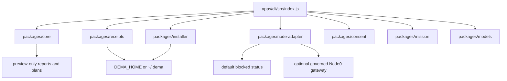

# Dema Architecture

Dema is the local-first product face for BIZRA Node0. It is intentionally small: a Node.js CLI, pure modules, local state, adapter boundaries, and receipt viewing.

## Core shape



## Runtime boundary

```text
Dema CLI
-> local preview / status / consent draft
-> Node0 adapter
-> governed runtime outside this repo
-> local receipt handoff
-> Dema receipt viewer
```

Dema does not own dangerous execution. It talks to adapters. Adapters talk to governed runtime. Receipts decide what can be inspected after the fact.

## Command-to-surface map

| Command                                                                                                                                                                                                                                                                                                                                                                                                                                                                                                       | Primary surface                                                                                                                                                                                                                                     | Effect boundary                                                                                                                                                                                                                                                                                                                                                                                                                                                                                                                                                                                                                                                                                                                                                                                                                                                                                                                                                                                                                                                                                                                                                                                                                                                                                                                                                                                                                                                                                                                                                                                                                                                                                                                                                                                                                                                                                                                                                                                                                                                                                                                                                                                                                                                                                                                                                                                                                                                                                                                                                                                                                                                                                                                                                                                                                                                                                                                                                                                                                                                                                                                                                                                                                                                                                                                                                                                                                                                                                                                                                                                                                                                                                                                                                                                                                                                                                                                                                                                                                                                                                                                                                                                                                                                                                                                                                                                                                                                                                                                                                                                                                                                                                                                                                                                                                                                             |
| ------------------------------------------------------------------------------------------------------------------------------------------------------------------------------------------------------------------------------------------------------------------------------------------------------------------------------------------------------------------------------------------------------------------------------------------------------------------------------------------------------------- | --------------------------------------------------------------------------------------------------------------------------------------------------------------------------------------------------------------------------------------------------- | --------------------------------------------------------------------------------------------------------------------------------------------------------------------------------------------------------------------------------------------------------------------------------------------------------------------------------------------------------------------------------------------------------------------------------------------------------------------------------------------------------------------------------------------------------------------------------------------------------------------------------------------------------------------------------------------------------------------------------------------------------------------------------------------------------------------------------------------------------------------------------------------------------------------------------------------------------------------------------------------------------------------------------------------------------------------------------------------------------------------------------------------------------------------------------------------------------------------------------------------------------------------------------------------------------------------------------------------------------------------------------------------------------------------------------------------------------------------------------------------------------------------------------------------------------------------------------------------------------------------------------------------------------------------------------------------------------------------------------------------------------------------------------------------------------------------------------------------------------------------------------------------------------------------------------------------------------------------------------------------------------------------------------------------------------------------------------------------------------------------------------------------------------------------------------------------------------------------------------------------------------------------------------------------------------------------------------------------------------------------------------------------------------------------------------------------------------------------------------------------------------------------------------------------------------------------------------------------------------------------------------------------------------------------------------------------------------------------------------------------------------------------------------------------------------------------------------------------------------------------------------------------------------------------------------------------------------------------------------------------------------------------------------------------------------------------------------------------------------------------------------------------------------------------------------------------------------------------------------------------------------------------------------------------------------------------------------------------------------------------------------------------------------------------------------------------------------------------------------------------------------------------------------------------------------------------------------------------------------------------------------------------------------------------------------------------------------------------------------------------------------------------------------------------------------------------------------------------------------------------------------------------------------------------------------------------------------------------------------------------------------------------------------------------------------------------------------------------------------------------------------------------------------------------------------------------------------------------------------------------------------------------------------------------------------------------------------------------------------------------------------------------------------------------------------------------------------------------------------------------------------------------------------------------------------------------------------------------------------------------------------------------------------------------------------------------------------------------------------------------------------------------------------------------------------------------------------------------------------------------------- |
| `dema language` / `dema language show` / `dema language show --json`                                                                                                                                                                                                                                                                                                                                                                                                                                          | `packages/core/src/homebase-language-picker.js` + `packages/core/src/operator-profile.js`                                                                                                                                                           | ADR-011 Phase-2: Language picker for first-run and reset-language flows. `dema language` → interactive picker (TTY) → writes language_code + secondary_language_code to profile.json atomically. `dema language show` → reads and displays current language. Law #9: profile with valid language_code silently loads (no prompt). Law #10: second language is offered after primary pick; single Enter skips. Non-TTY: returns null language_source=non_tty_default. EOF: returns null without profile write. 7 LANGUAGE_OPTIONS + GREETING_TEMPLATES (ar=DECLARED_NEEDS_NATIVE_REVIEW, en/fr/es/other=DECLARED, ur/hi=PLACEHOLDER_PENDING_NATIVE_AUTHOR).                                                                                                                                                                                                                                                                                                                                                                                                                                                                                                                                                                                                                                                                                                                                                                                                                                                                                                                                                                                                                                                                                                                                                                                                                                                                                                                                                                                                                                                                                                                                                                                                                                                                                                                                                                                                                                                                                                                                                                                                                                                                                                                                                                                                                                                                                                                                                                                                                                                                                                                                                                                                                                                                                                                                                                                                                                                                                                                                                                                                                                                                                                                                                                                                                                                                                                                                                                                                                                                                                                                                                                                                                                                                                                                                                                                                                                                                                                                                                                                                                                                                                                                                                                                                                  |
| `dema welcome`                                                                                                                                                                                                                                                                                                                                                                                                                                                                                                | CLI shell text                                                                                                                                                                                                                                      | No state change.                                                                                                                                                                                                                                                                                                                                                                                                                                                                                                                                                                                                                                                                                                                                                                                                                                                                                                                                                                                                                                                                                                                                                                                                                                                                                                                                                                                                                                                                                                                                                                                                                                                                                                                                                                                                                                                                                                                                                                                                                                                                                                                                                                                                                                                                                                                                                                                                                                                                                                                                                                                                                                                                                                                                                                                                                                                                                                                                                                                                                                                                                                                                                                                                                                                                                                                                                                                                                                                                                                                                                                                                                                                                                                                                                                                                                                                                                                                                                                                                                                                                                                                                                                                                                                                                                                                                                                                                                                                                                                                                                                                                                                                                                                                                                                                                                                                            |
| `dema onboard`                                                                                                                                                                                                                                                                                                                                                                                                                                                                                                | `packages/core/src/onboarding.js`                                                                                                                                                                                                                   | Preview-only guide; no state change.                                                                                                                                                                                                                                                                                                                                                                                                                                                                                                                                                                                                                                                                                                                                                                                                                                                                                                                                                                                                                                                                                                                                                                                                                                                                                                                                                                                                                                                                                                                                                                                                                                                                                                                                                                                                                                                                                                                                                                                                                                                                                                                                                                                                                                                                                                                                                                                                                                                                                                                                                                                                                                                                                                                                                                                                                                                                                                                                                                                                                                                                                                                                                                                                                                                                                                                                                                                                                                                                                                                                                                                                                                                                                                                                                                                                                                                                                                                                                                                                                                                                                                                                                                                                                                                                                                                                                                                                                                                                                                                                                                                                                                                                                                                                                                                                                                        |
| `dema explain`                                                                                                                                                                                                                                                                                                                                                                                                                                                                                                | `packages/core/src/canon-glossary.js`                                                                                                                                                                                                               | Plain-language inline canon teacher. 28 grounded vocabulary entries (ihsan, adl, riba-zero, zann-zero, PAT, SAT, URP, FATE, DEMA, BIZRA, Third Fact, الرسالة, البذرة, Node0, Node1, Lighthouse, Ring 0, Ring 1, ARTIFACT-011, ADR-005, Daughter Test, receipt, chain, truth-label, refusal-as-product, founding-documents, bitcoin-anchor, boundary). Each entry: title, short, long, truth_label, see_also, doc_anchor. Read-only; no state change; `--json` emits schema-tagged entry.                                                                                                                                                                                                                                                                                                                                                                                                                                                                                                                                                                                                                                                                                                                                                                                                                                                                                                                                                                                                                                                                                                                                                                                                                                                                                                                                                                                                                                                                                                                                                                                                                                                                                                                                                                                                                                                                                                                                                                                                                                                                                                                                                                                                                                                                                                                                                                                                                                                                                                                                                                                                                                                                                                                                                                                                                                                                                                                                                                                                                                                                                                                                                                                                                                                                                                                                                                                                                                                                                                                                                                                                                                                                                                                                                                                                                                                                                                                                                                                                                                                                                                                                                                                                                                                                                                                                                                                    |
| `dema setup`                                                                                                                                                                                                                                                                                                                                                                                                                                                                                                  | `packages/installer`                                                                                                                                                                                                                                | Creates local skeleton only.                                                                                                                                                                                                                                                                                                                                                                                                                                                                                                                                                                                                                                                                                                                                                                                                                                                                                                                                                                                                                                                                                                                                                                                                                                                                                                                                                                                                                                                                                                                                                                                                                                                                                                                                                                                                                                                                                                                                                                                                                                                                                                                                                                                                                                                                                                                                                                                                                                                                                                                                                                                                                                                                                                                                                                                                                                                                                                                                                                                                                                                                                                                                                                                                                                                                                                                                                                                                                                                                                                                                                                                                                                                                                                                                                                                                                                                                                                                                                                                                                                                                                                                                                                                                                                                                                                                                                                                                                                                                                                                                                                                                                                                                                                                                                                                                                                                |
| `dema setup-check`                                                                                                                                                                                                                                                                                                                                                                                                                                                                                            | `packages/installer/src/setup.js`                                                                                                                                                                                                                   | Verify install integrity: checks all expected dirs and files exist, computes sha256 hashes for JSON files. Verdict INTACT or INCOMPLETE. Read-only.                                                                                                                                                                                                                                                                                                                                                                                                                                                                                                                                                                                                                                                                                                                                                                                                                                                                                                                                                                                                                                                                                                                                                                                                                                                                                                                                                                                                                                                                                                                                                                                                                                                                                                                                                                                                                                                                                                                                                                                                                                                                                                                                                                                                                                                                                                                                                                                                                                                                                                                                                                                                                                                                                                                                                                                                                                                                                                                                                                                                                                                                                                                                                                                                                                                                                                                                                                                                                                                                                                                                                                                                                                                                                                                                                                                                                                                                                                                                                                                                                                                                                                                                                                                                                                                                                                                                                                                                                                                                                                                                                                                                                                                                                                                         |
| `dema uninstall` (with `--consent "REMOVE DEMA LOCAL DATA"`, `--dry-run`)                                                                                                                                                                                                                                                                                                                                                                                                                                     | `packages/installer/src/setup.js`                                                                                                                                                                                                                   | Consent-gated removal of DEMA_HOME. Requires exact phrase "REMOVE DEMA LOCAL DATA". --dry-run shows what would be removed without acting. Refuses on phrase mismatch or missing home.                                                                                                                                                                                                                                                                                                                                                                                                                                                                                                                                                                                                                                                                                                                                                                                                                                                                                                                                                                                                                                                                                                                                                                                                                                                                                                                                                                                                                                                                                                                                                                                                                                                                                                                                                                                                                                                                                                                                                                                                                                                                                                                                                                                                                                                                                                                                                                                                                                                                                                                                                                                                                                                                                                                                                                                                                                                                                                                                                                                                                                                                                                                                                                                                                                                                                                                                                                                                                                                                                                                                                                                                                                                                                                                                                                                                                                                                                                                                                                                                                                                                                                                                                                                                                                                                                                                                                                                                                                                                                                                                                                                                                                                                                       |
| `dema witness` (with `--consent "WITNESS NODE0 STATE"`, `--dry-run`, `--json`)                                                                                                                                                                                                                                                                                                                                                                                                                                | `packages/receipts/src/witness-receipt.js`                                                                                                                                                                                                          | Node0 Self-Witness v0.1. First real local receipt. Attests current node state (N=1, PAT-7, SAT-5, URP locked, harness verdict, setup integrity, epistemic ground) under exact consent. Content-addressed sha256 filename. Atomic write to DEMA_HOME/receipts/. No federation, no token, no model, no public network. Truth label: LOCAL_OPERATOR_WITNESS.                                                                                                                                                                                                                                                                                                                                                                                                                                                                                                                                                                                                                                                                                                                                                                                                                                                                                                                                                                                                                                                                                                                                                                                                                                                                                                                                                                                                                                                                                                                                                                                                                                                                                                                                                                                                                                                                                                                                                                                                                                                                                                                                                                                                                                                                                                                                                                                                                                                                                                                                                                                                                                                                                                                                                                                                                                                                                                                                                                                                                                                                                                                                                                                                                                                                                                                                                                                                                                                                                                                                                                                                                                                                                                                                                                                                                                                                                                                                                                                                                                                                                                                                                                                                                                                                                                                                                                                                                                                                                                                   |
| `dema authorship key init` (with `--consent "GENERATE AUTHORSHIP KEY"`, `--json`)                                                                                                                                                                                                                                                                                                                                                                                                                             | `packages/receipts/src/authorship-key-store.js`                                                                                                                                                                                                     | H18.3A Ed25519 key init. Generates keypair, writes private key (mode 0o600) and public key to `DEMA_HOME/keys/`. Consent-gated: requires exact phrase. Refuses second init. Never prints private key. Schema: `bizra.dema.authorship_key_init.v0.1`.                                                                                                                                                                                                                                                                                                                                                                                                                                                                                                                                                                                                                                                                                                                                                                                                                                                                                                                                                                                                                                                                                                                                                                                                                                                                                                                                                                                                                                                                                                                                                                                                                                                                                                                                                                                                                                                                                                                                                                                                                                                                                                                                                                                                                                                                                                                                                                                                                                                                                                                                                                                                                                                                                                                                                                                                                                                                                                                                                                                                                                                                                                                                                                                                                                                                                                                                                                                                                                                                                                                                                                                                                                                                                                                                                                                                                                                                                                                                                                                                                                                                                                                                                                                                                                                                                                                                                                                                                                                                                                                                                                                                                        |
| `dema authorship sign` (with `<artifact-path>`, `--consent "SIGN AUTHORSHIP RECEIPT"`, `--json`)                                                                                                                                                                                                                                                                                                                                                                                                              | `packages/receipts/src/authorship-sign-command.js`                                                                                                                                                                                                  | H18.3B consent-gated authorship signing. Reads artifact, computes SHA-256, loads persisted Ed25519 key, signs canonical payload, self-verifies, writes content-addressed receipt to `DEMA_HOME/receipts/authorship-<hash>.json`. One artifact, one consent, one receipt. No private key in output. No artifact content in receipt. Schema: `bizra.dema.authorship_sign_result.v0.1`.                                                                                                                                                                                                                                                                                                                                                                                                                                                                                                                                                                                                                                                                                                                                                                                                                                                                                                                                                                                                                                                                                                                                                                                                                                                                                                                                                                                                                                                                                                                                                                                                                                                                                                                                                                                                                                                                                                                                                                                                                                                                                                                                                                                                                                                                                                                                                                                                                                                                                                                                                                                                                                                                                                                                                                                                                                                                                                                                                                                                                                                                                                                                                                                                                                                                                                                                                                                                                                                                                                                                                                                                                                                                                                                                                                                                                                                                                                                                                                                                                                                                                                                                                                                                                                                                                                                                                                                                                                                                                        |
| `dema authorship latest` (with `--json`)                                                                                                                                                                                                                                                                                                                                                                                                                                                                      | `packages/receipts/src/authorship-latest.js`                                                                                                                                                                                                        | H18.3C.0 authorship receipt discovery. Read-only scan of `DEMA_HOME/receipts/authorship-*.json`, returns latest by mtime. No key access, no verification, no mutation. Schema: `bizra.dema.authorship_latest.v0.1`.                                                                                                                                                                                                                                                                                                                                                                                                                                                                                                                                                                                                                                                                                                                                                                                                                                                                                                                                                                                                                                                                                                                                                                                                                                                                                                                                                                                                                                                                                                                                                                                                                                                                                                                                                                                                                                                                                                                                                                                                                                                                                                                                                                                                                                                                                                                                                                                                                                                                                                                                                                                                                                                                                                                                                                                                                                                                                                                                                                                                                                                                                                                                                                                                                                                                                                                                                                                                                                                                                                                                                                                                                                                                                                                                                                                                                                                                                                                                                                                                                                                                                                                                                                                                                                                                                                                                                                                                                                                                                                                                                                                                                                                         |
| `dema authorship demo` (with `--json`)                                                                                                                                                                                                                                                                                                                                                                                                                                                                        | `packages/receipts/src/authorship-signature.js`                                                                                                                                                                                                     | H18 Ed25519 authorship demo. Generates ephemeral keypair, signs a test artifact hash, verifies the signature. No keys or receipts saved. Zero mutation, zero network, zero consent. Schema: `bizra.dema.authorship_demo.v0.1`.                                                                                                                                                                                                                                                                                                                                                                                                                                                                                                                                                                                                                                                                                                                                                                                                                                                                                                                                                                                                                                                                                                                                                                                                                                                                                                                                                                                                                                                                                                                                                                                                                                                                                                                                                                                                                                                                                                                                                                                                                                                                                                                                                                                                                                                                                                                                                                                                                                                                                                                                                                                                                                                                                                                                                                                                                                                                                                                                                                                                                                                                                                                                                                                                                                                                                                                                                                                                                                                                                                                                                                                                                                                                                                                                                                                                                                                                                                                                                                                                                                                                                                                                                                                                                                                                                                                                                                                                                                                                                                                                                                                                                                              |
| `dema authorship closeout` (with `--json`)                                                                                                                                                                                                                                                                                                                                                                                                                                                                    | `packages/receipts/src/authorship-closeout.js`                                                                                                                                                                                                      | H18.3C.2 authorship closeout summary. Composes `findLatestAuthorshipReceipt` + `verifyAuthorshipReceiptFile` into one report: receipt found/not, verification verdict, artifact/author/fingerprint metadata, truth label. Read-only, no signing, no key access, no mutation. Schema: `bizra.dema.authorship_closeout.v0.1`.                                                                                                                                                                                                                                                                                                                                                                                                                                                                                                                                                                                                                                                                                                                                                                                                                                                                                                                                                                                                                                                                                                                                                                                                                                                                                                                                                                                                                                                                                                                                                                                                                                                                                                                                                                                                                                                                                                                                                                                                                                                                                                                                                                                                                                                                                                                                                                                                                                                                                                                                                                                                                                                                                                                                                                                                                                                                                                                                                                                                                                                                                                                                                                                                                                                                                                                                                                                                                                                                                                                                                                                                                                                                                                                                                                                                                                                                                                                                                                                                                                                                                                                                                                                                                                                                                                                                                                                                                                                                                                                                                 |
| `dema authorship verify` (with `<receipt.json>` or `--latest`, `--json`)                                                                                                                                                                                                                                                                                                                                                                                                                                      | `packages/receipts/src/authorship-verify.js`                                                                                                                                                                                                        | H18.3C.1 Ed25519 authorship receipt verifier. Verifies by explicit path or `--latest` (discovers most recent receipt). Reads signed receipt, extracts public key + signature, verifies Ed25519 signature over canonical payload. VERIFIED or FAILED. Read-only, no key access, no mutation. Schema: `bizra.dema.authorship_verify_result.v0.1`.                                                                                                                                                                                                                                                                                                                                                                                                                                                                                                                                                                                                                                                                                                                                                                                                                                                                                                                                                                                                                                                                                                                                                                                                                                                                                                                                                                                                                                                                                                                                                                                                                                                                                                                                                                                                                                                                                                                                                                                                                                                                                                                                                                                                                                                                                                                                                                                                                                                                                                                                                                                                                                                                                                                                                                                                                                                                                                                                                                                                                                                                                                                                                                                                                                                                                                                                                                                                                                                                                                                                                                                                                                                                                                                                                                                                                                                                                                                                                                                                                                                                                                                                                                                                                                                                                                                                                                                                                                                                                                                             |
| `dema proof passport` (with `--json`)                                                                                                                                                                                                                                                                                                                                                                                                                                                                         | `packages/receipts/src/proof-passport.js`                                                                                                                                                                                                           | H19.1 Proof Passport v0.1. Scans all authorship receipts, verifies each, computes aggregate verdict + passport_hash. Portable local-export summary. No signing, no private key, no receipt content, no network/federation/token/legal claims. Schema: `bizra.dema.proof_passport.v0.1`.                                                                                                                                                                                                                                                                                                                                                                                                                                                                                                                                                                                                                                                                                                                                                                                                                                                                                                                                                                                                                                                                                                                                                                                                                                                                                                                                                                                                                                                                                                                                                                                                                                                                                                                                                                                                                                                                                                                                                                                                                                                                                                                                                                                                                                                                                                                                                                                                                                                                                                                                                                                                                                                                                                                                                                                                                                                                                                                                                                                                                                                                                                                                                                                                                                                                                                                                                                                                                                                                                                                                                                                                                                                                                                                                                                                                                                                                                                                                                                                                                                                                                                                                                                                                                                                                                                                                                                                                                                                                                                                                                                                     |
| `dema proof passport verify` (with `<passport.json>`, `--json`)                                                                                                                                                                                                                                                                                                                                                                                                                                               | `packages/receipts/src/proof-passport-verify.js`                                                                                                                                                                                                    | H19.2 Proof Passport verifier. Reads a passport JSON, recomputes `passport_hash` from stable body (excluding `generated_at`), validates schema, boundary canonical keys, receipts-array integrity, aggregate count consistency, truth label, no private key material, no embedded receipt content. Returns VERIFIED or FAILED with per-check details. Read-only, no network, no federation, no key access. Returns `verification_scope: "PASSPORT_ENVELOPE_ONLY"` and truth_label `LOCAL_PROOF_PASSPORT_ENVELOPE_VERIFIED` / `LOCAL_PROOF_PASSPORT_ENVELOPE_FAILED` to prevent overclaim. With `--deep [--receipts-dir <dir>]` (H19.3.1), additionally re-verifies each referenced authorship receipt file using the H19.3.0 deep verifier kernel: signature check + metadata parity (artifact_sha256, author_fingerprint, verdict, truth_label) + path-traversal rejection. Deep scope: `PASSPORT_ENVELOPE_AND_RECEIPTS`. Schema: `bizra.dema.proof_passport_verification.v0.1` (envelope) / `bizra.dema.proof_passport_deep_verification.v0.1` (deep).                                                                                                                                                                                                                                                                                                                                                                                                                                                                                                                                                                                                                                                                                                                                                                                                                                                                                                                                                                                                                                                                                                                                                                                                                                                                                                                                                                                                                                                                                                                                                                                                                                                                                                                                                                                                                                                                                                                                                                                                                                                                                                                                                                                                                                                                                                                                                                                                                                                                                                                                                                                                                                                                                                                                                                                                                                                                                                                                                                                                                                                                                                                                                                                                                                                                                                                                                                                                                                                                                                                                                                                                                                                                                                                                                                                                                    |
| `dema urp index --passport` (with `<passport.json>`, `--receipts-dir <dir>`, `--json`)                                                                                                                                                                                                                                                                                                                                                                                                                        | `apps/cli/src/index.js` · `packages/urp/src/local-index.js` · `packages/urp/src/local-index-writer.js`                                                                                                                                              | URP-3.1C local index CLI. Reads a proof passport JSON, deep-verifies it via `buildUrpLocalIndex` (which calls the H19.3.0 verifier kernel internally), then persists the resulting content-addressed index via `saveUrpLocalIndex` to `$DEMA_HOME/urp/indexes/urp-index-<sha256>.json` (mode 0o600, atomic rename, read-back hash check). On failure (missing/unreadable/invalid passport, deep verification failure, writer rejection) emits a clean error envelope and exits 1 without writing. Receipts-dir resolves to `$DEMA_HOME/receipts` when `--receipts-dir` is absent (mirrors `proof passport verify --deep` resolution). Truth label `LOCAL_VERIFIED_RESOURCE_INDEX` · mode `LOCAL_INDEX_ONLY` · share_status `MARKED_LOCAL_ONLY`. No share decision, no PoI scoring, no token mint, no federation, no network. Schema: `bizra.dema.urp_local_index_cli_result.v0.1` (CLI envelope) wrapping `bizra.dema.urp_local_index_write_result.v0.1` (writer envelope).                                                                                                                                                                                                                                                                                                                                                                                                                                                                                                                                                                                                                                                                                                                                                                                                                                                                                                                                                                                                                                                                                                                                                                                                                                                                                                                                                                                                                                                                                                                                                                                                                                                                                                                                                                                                                                                                                                                                                                                                                                                                                                                                                                                                                                                                                                                                                                                                                                                                                                                                                                                                                                                                                                                                                                                                                                                                                                                                                                                                                                                                                                                                                                                                                                                                                                                                                                                                                                                                                                                                                                                                                                                                                                                                                                                                                                                                                                 |
| `dema urp list` (with `--json`)                                                                                                                                                                                                                                                                                                                                                                                                                                                                               | `apps/cli/src/index.js` · `packages/urp/src/local-index-list.js`                                                                                                                                                                                    | URP-3.1C+ local index read surface. Enumerates `$DEMA_HOME/urp/indexes/urp-index-<sha256>.json` files via stdlib `readdir`, validates each entry's filename↔body hash parity (`filename_hash_matches`) and recomputes the body hash from the stable subset of fields (`body_hash_intact`) to detect tamper-after-write. Skips files that do not match the `urp-index-<sha256>.json` pattern (forward-compat). Returns empty envelope when the dir is absent or empty (mirrors `dema receipts` semantics). Exit 0 by default; exit 1 only when corruption is detected (renamed file with mismatched hash, tampered body bytes, malformed JSON, wrong schema). Read-only: no file write, no key load, no network, no mutation. Schema: `bizra.dema.urp_local_index_list.v0.1`.                                                                                                                                                                                                                                                                                                                                                                                                                                                                                                                                                                                                                                                                                                                                                                                                                                                                                                                                                                                                                                                                                                                                                                                                                                                                                                                                                                                                                                                                                                                                                                                                                                                                                                                                                                                                                                                                                                                                                                                                                                                                                                                                                                                                                                                                                                                                                                                                                                                                                                                                                                                                                                                                                                                                                                                                                                                                                                                                                                                                                                                                                                                                                                                                                                                                                                                                                                                                                                                                                                                                                                                                                                                                                                                                                                                                                                                                                                                                                                                                                                                                                                |
| `dema urp verify` (with `<index.json>`, `--json`)                                                                                                                                                                                                                                                                                                                                                                                                                                                             | `apps/cli/src/index.js` · `packages/urp/src/local-index-verify.js`                                                                                                                                                                                  | URP-3.1C-ter local index verify-by-path. Reads one local index JSON file and emits VERIFIED / FAILED. Checks (in order): `missing_path` → `cannot_read_file` → `invalid_json` → `wrong_schema` (must be `bizra.dema.urp_local_index.v0.1`) → `wrong_mode` (must be `LOCAL_INDEX_ONLY`) → `wrong_truth_label` (must be `LOCAL_VERIFIED_RESOURCE_INDEX`) → `wrong_share_status` (must be `MARKED_LOCAL_ONLY`) → `forbidden_field_present` (rejects `private_key`, `private_key_pem`, `raw_artifact`, `artifact_content`, `full_receipt_json`, `personal_memory`, `mint_candidate`, `token_eligible`, `reward`, `bzc`, `imp`, `economic_value`, `federation_target`) → `missing_or_invalid_index_hash` → `body_hash_mismatch` (recomputes hash from stable body, excluding `index_hash` and `indexed_at_iso`, compares to declared) → `filename_hash_mismatch` (only when filename matches `urp-index-<sha256>.json` pattern; non-canonical filenames pass with `filename_hash_matches: null`). Exit 0 on VERIFIED, 1 on FAILED. Read-only: no key load, no file write, no network, no mutation. Truth label `LOCAL_VERIFIED_RESOURCE_INDEX_FILE_VERIFIED` or `LOCAL_VERIFIED_RESOURCE_INDEX_FILE_FAILED`. Schema: `bizra.dema.urp_local_index_verification.v0.1`.                                                                                                                                                                                                                                                                                                                                                                                                                                                                                                                                                                                                                                                                                                                                                                                                                                                                                                                                                                                                                                                                                                                                                                                                                                                                                                                                                                                                                                                                                                                                                                                                                                                                                                                                                                                                                                                                                                                                                                                                                                                                                                                                                                                                                                                                                                                                                                                                                                                                                                                                                                                                                                                                                                                                                                                                                                                                                                                                                                                                                                                                                                                                                                                                                                                                                                                                                                                                                                                                                                                                                                                                             |
| `scripts/urp-stage3-closeout.mjs`                                                                                                                                                                                                                                                                                                                                                                                                                                                                             | `scripts/urp-stage3-closeout.mjs` · `scripts/check.mjs`                                                                                                                                                                                             | URP-3.1D Stage 3 Local Index Closeout drift-guard probe. One-shot Node script (stdlib only). Runs the real cryptographic chain end-to-end (`authorship key init` with `GENERATE AUTHORSHIP KEY` consent → `authorship sign` with `SIGN AUTHORSHIP RECEIPT` consent → `proof passport --json` → `urp index --passport <p> --json` → `urp list --json` → `urp verify <index> --json`) inside a throwaway `mkdtemp` `DEMA_HOME`; cleans the tmpdir in a `finally` block; emits one schema-tagged JSON envelope (`bizra.dema.urp_stage3_closeout_demo.v0.1`) on stdout with `demo_passed:true` + `truth_label:URP_STAGE_3_LOCAL_INDEX_DEMO_VERIFIED` on success (exit 0); failure envelope to stderr with `truth_label:URP_STAGE_3_LOCAL_INDEX_DEMO_FAILED` (exit 1). Per-subprocess wall-time bound: `URP_STAGE3_CLOSEOUT_TIMEOUT_MS` (default 30000). Registered as one tuple in `scripts/check.mjs`'s `commands` array so `npm run check` exercises it on every full check (`execFileSync` throws on non-zero exit). Not a `dema` subcommand. Not in the `driver.mjs` smoke matrix. No persistent closeout receipt. No share/PoI/mint/federation/network/economic fields. Boundary block: `local_only:true`, `network_used:false`, `share_decision_made:false`, `poi_score_calculated:false`, `token_minted:false`, `federation_used:false`, `persistent_closeout_receipt_written:false`.                                                                                                                                                                                                                                                                                                                                                                                                                                                                                                                                                                                                                                                                                                                                                                                                                                                                                                                                                                                                                                                                                                                                                                                                                                                                                                                                                                                                                                                                                                                                                                                                                                                                                                                                                                                                                                                                                                                                                                                                                                                                                                                                                                                                                                                                                                                                                                                                                                                                                                                                                                                                                                                                                                                                                                                                                                                                                                                                                                                                                                                                                                                                                                                                                                                                                                                                                                                                                                                                                    |
| `dema witness verify` (with `--file <path>`, `--json`, `--latest` default)                                                                                                                                                                                                                                                                                                                                                                                                                                    | `packages/receipts/src/witness-verify.js`                                                                                                                                                                                                           | Replay verifier for witness receipts. Reads a saved receipt, recomputes sha256 over canonical attests JSON, confirms hash integrity. 14 checks: file readable, valid JSON, schema match, truth label, attests present, content hash integrity, witnessed_at valid, boundary present, no federation, no public network, consent collected, node is Node0, no token claim, no model invocation. Verdict VERIFIED or FAILED. Read-only.                                                                                                                                                                                                                                                                                                                                                                                                                                                                                                                                                                                                                                                                                                                                                                                                                                                                                                                                                                                                                                                                                                                                                                                                                                                                                                                                                                                                                                                                                                                                                                                                                                                                                                                                                                                                                                                                                                                                                                                                                                                                                                                                                                                                                                                                                                                                                                                                                                                                                                                                                                                                                                                                                                                                                                                                                                                                                                                                                                                                                                                                                                                                                                                                                                                                                                                                                                                                                                                                                                                                                                                                                                                                                                                                                                                                                                                                                                                                                                                                                                                                                                                                                                                                                                                                                                                                                                                                                                        |
| `dema mission run health` (with `--dry-run`, `--json`, `--consent "RUN NODE0 HEALTH SNAPSHOT"`)                                                                                                                                                                                                                                                                                                                                                                                                               | `packages/mission/src/health-snapshot.js`                                                                                                                                                                                                           | Node0 health snapshot mission receipt. Composes setup integrity, harness summary, doctor predicates, latest witness verification, and local memory/setup counts into `bizra.dema.mission_receipt.health_snapshot.v0.1`. Dry-run previews without writing. Saving requires exact consent and writes a content-addressed `mission-health-*.json` under `DEMA_HOME/receipts/`. Boundary remains local-only: no network, no model invocation, no federation, no token, no public network.                                                                                                                                                                                                                                                                                                                                                                                                                                                                                                                                                                                                                                                                                                                                                                                                                                                                                                                                                                                                                                                                                                                                                                                                                                                                                                                                                                                                                                                                                                                                                                                                                                                                                                                                                                                                                                                                                                                                                                                                                                                                                                                                                                                                                                                                                                                                                                                                                                                                                                                                                                                                                                                                                                                                                                                                                                                                                                                                                                                                                                                                                                                                                                                                                                                                                                                                                                                                                                                                                                                                                                                                                                                                                                                                                                                                                                                                                                                                                                                                                                                                                                                                                                                                                                                                                                                                                                                       |
| `dema mission verify` (with `<path>`, `--json`)                                                                                                                                                                                                                                                                                                                                                                                                                                                               | `packages/mission/src/health-snapshot.js`                                                                                                                                                                                                           | Read-only replay verifier for health snapshot mission receipts. Reads a saved receipt, validates schema/truth label/mission type, recomputes canonical attests hash, checks consent verification and boundary invariants, and emits `bizra.dema.mission_verification.v0.1` with verdict `VERIFIED` or `FAILED`. No receipt mint, runtime execution, network, model, or federation.                                                                                                                                                                                                                                                                                                                                                                                                                                                                                                                                                                                                                                                                                                                                                                                                                                                                                                                                                                                                                                                                                                                                                                                                                                                                                                                                                                                                                                                                                                                                                                                                                                                                                                                                                                                                                                                                                                                                                                                                                                                                                                                                                                                                                                                                                                                                                                                                                                                                                                                                                                                                                                                                                                                                                                                                                                                                                                                                                                                                                                                                                                                                                                                                                                                                                                                                                                                                                                                                                                                                                                                                                                                                                                                                                                                                                                                                                                                                                                                                                                                                                                                                                                                                                                                                                                                                                                                                                                                                                          |
| `dema status`, `dema status:json`                                                                                                                                                                                                                                                                                                                                                                                                                                                                             | `packages/node-adapter`, `packages/core/status.js`                                                                                                                                                                                                  | Reads adapter status.                                                                                                                                                                                                                                                                                                                                                                                                                                                                                                                                                                                                                                                                                                                                                                                                                                                                                                                                                                                                                                                                                                                                                                                                                                                                                                                                                                                                                                                                                                                                                                                                                                                                                                                                                                                                                                                                                                                                                                                                                                                                                                                                                                                                                                                                                                                                                                                                                                                                                                                                                                                                                                                                                                                                                                                                                                                                                                                                                                                                                                                                                                                                                                                                                                                                                                                                                                                                                                                                                                                                                                                                                                                                                                                                                                                                                                                                                                                                                                                                                                                                                                                                                                                                                                                                                                                                                                                                                                                                                                                                                                                                                                                                                                                                                                                                                                                       |
| `dema realm` (with `--json`, `--no-color`)                                                                                                                                                                                                                                                                                                                                                                                                                                                                    | `apps/cli/src/index.js` · `packages/core/src/dema-realm-home.js`                                                                                                                                                                                    | UX-1A Dema Realm Home (static TUI v0 · opt-in via the new `dema realm` subcommand · does NOT replace bare `dema` invocation). 7-step Node0 boot sequence (`Loading Node0 identity` / `Checking authorship key` / `Reading last checkpoint` / `Hydrating council profiles` / `Loading quest board` / `Checking unsafe surfaces` / `Entering Dema Home`) followed by the `BIZRA NODE0 · DEMA HOME` frame (header + character loading line + identity status + last checkpoint) followed by 5 menu placeholders (`[ Continue from Last Checkpoint ]` / `[ Open Mission Board ]` / `[ Enter Council Chamber ]` / `[ Resource Wallet ]` / `[ Proof Studio ]`). Truth-label discipline per BIZRA canon: `VERIFIED` only when Ed25519 key actually present at `$DEMA_HOME/keys/node0-ed25519.pub.pem`; `DECLARED` for surfaces named but with no runtime yet (Council); `EMPTY`/`NONE`/`ABSENT` for honest absence; `OFF` for intentionally-off surfaces (unsafe surfaces, network); `—` when no checkpoint is on disk. Awakened line is dynamic: `The sovereign seed is awake.` only when identity is VERIFIED; `The sovereign seed awaits initialization.` otherwise. 24-bit true-color ANSI palette (Obsidian/Sovereign Gold `#D4AF37`/Emerald `#10B981`/Crimson `#EF4444`/Ash). `--no-color` disables. `--json` emits `bizra.dema.realm_home.v0.1` envelope with frozen 10-flag boundary block (all false: `file_write_performed`, `network_used`, `federation_used`, `share_decision_made`, `poi_score_calculated`, `token_minted`, `economic_claim_made`, `private_key_loaded`, `raw_artifact_included`, `mutation_performed`). Menu dispatch is preview-only in v0; UX-2A wires actual navigation. No mutation, no network, pure read-and-render.                                                                                                                                                                                                                                                                                                                                                                                                                                                                                                                                                                                                                                                                                                                                                                                                                                                                                                                                                                                                                                                                                                                                                                                                                                                                                                                                                                                                                                                                                                                                                                                                                                                                                                                                                                                                                                                                                                                                                                                                                                                                                                                                                                                                                                                                                                                                                                                                                                                                                                                                                                                                                                                                                                                                                                                                                                                                                                                                                                                                                                                                                                                           |
| `dema realm board` (with `--json`, `--no-color`)                                                                                                                                                                                                                                                                                                                                                                                                                                                              | `apps/cli/src/index.js` · `packages/core/src/dema-realm-board.js`                                                                                                                                                                                   | UX-1B Dema Realm Mission Board (static TUI v0 · sub-action of `dema realm`). Renders the 6-stage BIZRA lifecycle quest board (`SEED` · `PREFLIGHT` · `FORGE` · `VERIFY` · `CLOSEOUT` · `ARCHIVE`) with per-quest status discipline (`DONE` in ARCHIVE · `ACTIVE` for current FORGE · `NEXT` for FORGE-ready · `READY` in SEED · `BLOCKED` with `blockers[]` array). Data source: reads `$DEMA_HOME/realm/quest-board.json` if present (operator-curated → `truth_label: LOCAL_OPERATOR_QUEST_BOARD` · `source: OPERATOR_LOCAL_FILE`); else falls back to a built-in default reflecting the actual session ledger (the URP and UX slices shipped this session, mapped to their real stages → `truth_label: LOCAL_REALM_QUEST_BOARD` · `source: BUILT_IN_SESSION_LEDGER`). Malformed override JSON or quests with invalid stages safely fall back to the built-in default. Schema: `bizra.dema.realm_quest_board.v0.1`. Envelope frozen with 10-flag false boundary block. Per-quest fields: `id`, `title`, `stage`, `status`, `assigned_agent`, `blockers`. No mutation, no network, pure read-and-render.                                                                                                                                                                                                                                                                                                                                                                                                                                                                                                                                                                                                                                                                                                                                                                                                                                                                                                                                                                                                                                                                                                                                                                                                                                                                                                                                                                                                                                                                                                                                                                                                                                                                                                                                                                                                                                                                                                                                                                                                                                                                                                                                                                                                                                                                                                                                                                                                                                                                                                                                                                                                                                                                                                                                                                                                                                                                                                                                                                                                                                                                                                                                                                                                                                                                                                                                                                                                                                                                                                                                                                                                                                                                                                                                                                   |
| `dema state`                                                                                                                                                                                                                                                                                                                                                                                                                                                                                                  | `packages/core/state.js`                                                                                                                                                                                                                            | Emits Node0 state preview JSON (`bizra.dema.node0_state.v0.1`, truth label `NODE0_LOCAL_SEED`); preview-only, no adapter call, no runtime.                                                                                                                                                                                                                                                                                                                                                                                                                                                                                                                                                                                                                                                                                                                                                                                                                                                                                                                                                                                                                                                                                                                                                                                                                                                                                                                                                                                                                                                                                                                                                                                                                                                                                                                                                                                                                                                                                                                                                                                                                                                                                                                                                                                                                                                                                                                                                                                                                                                                                                                                                                                                                                                                                                                                                                                                                                                                                                                                                                                                                                                                                                                                                                                                                                                                                                                                                                                                                                                                                                                                                                                                                                                                                                                                                                                                                                                                                                                                                                                                                                                                                                                                                                                                                                                                                                                                                                                                                                                                                                                                                                                                                                                                                                                                  |
| `dema profiles`                                                                                                                                                                                                                                                                                                                                                                                                                                                                                               | `packages/core/profiles.js`                                                                                                                                                                                                                         | Emits Profile Foundation Preview (`bizra.dema.profile_foundation.v0.1`): UserProfile / PATProfile / SATProfile / MissionProfile / ContextCapsule. Preview-only; ContextCapsule includes whitelisted fields only (no raw conversation, no full evidence payload).                                                                                                                                                                                                                                                                                                                                                                                                                                                                                                                                                                                                                                                                                                                                                                                                                                                                                                                                                                                                                                                                                                                                                                                                                                                                                                                                                                                                                                                                                                                                                                                                                                                                                                                                                                                                                                                                                                                                                                                                                                                                                                                                                                                                                                                                                                                                                                                                                                                                                                                                                                                                                                                                                                                                                                                                                                                                                                                                                                                                                                                                                                                                                                                                                                                                                                                                                                                                                                                                                                                                                                                                                                                                                                                                                                                                                                                                                                                                                                                                                                                                                                                                                                                                                                                                                                                                                                                                                                                                                                                                                                                                            |
| `dema consent-card`                                                                                                                                                                                                                                                                                                                                                                                                                                                                                           | `packages/core/consent-card-preview.js`                                                                                                                                                                                                             | Emits Consent Card Preview (`bizra.dema.consent_card_preview.v0.1`): mission + PAT proposal + SAT-style verdict + allowed/blocked effects + decision options. Required blocked effects (runtime, federation, mint, Node1/2 connection, raw scan, public network) are pinned non-overrideable; caller can ADD blocks but never REMOVE. SAT verdict status pinned `policy_preview`. Receipt preview status `not_minted`. Preview-only, deep-frozen, exhaustively-false boundary.                                                                                                                                                                                                                                                                                                                                                                                                                                                                                                                                                                                                                                                                                                                                                                                                                                                                                                                                                                                                                                                                                                                                                                                                                                                                                                                                                                                                                                                                                                                                                                                                                                                                                                                                                                                                                                                                                                                                                                                                                                                                                                                                                                                                                                                                                                                                                                                                                                                                                                                                                                                                                                                                                                                                                                                                                                                                                                                                                                                                                                                                                                                                                                                                                                                                                                                                                                                                                                                                                                                                                                                                                                                                                                                                                                                                                                                                                                                                                                                                                                                                                                                                                                                                                                                                                                                                                                                              |
| `dema mission-loop`                                                                                                                                                                                                                                                                                                                                                                                                                                                                                           | `packages/core/mission-loop-preview.js`                                                                                                                                                                                                             | Emits Mission Loop Preview (`bizra.dema.mission_loop_preview.v0.1`): pure composition of `state` + `profiles` + `consent-card` plus 3 new lifecycle fields (local_model_invocation · evidence_chain_event · receipt_preview). `preview_lifecycle_status` pinned `HOLD` regardless of consent decision; `lifecycle_phase` derives from inputs across 6 canonical phases (ready · needs_pat_proposal · awaiting_consent · narrowing_scope · complete_preview_declined · complete_preview_approved). `routing_allowed`/`chain_advance`/`receipt_minted` pinned false. No runtime, no model invocation, no chain advance, no receipt mint.                                                                                                                                                                                                                                                                                                                                                                                                                                                                                                                                                                                                                                                                                                                                                                                                                                                                                                                                                                                                                                                                                                                                                                                                                                                                                                                                                                                                                                                                                                                                                                                                                                                                                                                                                                                                                                                                                                                                                                                                                                                                                                                                                                                                                                                                                                                                                                                                                                                                                                                                                                                                                                                                                                                                                                                                                                                                                                                                                                                                                                                                                                                                                                                                                                                                                                                                                                                                                                                                                                                                                                                                                                                                                                                                                                                                                                                                                                                                                                                                                                                                                                                                                                                                                                      |
| `dema evidence-event`                                                                                                                                                                                                                                                                                                                                                                                                                                                                                         | `packages/core/evidence-chain-event-preview.js`                                                                                                                                                                                                     | Emits EvidenceChain Event Preview (`bizra.dema.evidence_chain_event_preview.v0.1`): proof-instrumentation layer between lifecycle and runtime. Takes a mission_loop_preview snapshot as input; emits prepared (never recorded) event. Canonical `event_status` values: `not_prepared` (loop not in approved phase) or `prepared_not_recorded` (approved phase reached, event structured but not on chain). Status `recorded` is intentionally unreachable. `chain_advance` and `receipt_mint` pinned false. Payload policy: `raw_payload_included=false`, `hash_only=true`. evidence_refs stripped to {id, schema, content_hash:null}.                                                                                                                                                                                                                                                                                                                                                                                                                                                                                                                                                                                                                                                                                                                                                                                                                                                                                                                                                                                                                                                                                                                                                                                                                                                                                                                                                                                                                                                                                                                                                                                                                                                                                                                                                                                                                                                                                                                                                                                                                                                                                                                                                                                                                                                                                                                                                                                                                                                                                                                                                                                                                                                                                                                                                                                                                                                                                                                                                                                                                                                                                                                                                                                                                                                                                                                                                                                                                                                                                                                                                                                                                                                                                                                                                                                                                                                                                                                                                                                                                                                                                                                                                                                                                                      |
| `dema project-status`                                                                                                                                                                                                                                                                                                                                                                                                                                                                                         | `packages/core/src/project-status-preview.js` + `packages/core/src/tui-formatter.js`                                                                                                                                                                | Emits Project Status Preview v0.1 (`bizra.dema.project_status.v0.1`): PMBOK 7th-edition-aligned project surface. Companion to `docs/pm/PROJECT_CHARTER_AND_STATUS.md`. Surfaces project vision + operator + phase, stakeholder map with 7-role concentric-ring taxonomy (founder/first_invited/candidate/future_ring_2/3/4/concurrent_claude_session), value stream (unit_of_value = ironclad_proof_forge_receipt · NOT features/LOC/commits), risk register with severity + mitigation + status (refuse-as-product: cannot close a risk without named mitigation · enforced structurally), quality posture (master_craftsmanship_compliance + 5_gate_state + adversarial_floor + canonical_boundary_keys), all 12 PMBOK 7th-edition principles each bound to a structural mechanism in the codebase. 8 primary_refusals: refuse-to-claim-progress-without-evidence · refuse-to-rate-quality-by-self-assessment · refuse-to-skip-stakeholder-ring · refuse-to-close-risk-without-mitigation · refuse-to-advance-phase-without-predecessor · refuse-to-count-features-as-value · refuse-to-publish-contradicting-chain · refuse-to-hide-open-typed-gos. 10 blocked_effects. Pure builder · deep-frozen · deterministic.                                                                                                                                                                                                                                                                                                                                                                                                                                                                                                                                                                                                                                                                                                                                                                                                                                                                                                                                                                                                                                                                                                                                                                                                                                                                                                                                                                                                                                                                                                                                                                                                                                                                                                                                                                                                                                                                                                                                                                                                                                                                                                                                                                                                                                                                                                                                                                                                                                                                                                                                                                                                                                                                                                                                                                                                                                                                                                                                                                                                                                                                                                                                                                                                                                                                                                                                                                                                                                                                                                                                                                                                                                                      |
| `dema skill-growth-governor`                                                                                                                                                                                                                                                                                                                                                                                                                                                                                  | `packages/core/src/skill-growth-governor.js` + `packages/core/src/tui-formatter.js`                                                                                                                                                                 | Emits Skill Growth Governor Preview v0.1 (`bizra.dema.skill_growth_governor.v0.1`): the proof-governed growth layer that makes DEMA safe to self-improve. Implements the canonical four-line law (no learning without evaluation · no evaluation without evidence · no skill promotion without receipt · no overwrite without human consent). Five promotion gates: evidence_exists · success_metric_present · no_boundary_violation · sat_review_passed · human_consent_received. Eight primary_refusals: overwrite-human-edited · promote-without-evidence · promote-failed-task · promote-without-metric · skill-change-without-consent · archive-pinned · self-reflection-only · namespace-overlap. Six protected namespaces (consent · boundary · receipt_mint · federation · identity · canon) refuse new skills without explicit override. Promotion phrase template: `GO promote skill <id> v<version>` (ADR-005 exact-string · no fuzzy · no case-insensitive · no paste). Pure builder · deep-frozen · deterministic. Companion to ADR-009 POI (promoted skills feed impact-score).                                                                                                                                                                                                                                                                                                                                                                                                                                                                                                                                                                                                                                                                                                                                                                                                                                                                                                                                                                                                                                                                                                                                                                                                                                                                                                                                                                                                                                                                                                                                                                                                                                                                                                                                                                                                                                                                                                                                                                                                                                                                                                                                                                                                                                                                                                                                                                                                                                                                                                                                                                                                                                                                                                                                                                                                                                                                                                                                                                                                                                                                                                                                                                                                                                                                                                                                                                                                                                                                                                                                                                                                                                                                                                                                                                               |
| `dema onboarding-lifecycle`                                                                                                                                                                                                                                                                                                                                                                                                                                                                                   | `packages/core/src/onboarding-lifecycle.js` + `packages/core/src/tui-formatter.js`                                                                                                                                                                  | Emits Onboarding Lifecycle Preview v0.1 (`bizra.dema.onboarding_lifecycle.v0.1`): the canonical 7-stage flow every new node candidate walks at first boot (language → technical_level → node_role → purpose → resources → consent_constitution → first_mission). Language FIRST · comprehension before consent · safest defaults (nothing_yet for resources). Pure builder · deep-frozen · deterministic. Operating law surfaces: language_before_capability, human_dignity_before_configuration, consent_form=exact_string_typed_character_by_character. 8 primary_refusals + 10 blocked_effects + ADR-005 binding + canon_anchors cross-reference. ANSI TUI rendering via tui-formatter (NO_COLOR + TERM=dumb honored · 76-col discipline · world-class visual hierarchy without new dependencies). Default = pretty TUI on TTY · `--json` or non-TTY emits JSON.                                                                                                                                                                                                                                                                                                                                                                                                                                                                                                                                                                                                                                                                                                                                                                                                                                                                                                                                                                                                                                                                                                                                                                                                                                                                                                                                                                                                                                                                                                                                                                                                                                                                                                                                                                                                                                                                                                                                                                                                                                                                                                                                                                                                                                                                                                                                                                                                                                                                                                                                                                                                                                                                                                                                                                                                                                                                                                                                                                                                                                                                                                                                                                                                                                                                                                                                                                                                                                                                                                                                                                                                                                                                                                                                                                                                                                                                                                                                                                                                         |
| `dema node-registry`                                                                                                                                                                                                                                                                                                                                                                                                                                                                                          | `packages/core/src/node-registry-preview.js`                                                                                                                                                                                                        | Emits Node Registry Preview v0.1e+f (`bizra.dema.node_registry_preview.v0.1`): the schema-tagged registry that makes the Node ordinal law (canonized 2026-05-18, `docs/canon/BIZRA_TOPOLOGY_CANON.md` §"Node ordinal law") operational. Surfaces accepted nodes + ghost-preview candidates + `next_available_ordinal` + `highest_assigned_ordinal` + `forbidden_ordinals` (3, 4 per canon_registry). v0.1f adds count primitives (`connected_node_count` · `primary_node_count` · `companion_device_count` · `ghost_pending_count`) AND `urp_shared_pool_inventory` block: `federation_active: false` · `current_totals_if_each_node_were_to_activate` (pat_agents = primary × 7 · sat_agents = primary × 5 · per canonical Scaling table) · 5 canonical resource categories (hardware/data_corpus/knowledge_base/experience_history/skill_library) · `contribution_status: preview_only_no_node_has_federated`. Refuses (as data) every ordinal-law violation: forbidden ordinals, duplicates, would-skip-ordinal, ghost-without-candidate-name, active-as-ghost-status, self-referencing `companion_of`, non-integer ordinals. `ordinal_claim_phrase` template `GO accept Node<N> ordinal` enforces ADR-005 exact-string consent. 43 tests (25 base + 18 adversarial).                                                                                                                                                                                                                                                                                                                                                                                                                                                                                                                                                                                                                                                                                                                                                                                                                                                                                                                                                                                                                                                                                                                                                                                                                                                                                                                                                                                                                                                                                                                                                                                                                                                                                                                                                                                                                                                                                                                                                                                                                                                                                                                                                                                                                                                                                                                                                                                                                                                                                                                                                                                                                                                                                                                                                                                                                                                                                                                                                                                                                                                                                                                                                                                                                                                                                                                                                                                                                                                                                                                                                                                                    |
| `dema llm-router`                                                                                                                                                                                                                                                                                                                                                                                                                                                                                             | `packages/core/local-llm-router-preview.js`                                                                                                                                                                                                         | Emits Local LLM Router Preview (`bizra.dema.local_llm_router_preview.v0.1`): declarative-only routing layer. Inventory + role_map for 5 canonical roles (mission_intent_parse, pat_proposal_draft, consent_phrase_generate, evidence_summary, abstain_or_unknown). `routing_allowed=false` pinned at top level, per-model, and per-role. `invocation_status` pinned `not_invoked_preview_only`. Model status pinned `declared_preview_only` regardless of caller-claimed status. ABSTAIN is the universal fallback. Consent boundary declares `routing_requires=typed_GO_plus_chain_advance`. No model load, no prompt execution, no external call, no raw corpus scan, no tool execution.                                                                                                                                                                                                                                                                                                                                                                                                                                                                                                                                                                                                                                                                                                                                                                                                                                                                                                                                                                                                                                                                                                                                                                                                                                                                                                                                                                                                                                                                                                                                                                                                                                                                                                                                                                                                                                                                                                                                                                                                                                                                                                                                                                                                                                                                                                                                                                                                                                                                                                                                                                                                                                                                                                                                                                                                                                                                                                                                                                                                                                                                                                                                                                                                                                                                                                                                                                                                                                                                                                                                                                                                                                                                                                                                                                                                                                                                                                                                                                                                                                                                                                                                                                                  |
| `dema harness` (with `--summary`, `--json`)                                                                                                                                                                                                                                                                                                                                                                                                                                                                   | `packages/core/src/harness-integration.js`                                                                                                                                                                                                          | Unified harness integration (`bizra.dema.harness_integration.v0.1`): aggregates self-proactive harness, self-critique, micro-compliance, micro-consent, and hook inventory from safety-report + diagnostics-plan + process-mining sources. Verdict CLEAN or REVIEW based on gate status, compliance boundary, and blocker gaps. 50 tests. Preview-only; canonical boundary all false.                                                                                                                                                                                                                                                                                                                                                                                                                                                                                                                                                                                                                                                                                                                                                                                                                                                                                                                                                                                                                                                                                                                                                                                                                                                                                                                                                                                                                                                                                                                                                                                                                                                                                                                                                                                                                                                                                                                                                                                                                                                                                                                                                                                                                                                                                                                                                                                                                                                                                                                                                                                                                                                                                                                                                                                                                                                                                                                                                                                                                                                                                                                                                                                                                                                                                                                                                                                                                                                                                                                                                                                                                                                                                                                                                                                                                                                                                                                                                                                                                                                                                                                                                                                                                                                                                                                                                                                                                                                                                       |
| `dema process-mining` (with `--summary`)                                                                                                                                                                                                                                                                                                                                                                                                                                                                      | `packages/core/src/process-mining-preview.js`                                                                                                                                                                                                       | Emits Process Mining Preview (`bizra.dema.process_mining_preview.v0.1`): L1.5 operator-pattern mirror. Surfaces `ring_advancement_status` + `next_step_observable` (always `_observable` suffix · never imperative). `blocked_effects` explicitly includes `operator_judgment` (the miner does NOT judge). `self_critique.this_preview_offers_a_mirror=true` invariant. Adversarial filters drop non-primitive metric values silently. Deterministic given identical input. Summary variant collapses metrics to counts.                                                                                                                                                                                                                                                                                                                                                                                                                                                                                                                                                                                                                                                                                                                                                                                                                                                                                                                                                                                                                                                                                                                                                                                                                                                                                                                                                                                                                                                                                                                                                                                                                                                                                                                                                                                                                                                                                                                                                                                                                                                                                                                                                                                                                                                                                                                                                                                                                                                                                                                                                                                                                                                                                                                                                                                                                                                                                                                                                                                                                                                                                                                                                                                                                                                                                                                                                                                                                                                                                                                                                                                                                                                                                                                                                                                                                                                                                                                                                                                                                                                                                                                                                                                                                                                                                                                                                    |
| `dema models scan` (with `--summary`)                                                                                                                                                                                                                                                                                                                                                                                                                                                                         | `packages/core/src/local-model-inventory-scan.js`                                                                                                                                                                                                   | C1.5 per [ADR-008](06-adr/ADR-008-runtime-activation.md): Local Model Inventory Scan. Emits `bizra.dema.local_model_inventory.v0.1` with canonical 16-key boundary, truth_label `LOCALHOST_READ_ONLY_SCAN`. Wraps existing `collectModelInventory` and adds HuggingFace cache scanner (`~/.cache/huggingface/hub`), `/data/bizra` secondary root scanner, per-record `file_type` and `usable_for` augmentation. All inference fields (usable_for) are naming-based hints, never claimed verified — A-grade per Key Maker V/D/A/U discipline.                                                                                                                                                                                                                                                                                                                                                                                                                                                                                                                                                                                                                                                                                                                                                                                                                                                                                                                                                                                                                                                                                                                                                                                                                                                                                                                                                                                                                                                                                                                                                                                                                                                                                                                                                                                                                                                                                                                                                                                                                                                                                                                                                                                                                                                                                                                                                                                                                                                                                                                                                                                                                                                                                                                                                                                                                                                                                                                                                                                                                                                                                                                                                                                                                                                                                                                                                                                                                                                                                                                                                                                                                                                                                                                                                                                                                                                                                                                                                                                                                                                                                                                                                                                                                                                                                                                                |
| `dema llm-invoke` (with `--model NAME --prompt TEXT`, `--invoke --consent`, and `--summary`)                                                                                                                                                                                                                                                                                                                                                                                                                  | `packages/core/src/llm-adapter.js`                                                                                                                                                                                                                  | C1 per [ADR-008](06-adr/ADR-008-runtime-activation.md): Local LLM Adapter. Preview emits `bizra.dema.llm_invocation_preview.v0.1` with canonical 16-key boundary all-false. `--invoke` flag with exact-string consent phrase (per [ADR-005](06-adr/ADR-005-operator-actions-require-explicit-consent.md)) calls Ollama at localhost. Result emits `bizra.dema.llm_invocation_result.v0.1` with `effects_observed` reflecting what flipped. Model whitelist (llama, qwen, mistral, mixtral, gemma, phi, deepseek, embed families). Localhost-bound by default (caller cannot redirect to non-localhost). Failure modes are schema-tagged (timeout, network_error, http_status_N, response_not_json, consent_phrase_mismatch, model_not_in_whitelist, prompt_empty, prompt_too_long, endpoint_not_localhost). 24 tests including mocked Ollama responses and abort-aware timeout.                                                                                                                                                                                                                                                                                                                                                                                                                                                                                                                                                                                                                                                                                                                                                                                                                                                                                                                                                                                                                                                                                                                                                                                                                                                                                                                                                                                                                                                                                                                                                                                                                                                                                                                                                                                                                                                                                                                                                                                                                                                                                                                                                                                                                                                                                                                                                                                                                                                                                                                                                                                                                                                                                                                                                                                                                                                                                                                                                                                                                                                                                                                                                                                                                                                                                                                                                                                                                                                                                                                                                                                                                                                                                                                                                                                                                                                                                                                                                                                             |
| `dema model-broker route --task` (with `--required-role <role>`, `--no-local-only`, `--allow-unknown`, `--max-size <class>`, `--registry-stdin`, `--use-local-registry`, `--registry-file <abs-path>`, `--save-receipt`, `--consent "GO: save local model route receipt"`, `--invoke`, `--prompt <text>`, `--invoke-consent "GO: invoke local LLM at <selected_model_id>"`, `--timeout-ms <n>`, `--save-invocation-result`, `--save-invocation-consent "GO: save local model invocation result"`, `--pretty`) | `packages/models/src/model-broker-preview.js` + `packages/models/src/model-registry-config-preview.js` + `packages/receipts/src/route-receipt-save.js` + `packages/core/src/routed-llm-invocation.js` + `packages/core/src/llm-adapter.js` (reused) | CLI surface for the local model broker + registry config + routed invocation (PR #79 + #80 + #81 + v0.2 file-loading + v0.2 receipt SAVE + v0.1 routed invocation). Emits `bizra.dema.local_model_route_receipt.v0.1` JSON to stdout by default (with full route receipt: `schema`, `timestamp`, `task_kind`, `required_role`, `local_only`, `selected_model_id`, `selected_model_role`, `selected_model_locality`, `reason`, `rejected_candidates`, `canon_refs`, `warnings`, `boundary`). Default registry is `DEFAULT_SAMPLE_REGISTRY` (6 honest placeholders, all `status=source_pending` + `locality=unknown` → broker routes nothing). **Three registry input modes (mutually exclusive)**: (a) `--registry-stdin` reads operator JSON `{ entries: [...] }` from stdin; (b) `--use-local-registry` reads `$DEMA_HOME/models/registry.json` (env override honored; falls back to `~/.dema`) — read-only, 1 MB max file size, fail-closed on missing/malformed/oversized; (c) `--registry-file <abs-path>` reads operator-supplied absolute path (relative paths rejected with helpful stderr) — same read-only + 1 MB + fail-closed semantics. Any combination of two or more registry input flags → non-zero exit with `mutually exclusive` stderr. **Receipt SAVE (preview-grade, NOT canonical chain-bound mint)**: `--save-receipt` with exact `--consent "GO: save local model route receipt"` writes the same receipt JSON to `$DEMA_HOME/receipts/route-<sha256-hex>.json` (content-addressed filename) via atomic write (`writeFile(tmp, {flag: "wx"})` → `rename(tmp, final)`); on-disk file matches stdout byte-for-byte; stderr emits one-line `saved receipt to: <path>` note. Consent missing/mismatched → non-zero exit. Save is preview persistence; the canonical chain-bound mint (PAT-6 → SAT-1..5 → governed gateway → OTS attestation for founding-grade) is `packages/core/src/receipt-mint-integration.js` C12 and is **not** what `--save-receipt` does. **ROUTED INVOCATION v0.1**: `--invoke` runs the broker-selected local model via a thin bridge to the existing `llm-adapter.js` (reuses adapter safety gates verbatim: localhost-only endpoint, model whitelist, 100K prompt length cap, exact `--invoke-consent "GO: invoke local LLM at <selected_model_id>"`, 60s default timeout). Hard ordering: route → save → invoke. `--invoke` REQUIRES `--save-receipt` (route durability before invocation), `--prompt "<text>"`, and `--invoke-consent`. In invoke mode, stdout emits a `bizra.dema.local_model_routed_invocation_result.v0.1` envelope (wraps original route receipt + adapter's `bizra.dema.llm_invocation_result.v0.1` + a 9-key derived boundary). Boundary fields are derived from actual adapter outcome: `model_invocation=true` only when adapter returns `invocation_status=completed`; `network_used=true` only when the adapter actually attempted the HTTP fetch (pre-fetch failures leave it false); `localhost_only=true` always; `remote_provider`/`federation`/`mint`/`token_economy`/`urp_networking` all false. `--timeout-ms <n>` overrides adapter default (bounded by adapter [1, 600000]). **INVOCATION RESULT SAVE v0.1** (preview-grade, NOT canonical chain-bound mint): `--save-invocation-result` with exact `--save-invocation-consent "GO: save local model invocation result"` persists the envelope JSON to `$DEMA_HOME/receipts/invocation-<sha256-hex>.json` via the same atomic-write pattern as route-receipt SAVE (PR #83): `mkdir(recursive)` → `realpath` containment → `writeFile(tmp, {flag: "wx"})` → `rename(tmp, final)` → best-effort `unlink(tmp)` on error. On-disk file matches stdout byte-for-byte (single serializer for both); stderr emits `saved invocation result to: <path>`. Save consent missing/mismatched → non-zero exit + stderr names required phrase. `--save-invocation-result` REQUIRES `--invoke` (early validation; no envelope to save without invocation). **Saves both success AND failure envelopes** (audit principle: operator can review WHY a failure occurred). Cites canon: CLAIM_REGISTER · LAW_OF_ASSUMPTION · HARNESS_AND_SKILL_DNA · COMPONENT_DNA · ADR-005 (explicit consent) · ADR-008 §C1 (LLM adapter) · ADR-008 §C12 (the chain-bound mint reserved separately). **No remote provider. No streaming. No multi-model invocation. No conversation history. No prompt templates. No structured-output enforcement yet. No auto-failover. No PAT/SAT swarm. No URP networking. No token/economy. No canonical chain-bound mint of the invocation result (preview-grade SAVE only; chain-bound mint is a future C12 path).**                                                                                                                                                                                                              |
| `dema model-broker verify-invocation` (with `--invocation-result-file <abs-path>` OR `--latest`, optional `--save-verification-result --save-verification-consent "GO: save local model invocation verification"`, `--pretty`)                                                                                                                                                                                                                                                                                | `packages/core/src/routed-invocation-verifier.js` + `packages/receipts/src/verification-result-save.js`                                                                                                                                             | Deterministic invariant checker for saved routed invocation envelopes (output of `--save-invocation-result`). **NOT canonical SAT-1..5 chain-bound verification** (reserves the `sat-*-verifier.js` modules for the chain-bound flow). **NOT a model invocation** — this is a deterministic, read-only, file-IO-only verifier. Reads an `invocation-<sha256>.json` envelope and runs **17 invariant probes**: envelope_is_object · envelope_schema_matches · route_receipt_present · route_receipt_schema_matches · selected_model_id_consistent · boundary_shape_9key · boundary_localhost_only_true · boundary_remote_provider_false · boundary_federation_false · boundary_mint_false · boundary_token_economy_false · boundary_urp_networking_false · invocation_status_shape · completed_has_response · failed_has_error_reason · no_selected_model_means_null_result · parsed_object_is_plain. Read modes (mutually exclusive): `--invocation-result-file <abs-path>` (absolute-only; 1 MB cap; bounded read pattern from PR #82) OR `--latest` (newest `invocation-*.json` from `$DEMA_HOME/receipts/` by mtime; falls back to `~/.dema/receipts/`). Emits `bizra.dema.local_model_routed_invocation_verification.v0.1` JSON to stdout with verdict (`compliant` / `non_compliant` / `inconclusive`), invariants list with per-probe evidence, evidence_quality (`high` / `medium` / `low`), invocation_status_summary, route_consistency + boundary_consistency summaries, self_critique, warnings, and a canonical next_step recommendation. **VERIFICATION RESULT SAVE v0.1** (preview-grade, **NOT** canonical SAT verification, **NOT** chain-bound mint): optional `--save-verification-result` with exact `--save-verification-consent "GO: save local model invocation verification"` persists the verification envelope JSON to `$DEMA_HOME/receipts/verification-<sha256-hex>.json` (content-addressed filename derived from sha256 of the exact bytes written). Reuses PR #83 + PR #85 atomic-write discipline: single serializer shared by stdout + disk · `mkdir(recursive)` → `realpath` containment → `writeFile(tmp, content, {flag: "wx"})` → `rename(tmp, final)` → best-effort `unlink(tmp)` on error. Saved file matches stdout byte-for-byte (including `--pretty`); stderr emits `saved verification result to: <path>`. Save consent missing/mismatched → non-zero exit + stderr names required phrase. Both source modes (`--invocation-result-file` and `--latest`) support saving. **Saves both `compliant` AND `non_compliant` envelopes** (audit principle: operator can review WHY a verification failed). `--save-verification-result` outside `verify-invocation` (e.g. on `route`) exits non-zero with helpful stderr (only valid for the verifier action). Verifier boundary: `runtime=true` · `file_io=true` · `network_used=false` · `model_invocation=false` · `mutation=false` · `federation/mint/token_economy/urp_networking=false`. Non-compliant verdict exits non-zero. **No model invocation. No network call. No PAT/SAT swarm. No URP networking. No token/economy logic. No chain-bound mint. No PAT/SAT verification claim.**                                                                                                                                                                                                                                                                                                                                                                                                                                                                                                                                                                                                                                                                                                                                                                                                                                                                                                                                                                                                                                                                                                                                                                                                                                                                                                                                                                                                                                                                                                                                                                                                                                                                                         |
| `dema key-maker-check` (with `--door "<text>"` and `--summary`)                                                                                                                                                                                                                                                                                                                                                                                                                                               | `packages/core/src/key-maker-compliance.js`                                                                                                                                                                                                         | Emits Key Maker Compliance Envelope (`bizra.dema.key_maker_compliance.v0.1`): bridges canon → code from [Key Maker Epistemic Conduct v0.1](02-architecture/key-maker-epistemic-conduct-v0.1.md). Self-audits reasoning shape against 5 invariants: assumption_declaration · certainty_mapping · constructive_reading · opposing_view_search · boundary_marker. Emits `overall_compliant` + `failed_invariants` array. Fails closed when canon violated. `key_types` filter rejects non-canonical entries (8 canonical: question/map/mirror/bridge/boundary_marker/lens/lantern/silence). `micro_consent.mutation_authorized` pinned false at builder level.                                                                                                                                                                                                                                                                                                                                                                                                                                                                                                                                                                                                                                                                                                                                                                                                                                                                                                                                                                                                                                                                                                                                                                                                                                                                                                                                                                                                                                                                                                                                                                                                                                                                                                                                                                                                                                                                                                                                                                                                                                                                                                                                                                                                                                                                                                                                                                                                                                                                                                                                                                                                                                                                                                                                                                                                                                                                                                                                                                                                                                                                                                                                                                                                                                                                                                                                                                                                                                                                                                                                                                                                                                                                                                                                                                                                                                                                                                                                                                                                                                                                                                                                                                                                                 |
| `dema orchestrator verify` (with `--invocation-file <abs-path>` OR `--latest`, optional `--pretty`, optional `--save-pipeline-result --save-pipeline-consent "GO: save local orchestrator pipeline result"`)                                                                                                                                                                                                                                                                                                  | `packages/core/src/multi-agent-orchestrator.js` + `packages/core/src/sat-*.js` (5) + `packages/receipts/src/pipeline-result-save.js`                                                                                                                | v0.1 SAT-1..5 pipeline exposure (per ADR-008 §C6). Pipes a saved invocation envelope through the existing `runVerificationPipeline()` (SAT-1 boundary → SAT-3 doctrine → SAT-2 consent → SAT-4 receipt-chain → SAT-5 identity) and emits `bizra.dema.orchestrator_verification_pipeline.v0.1` to stdout with per-SAT verdicts + aggregate verdict + source linkage (`source.path` + `source.source_invocation_result_hash`). **NOT canonical chain-bound mint** — reserves the canonical mint flow per ADR-008 §C12 (`packages/core/src/receipt-mint-integration.js`). **NOT PAT execution** — PATs remain preview-only in v0.1; PAT execution surface deferred to v0.2. **No model invocation. No network. No target-repo mutation. No URP. No token/economy.** Mutually exclusive read modes: `--invocation-file <abs-path>` (relative paths rejected) OR `--latest` (newest `invocation-*.json` from `$DEMA_HOME/receipts/` by mtime). Reuses PR #86 bounded-read discipline (1 MiB cap, fail-closed on missing/malformed). v0.1 accepts ONLY `--invocation-file` / `--latest` as the artifact source; the orchestrator's other inputs (`doctrine_inputs`, `action`, `receipts`, `profile`) are deferred to v0.2. **PIPELINE RESULT SAVE v0.1** (preview-grade, **NOT** chain-bound mint, **NOT** SAT verification claim — the SATs ran, the SAVE persists their aggregate verdict): optional `--save-pipeline-result` with exact `--save-pipeline-consent "GO: save local orchestrator pipeline result"` persists the pipeline envelope JSON to `$DEMA_HOME/receipts/pipeline-<sha256-hex>.json` using the same atomic-write canon as PR #83/#85/#87/#89 (single serializer shared by stdout + disk · `mkdir(recursive)` → `realpath` containment → `writeFile(tmp, content, {flag: "wx"})` → `rename(tmp, final)` → best-effort `unlink(tmp)` on error). Saved file matches stdout byte-for-byte (including `--pretty`); stderr emits `saved pipeline result to: <path>`. **Saves both `passed` AND non-passed pipeline envelopes** (audit principle: operator can review WHY the pipeline failed). No `MAX_SAVED_BYTES` cap needed — pipeline envelopes are bounded by design (5 SAT verdicts at ~1 KiB each). Save consent missing/mismatched → non-zero exit + stderr names required phrase. Non-passed pipeline exits non-zero. **No mint suggestion in CLI output** (chain-bound mint is freeze-point item #4, explicit halt-gate). Existing `runVerificationPipeline()` (~245 LOC, untouched here) was shipped earlier in the orchestrator substrate; this slice is operator-CLI exposure + the 5th save layer only.                                                                                                                                                                                                                                                                                                                                                                                                                                                                                                                                                                                                                                                                                                                                                                                                                                                                                                                                                                                                                                                                                                                                                                                                                                                                                                                                                                                                                                                                                                                                                                                                                                                                                                                                                                                                                                                                                                                                                                                                                                                                                                                                                                                                                                             |
| `dema codebase map` (with absolute `<repo-path>` argument and `--summary`, `--json`, `--max-files N`, `--max-depth N`, `--max-file-size N`, `--include-tests`, `--hotspots`, `--exclude PAT` (repeatable), `--no-default-exclude`, plus v0.2 save flags `--save-map` and `--save-map-consent "GO: save local codebase architecture map"`)                                                                                                                                                                     | `packages/core/src/codebase-architecture-map.js` + `packages/receipts/src/codebase-map-save.js`                                                                                                                                                     | v0.1 read-only codebase architecture mapper. Iterative bounded walker (no recursion); stdlib-only (no new dependency); deterministic (same repo state → identical envelope ignoring `scanned_at`). **Hard refusals** (no toggle): no file write · no model invocation · no network call · no shell execution against the target · no chain advance / no receipt mint · no federation / no URP / no token economy · no symlink follow (metadata only) · `/proc`/`/sys`/`/dev` and paths under `~/.ssh` and `~/.dema` refused at the boundary. **Secret-pattern files** (`.env*`, `*secret*`, `*credential*`, `*.pem/.key/.crt/.p12`, `id_rsa*`) recorded as role `secret_metadata_only` with `content_skipped_secret=true`; contents NEVER read. **Binary files** recorded with `content_skipped_binary=true`. Default bounds: `max_files=20000` · `max_depth=12` · `max_file_size=2 MiB` · `max_total_bytes_read=64 MiB` · `walker_budget_ms=5000`. Default exclusions: `.git`, `node_modules`, `dist`, `build`, `out`, `coverage`, `.next`, `.nuxt`, `.svelte-kit`, `target`, `.gradle`, `__pycache__`, `.venv`, `venv`, `env`, `.pytest_cache`, `.mypy_cache`, `.ruff_cache`, `.tox`, `vendor`, `tmp`, `logs`, `.cache`, `.artifacts`, `.proof-forge`, `.qodo`, `.claude`. **Output**: `bizra.dema.codebase_architecture_map.v0.1` envelope with `scan_config` + `totals` (by_extension, by_role) + `packages` (manifest roots) + `modules` (top-level dirs per package) + `files` (path · role · size · mtime · fan_in · fan_out · line_count · skip-flags) + `symlinks` (path + target string) + `edges` (`from`, `to_raw`, `to_resolved`, `kind` ∈ {import, require, use, workflow_action, manifest}, `resolved_local`, `resolved_external`) + `hotspots` (empty unless `--hotspots`; reasons include `file_exceeds_500_LOC`, `file_exceeds_100KB`, `high_fan_in_central_dependency`, `high_fan_out_god_object_risk`, `directory_overflow`, `source_without_test_pair`, `marker_concentration`, `noisy_logging_density`, `unpinned_action_supply_chain_risk`) + `warnings` + `partial` + `error_reason` + `blocked_effects` + `boundary` (10-key domain vocabulary: `runtime=true`, `file_io=true`, `secret_files_skipped=true`, everything else false). Edge extraction is regex-based (NO AST, NO LLM, NO new dependency) with ReDoS-safe bounded quantifiers; lines longer than 10000 chars are skipped from regex. Languages probed: JS/TS (`import/from`, bare `import`, `require()`), Python (`from X import`, `import X`), Rust (`use X::Y`), Go (`import "X"` and grouped imports), GitHub workflows (`uses: action@version`), manifest dependencies (`package.json` deps/devDeps/peerDeps, `Cargo.toml` + `pyproject.toml` `[dependencies]` blocks, `requirements.txt`). Roles classified by ext + path: `source` · `test` · `docs` · `config` · `script` · `workflow` · `binary` · `secret_metadata_only` · `symlink`. CLI rules: `<abs-path>` MUST be absolute (relative rejected with helpful stderr) and resolved through `realpath` before any read; nonexistent path → shaped failure `path_not_found`. Default output is JSON to stdout; `--summary` emits compact human summary instead. `--save-map` and `--trace-from` deferred to v0.2 per ADR-005 + architect-locked discovery-only scope. **v0.2 SAVE flag** (`--save-map` + exact `--save-map-consent "GO: save local codebase architecture map"`) persists the envelope JSON to `$DEMA_HOME/receipts/codebase-map-<sha256-hex>.json` using the same atomic-write canon as PR #83/#85/#87 (single serializer shared by stdout + disk · `mkdir(recursive)` → `realpath` containment → `writeFile(tmp, content, {flag: "wx"})` → `rename(tmp, final)` → best-effort `unlink(tmp)` on error). Saved file matches stdout byte-for-byte; stderr emits `saved codebase map to: <path>`. **NEW design delta unique to codebase-map** (vs. the 3-PR save mirror): `MAX_SAVED_BYTES = 268_435_456` (256 MiB) hard cap on the serialized envelope — architecture maps grow with repo size and could otherwise produce arbitrarily large saved files. Fail-closed on overflow. **Saves complete AND partial envelopes** (including `error_reason=file_limit_exceeded`) for audit. Input-validation failures BEFORE envelope build (e.g. relative path, missing path) exit non-zero WITHOUT saving (no envelope exists). `--save-map --summary` (without `--json`) is rejected with helpful stderr (saved file must be JSON for byte-for-byte invariant); `--save-map --summary --json` proceeds (JSON overrides summary). Save is preview-grade, **NOT** canonical SAT verification, **NOT** chain-bound mint. **NOT an LLM tool** — useful without one (operating-law). **NOT a model invocation. NO network. NO target-repo mutation. NO chain-bound mint. NO PAT/SAT swarm. NO URP. NO token/economy.** |
| `dema master-craftsmanship audit` (with `[<path>]` and `--json`)                                                                                                                                                                                                                                                                                                                                                                                                                                              | `packages/core/src/master-craftsmanship-audit.js`                                                                                                                                                                                                   | External-witness audit surface. Maps any artifact file against the 10 `MASTER_CRAFTSMANSHIP_INVARIANTS` exported from `packages/core/src/craftsmanship-witness-preview.js` (canon_bound · test_backed · consent_gated · receipt_emitting · doctrine_coherent · boundary_disciplined · adversarial_tested · verify_before_asserting · reversible · cross_referenced). Each invariant gets evidence-anchored counts via heuristic probes. Emits `bizra.dema.master_craftsmanship_audit.v0.1` with `overall_compliant`, `failed_invariants[]`, `audit_summary` (T-N / P-N anchor lists · ADR cross-references · adversarial test count). Default subject `tests/node-onboarding-adr011-compliance.test.js` (the ADR-011 phase-4 compliance suite). Verdict: COMPLIANT (10/10) · PARTIAL (N/10) · NON-COMPLIANT. Exits 1 on non-compliant or missing artifact path. Per [ADR-012](06-adr/ADR-012-cli-naming-convention.md) §Amendments 2026-05-19, the kebab `master-craftsmanship` token is the 13th legacy allowlist entry.                                                                                                                                                                                                                                                                                                                                                                                                                                                                                                                                                                                                                                                                                                                                                                                                                                                                                                                                                                                                                                                                                                                                                                                                                                                                                                                                                                                                                                                                                                                                                                                                                                                                                                                                                                                                                                                                                                                                                                                                                                                                                                                                                                                                                                                                                                                                                                                                                                                                                                                                                                                                                                                                                                                                                                                                                                                                                                                                                                                                                                                                                                                                                                                                                                                                                                                                                                                                                                                                                                                                                                                                                                                                                                                                                                                                                                                   |
| `dema today`                                                                                                                                                                                                                                                                                                                                                                                                                                                                                                  | `packages/core/today.js`                                                                                                                                                                                                                            | Records local continuity, not runtime pulse.                                                                                                                                                                                                                                                                                                                                                                                                                                                                                                                                                                                                                                                                                                                                                                                                                                                                                                                                                                                                                                                                                                                                                                                                                                                                                                                                                                                                                                                                                                                                                                                                                                                                                                                                                                                                                                                                                                                                                                                                                                                                                                                                                                                                                                                                                                                                                                                                                                                                                                                                                                                                                                                                                                                                                                                                                                                                                                                                                                                                                                                                                                                                                                                                                                                                                                                                                                                                                                                                                                                                                                                                                                                                                                                                                                                                                                                                                                                                                                                                                                                                                                                                                                                                                                                                                                                                                                                                                                                                                                                                                                                                                                                                                                                                                                                                                                |
| `dema doctor`                                                                                                                                                                                                                                                                                                                                                                                                                                                                                                 | CLI readiness predicates                                                                                                                                                                                                                            | Exits nonzero when safety gates fail.                                                                                                                                                                                                                                                                                                                                                                                                                                                                                                                                                                                                                                                                                                                                                                                                                                                                                                                                                                                                                                                                                                                                                                                                                                                                                                                                                                                                                                                                                                                                                                                                                                                                                                                                                                                                                                                                                                                                                                                                                                                                                                                                                                                                                                                                                                                                                                                                                                                                                                                                                                                                                                                                                                                                                                                                                                                                                                                                                                                                                                                                                                                                                                                                                                                                                                                                                                                                                                                                                                                                                                                                                                                                                                                                                                                                                                                                                                                                                                                                                                                                                                                                                                                                                                                                                                                                                                                                                                                                                                                                                                                                                                                                                                                                                                                                                                       |
| `dema dashboard`                                                                                                                                                                                                                                                                                                                                                                                                                                                                                              | `docs/tui/dema-homebase-dashboard-v0.1.html`                                                                                                                                                                                                        | Opens the homebase dashboard in the default browser via `execFile(xdg-open/open/start)`. `--json` emits the resolved path as `bizra.dema.dashboard.v0.1` without opening. No runtime, no network, no state change.                                                                                                                                                                                                                                                                                                                                                                                                                                                                                                                                                                                                                                                                                                                                                                                                                                                                                                                                                                                                                                                                                                                                                                                                                                                                                                                                                                                                                                                                                                                                                                                                                                                                                                                                                                                                                                                                                                                                                                                                                                                                                                                                                                                                                                                                                                                                                                                                                                                                                                                                                                                                                                                                                                                                                                                                                                                                                                                                                                                                                                                                                                                                                                                                                                                                                                                                                                                                                                                                                                                                                                                                                                                                                                                                                                                                                                                                                                                                                                                                                                                                                                                                                                                                                                                                                                                                                                                                                                                                                                                                                                                                                                                          |
| `dema ambient`, `dema ambient:json`                                                                                                                                                                                                                                                                                                                                                                                                                                                                           | `packages/core/src/ambient.js`                                                                                                                                                                                                                      | Preview-only boundary report.                                                                                                                                                                                                                                                                                                                                                                                                                                                                                                                                                                                                                                                                                                                                                                                                                                                                                                                                                                                                                                                                                                                                                                                                                                                                                                                                                                                                                                                                                                                                                                                                                                                                                                                                                                                                                                                                                                                                                                                                                                                                                                                                                                                                                                                                                                                                                                                                                                                                                                                                                                                                                                                                                                                                                                                                                                                                                                                                                                                                                                                                                                                                                                                                                                                                                                                                                                                                                                                                                                                                                                                                                                                                                                                                                                                                                                                                                                                                                                                                                                                                                                                                                                                                                                                                                                                                                                                                                                                                                                                                                                                                                                                                                                                                                                                                                                               |
| `dema diagnostics plan`                                                                                                                                                                                                                                                                                                                                                                                                                                                                                       | diagnostics plan surface                                                                                                                                                                                                                            | Preview-only; does not run checks.                                                                                                                                                                                                                                                                                                                                                                                                                                                                                                                                                                                                                                                                                                                                                                                                                                                                                                                                                                                                                                                                                                                                                                                                                                                                                                                                                                                                                                                                                                                                                                                                                                                                                                                                                                                                                                                                                                                                                                                                                                                                                                                                                                                                                                                                                                                                                                                                                                                                                                                                                                                                                                                                                                                                                                                                                                                                                                                                                                                                                                                                                                                                                                                                                                                                                                                                                                                                                                                                                                                                                                                                                                                                                                                                                                                                                                                                                                                                                                                                                                                                                                                                                                                                                                                                                                                                                                                                                                                                                                                                                                                                                                                                                                                                                                                                                                          |
| `dema consent plan`                                                                                                                                                                                                                                                                                                                                                                                                                                                                                           | `packages/consent`                                                                                                                                                                                                                                  | Drafts micro-consent with actuator classes, policy-preview decisions, self-proactive harness, self-critique, and micro-compliance; does not approve, mint, or execute.                                                                                                                                                                                                                                                                                                                                                                                                                                                                                                                                                                                                                                                                                                                                                                                                                                                                                                                                                                                                                                                                                                                                                                                                                                                                                                                                                                                                                                                                                                                                                                                                                                                                                                                                                                                                                                                                                                                                                                                                                                                                                                                                                                                                                                                                                                                                                                                                                                                                                                                                                                                                                                                                                                                                                                                                                                                                                                                                                                                                                                                                                                                                                                                                                                                                                                                                                                                                                                                                                                                                                                                                                                                                                                                                                                                                                                                                                                                                                                                                                                                                                                                                                                                                                                                                                                                                                                                                                                                                                                                                                                                                                                                                                                      |
| `dema mission draft`                                                                                                                                                                                                                                                                                                                                                                                                                                                                                          | `packages/mission`                                                                                                                                                                                                                                  | Drafts intent; does not execute.                                                                                                                                                                                                                                                                                                                                                                                                                                                                                                                                                                                                                                                                                                                                                                                                                                                                                                                                                                                                                                                                                                                                                                                                                                                                                                                                                                                                                                                                                                                                                                                                                                                                                                                                                                                                                                                                                                                                                                                                                                                                                                                                                                                                                                                                                                                                                                                                                                                                                                                                                                                                                                                                                                                                                                                                                                                                                                                                                                                                                                                                                                                                                                                                                                                                                                                                                                                                                                                                                                                                                                                                                                                                                                                                                                                                                                                                                                                                                                                                                                                                                                                                                                                                                                                                                                                                                                                                                                                                                                                                                                                                                                                                                                                                                                                                                                            |
| `dema mission propose`                                                                                                                                                                                                                                                                                                                                                                                                                                                                                        | `packages/core/mission.js` + FATE                                                                                                                                                                                                                   | Previews ARTIFACT-011 readiness only.                                                                                                                                                                                                                                                                                                                                                                                                                                                                                                                                                                                                                                                                                                                                                                                                                                                                                                                                                                                                                                                                                                                                                                                                                                                                                                                                                                                                                                                                                                                                                                                                                                                                                                                                                                                                                                                                                                                                                                                                                                                                                                                                                                                                                                                                                                                                                                                                                                                                                                                                                                                                                                                                                                                                                                                                                                                                                                                                                                                                                                                                                                                                                                                                                                                                                                                                                                                                                                                                                                                                                                                                                                                                                                                                                                                                                                                                                                                                                                                                                                                                                                                                                                                                                                                                                                                                                                                                                                                                                                                                                                                                                                                                                                                                                                                                                                       |
| `dema receipts`                                                                                                                                                                                                                                                                                                                                                                                                                                                                                               | `packages/receipts`                                                                                                                                                                                                                                 | Reads local receipt files.                                                                                                                                                                                                                                                                                                                                                                                                                                                                                                                                                                                                                                                                                                                                                                                                                                                                                                                                                                                                                                                                                                                                                                                                                                                                                                                                                                                                                                                                                                                                                                                                                                                                                                                                                                                                                                                                                                                                                                                                                                                                                                                                                                                                                                                                                                                                                                                                                                                                                                                                                                                                                                                                                                                                                                                                                                                                                                                                                                                                                                                                                                                                                                                                                                                                                                                                                                                                                                                                                                                                                                                                                                                                                                                                                                                                                                                                                                                                                                                                                                                                                                                                                                                                                                                                                                                                                                                                                                                                                                                                                                                                                                                                                                                                                                                                                                                  |
| `dema memory`, `dema memory show`                                                                                                                                                                                                                                                                                                                                                                                                                                                                             | `packages/memory`                                                                                                                                                                                                                                   | Reads local memory/profile entries only.                                                                                                                                                                                                                                                                                                                                                                                                                                                                                                                                                                                                                                                                                                                                                                                                                                                                                                                                                                                                                                                                                                                                                                                                                                                                                                                                                                                                                                                                                                                                                                                                                                                                                                                                                                                                                                                                                                                                                                                                                                                                                                                                                                                                                                                                                                                                                                                                                                                                                                                                                                                                                                                                                                                                                                                                                                                                                                                                                                                                                                                                                                                                                                                                                                                                                                                                                                                                                                                                                                                                                                                                                                                                                                                                                                                                                                                                                                                                                                                                                                                                                                                                                                                                                                                                                                                                                                                                                                                                                                                                                                                                                                                                                                                                                                                                                                    |
| `dema memory query "<text>" [--top N] [--json]`                                                                                                                                                                                                                                                                                                                                                                                                                                                               | `apps/cli/src/index.js` + operator-side `~/.dema/bin/agent-db-query`                                                                                                                                                                                | MC-A v0.1 · read-only operator-local query against BIZRA Omega's AgentDB (separate `/data/bizra/dema-runtime-arch-wt/core/memory/`, NOT in this repo per ADR-022 doctrine). Spawns Python subprocess wrapper · 30s timeout · honest 16-key boundary (`runtime_execution_performed: true`, `tool_executed: false` per `preview-boundary.js` runtime-emission canon) + 5-key memory_domain_boundary (snippet cap 200, `public_safe: false`, `operator_local_only: true`) + 3-key consent (`typed_command_read_only` / `C0_OPERATOR_LOCAL_READ`). No LLM call, no mission loop, no receipt mint, no chain advance, no memory write. Schema: `bizra.dema.memory_query_result.v0.1`.                                                                                                                                                                                                                                                                                                                                                                                                                                                                                                                                                                                                                                                                                                                                                                                                                                                                                                                                                                                                                                                                                                                                                                                                                                                                                                                                                                                                                                                                                                                                                                                                                                                                                                                                                                                                                                                                                                                                                                                                                                                                                                                                                                                                                                                                                                                                                                                                                                                                                                                                                                                                                                                                                                                                                                                                                                                                                                                                                                                                                                                                                                                                                                                                                                                                                                                                                                                                                                                                                                                                                                                                                                                                                                                                                                                                                                                                                                                                                                                                                                                                                                                                                                                             |
| `dema models`                                                                                                                                                                                                                                                                                                                                                                                                                                                                                                 | `packages/models`                                                                                                                                                                                                                                   | Inventories local model surfaces; no inference.                                                                                                                                                                                                                                                                                                                                                                                                                                                                                                                                                                                                                                                                                                                                                                                                                                                                                                                                                                                                                                                                                                                                                                                                                                                                                                                                                                                                                                                                                                                                                                                                                                                                                                                                                                                                                                                                                                                                                                                                                                                                                                                                                                                                                                                                                                                                                                                                                                                                                                                                                                                                                                                                                                                                                                                                                                                                                                                                                                                                                                                                                                                                                                                                                                                                                                                                                                                                                                                                                                                                                                                                                                                                                                                                                                                                                                                                                                                                                                                                                                                                                                                                                                                                                                                                                                                                                                                                                                                                                                                                                                                                                                                                                                                                                                                                                             |
| `dema report safety`                                                                                                                                                                                                                                                                                                                                                                                                                                                                                          | safety report surface                                                                                                                                                                                                                               | Preview-only; not certification.                                                                                                                                                                                                                                                                                                                                                                                                                                                                                                                                                                                                                                                                                                                                                                                                                                                                                                                                                                                                                                                                                                                                                                                                                                                                                                                                                                                                                                                                                                                                                                                                                                                                                                                                                                                                                                                                                                                                                                                                                                                                                                                                                                                                                                                                                                                                                                                                                                                                                                                                                                                                                                                                                                                                                                                                                                                                                                                                                                                                                                                                                                                                                                                                                                                                                                                                                                                                                                                                                                                                                                                                                                                                                                                                                                                                                                                                                                                                                                                                                                                                                                                                                                                                                                                                                                                                                                                                                                                                                                                                                                                                                                                                                                                                                                                                                                            |
| `dema network blueprint`                                                                                                                                                                                                                                                                                                                                                                                                                                                                                      | `packages/core/src/network-blueprint.js`                                                                                                                                                                                                            | Node1/Node2 and phase-gated readiness preview only; no sockets, handshakes, or federation.                                                                                                                                                                                                                                                                                                                                                                                                                                                                                                                                                                                                                                                                                                                                                                                                                                                                                                                                                                                                                                                                                                                                                                                                                                                                                                                                                                                                                                                                                                                                                                                                                                                                                                                                                                                                                                                                                                                                                                                                                                                                                                                                                                                                                                                                                                                                                                                                                                                                                                                                                                                                                                                                                                                                                                                                                                                                                                                                                                                                                                                                                                                                                                                                                                                                                                                                                                                                                                                                                                                                                                                                                                                                                                                                                                                                                                                                                                                                                                                                                                                                                                                                                                                                                                                                                                                                                                                                                                                                                                                                                                                                                                                                                                                                                                                  |
| `dema network fixture preview`                                                                                                                                                                                                                                                                                                                                                                                                                                                                                | `packages/core/src/network-fixture-preview.js`                                                                                                                                                                                                      | Offline 5-slot schematic only; 0 live nodes, no sockets, no mint.                                                                                                                                                                                                                                                                                                                                                                                                                                                                                                                                                                                                                                                                                                                                                                                                                                                                                                                                                                                                                                                                                                                                                                                                                                                                                                                                                                                                                                                                                                                                                                                                                                                                                                                                                                                                                                                                                                                                                                                                                                                                                                                                                                                                                                                                                                                                                                                                                                                                                                                                                                                                                                                                                                                                                                                                                                                                                                                                                                                                                                                                                                                                                                                                                                                                                                                                                                                                                                                                                                                                                                                                                                                                                                                                                                                                                                                                                                                                                                                                                                                                                                                                                                                                                                                                                                                                                                                                                                                                                                                                                                                                                                                                                                                                                                                                           |
| `dema network refusal preview`                                                                                                                                                                                                                                                                                                                                                                                                                                                                                | `packages/core/src/network-refusal-matrix-preview.js`                                                                                                                                                                                               | Partition/rejoin refusal matrix preview only; no sockets, no simulation, no mint.                                                                                                                                                                                                                                                                                                                                                                                                                                                                                                                                                                                                                                                                                                                                                                                                                                                                                                                                                                                                                                                                                                                                                                                                                                                                                                                                                                                                                                                                                                                                                                                                                                                                                                                                                                                                                                                                                                                                                                                                                                                                                                                                                                                                                                                                                                                                                                                                                                                                                                                                                                                                                                                                                                                                                                                                                                                                                                                                                                                                                                                                                                                                                                                                                                                                                                                                                                                                                                                                                                                                                                                                                                                                                                                                                                                                                                                                                                                                                                                                                                                                                                                                                                                                                                                                                                                                                                                                                                                                                                                                                                                                                                                                                                                                                                                           |
| `dema amana contracts preview`                                                                                                                                                                                                                                                                                                                                                                                                                                                                                | `packages/core/src/amana-contracts-preview.js`                                                                                                                                                                                                      | Registry preview only; no external code import, execution, mint, or Step 7 unlock.                                                                                                                                                                                                                                                                                                                                                                                                                                                                                                                                                                                                                                                                                                                                                                                                                                                                                                                                                                                                                                                                                                                                                                                                                                                                                                                                                                                                                                                                                                                                                                                                                                                                                                                                                                                                                                                                                                                                                                                                                                                                                                                                                                                                                                                                                                                                                                                                                                                                                                                                                                                                                                                                                                                                                                                                                                                                                                                                                                                                                                                                                                                                                                                                                                                                                                                                                                                                                                                                                                                                                                                                                                                                                                                                                                                                                                                                                                                                                                                                                                                                                                                                                                                                                                                                                                                                                                                                                                                                                                                                                                                                                                                                                                                                                                                          |
| `dema mcp blueprint`                                                                                                                                                                                                                                                                                                                                                                                                                                                                                          | `packages/core/src/mcp-blueprint.js`                                                                                                                                                                                                                | MCP integration contract only; no MCP tool call or credential access.                                                                                                                                                                                                                                                                                                                                                                                                                                                                                                                                                                                                                                                                                                                                                                                                                                                                                                                                                                                                                                                                                                                                                                                                                                                                                                                                                                                                                                                                                                                                                                                                                                                                                                                                                                                                                                                                                                                                                                                                                                                                                                                                                                                                                                                                                                                                                                                                                                                                                                                                                                                                                                                                                                                                                                                                                                                                                                                                                                                                                                                                                                                                                                                                                                                                                                                                                                                                                                                                                                                                                                                                                                                                                                                                                                                                                                                                                                                                                                                                                                                                                                                                                                                                                                                                                                                                                                                                                                                                                                                                                                                                                                                                                                                                                                                                       |
| `dema roadmap preview`                                                                                                                                                                                                                                                                                                                                                                                                                                                                                        | `packages/core/src/optimization-roadmap.js`                                                                                                                                                                                                         | Advisory roadmap only; no execution or gate enforcement.                                                                                                                                                                                                                                                                                                                                                                                                                                                                                                                                                                                                                                                                                                                                                                                                                                                                                                                                                                                                                                                                                                                                                                                                                                                                                                                                                                                                                                                                                                                                                                                                                                                                                                                                                                                                                                                                                                                                                                                                                                                                                                                                                                                                                                                                                                                                                                                                                                                                                                                                                                                                                                                                                                                                                                                                                                                                                                                                                                                                                                                                                                                                                                                                                                                                                                                                                                                                                                                                                                                                                                                                                                                                                                                                                                                                                                                                                                                                                                                                                                                                                                                                                                                                                                                                                                                                                                                                                                                                                                                                                                                                                                                                                                                                                                                                                    |
| `dema roadmap dev`                                                                                                                                                                                                                                                                                                                                                                                                                                                                                            | `packages/core/src/roadmap-dev.js`                                                                                                                                                                                                                  | Live dev anchor (branch · HEAD · dirty · main vs origin · recent · feat/\* · anchor-doc presence); read-only; emits `bizra.dema.roadmap_dev.v0.1`.                                                                                                                                                                                                                                                                                                                                                                                                                                                                                                                                                                                                                                                                                                                                                                                                                                                                                                                                                                                                                                                                                                                                                                                                                                                                                                                                                                                                                                                                                                                                                                                                                                                                                                                                                                                                                                                                                                                                                                                                                                                                                                                                                                                                                                                                                                                                                                                                                                                                                                                                                                                                                                                                                                                                                                                                                                                                                                                                                                                                                                                                                                                                                                                                                                                                                                                                                                                                                                                                                                                                                                                                                                                                                                                                                                                                                                                                                                                                                                                                                                                                                                                                                                                                                                                                                                                                                                                                                                                                                                                                                                                                                                                                                                                          |
| `dema eval layer2 prompts`                                                                                                                                                                                                                                                                                                                                                                                                                                                                                    | `packages/core/src/eval-layer2-rubrics.js`                                                                                                                                                                                                          | Emits Layer 2 rubric pack (truthfulness · actionability · boundary_compliance) as `bizra.dema.eval_layer2_rubric_pack.v0.1`; data-only; no LLM invocation.                                                                                                                                                                                                                                                                                                                                                                                                                                                                                                                                                                                                                                                                                                                                                                                                                                                                                                                                                                                                                                                                                                                                                                                                                                                                                                                                                                                                                                                                                                                                                                                                                                                                                                                                                                                                                                                                                                                                                                                                                                                                                                                                                                                                                                                                                                                                                                                                                                                                                                                                                                                                                                                                                                                                                                                                                                                                                                                                                                                                                                                                                                                                                                                                                                                                                                                                                                                                                                                                                                                                                                                                                                                                                                                                                                                                                                                                                                                                                                                                                                                                                                                                                                                                                                                                                                                                                                                                                                                                                                                                                                                                                                                                                                                  |
| `dema eval layer2 verify`                                                                                                                                                                                                                                                                                                                                                                                                                                                                                     | `packages/core/src/eval-layer2-verdict-validator.js`                                                                                                                                                                                                | Validates an operator-pasted Layer 2 judge verdict (absolute path arg) against `bizra.dema.eval_layer2_judge_verdict.v0.1`; structural + semantic checks; read-only; exit 1 on failure.                                                                                                                                                                                                                                                                                                                                                                                                                                                                                                                                                                                                                                                                                                                                                                                                                                                                                                                                                                                                                                                                                                                                                                                                                                                                                                                                                                                                                                                                                                                                                                                                                                                                                                                                                                                                                                                                                                                                                                                                                                                                                                                                                                                                                                                                                                                                                                                                                                                                                                                                                                                                                                                                                                                                                                                                                                                                                                                                                                                                                                                                                                                                                                                                                                                                                                                                                                                                                                                                                                                                                                                                                                                                                                                                                                                                                                                                                                                                                                                                                                                                                                                                                                                                                                                                                                                                                                                                                                                                                                                                                                                                                                                                                     |
| `dema evidence receipt preview`                                                                                                                                                                                                                                                                                                                                                                                                                                                                               | `packages/verifier/src/evidence-receipt-preview.js`                                                                                                                                                                                                 | Receipt-shaped preview only; no mint, signature, chain advance, or write.                                                                                                                                                                                                                                                                                                                                                                                                                                                                                                                                                                                                                                                                                                                                                                                                                                                                                                                                                                                                                                                                                                                                                                                                                                                                                                                                                                                                                                                                                                                                                                                                                                                                                                                                                                                                                                                                                                                                                                                                                                                                                                                                                                                                                                                                                                                                                                                                                                                                                                                                                                                                                                                                                                                                                                                                                                                                                                                                                                                                                                                                                                                                                                                                                                                                                                                                                                                                                                                                                                                                                                                                                                                                                                                                                                                                                                                                                                                                                                                                                                                                                                                                                                                                                                                                                                                                                                                                                                                                                                                                                                                                                                                                                                                                                                                                   |
| `dema ihsan floor preview`                                                                                                                                                                                                                                                                                                                                                                                                                                                                                    | `packages/verifier/src/ihsan-floor-preview.js`                                                                                                                                                                                                      | Externally supplied scalar check only; no certification or runtime gate.                                                                                                                                                                                                                                                                                                                                                                                                                                                                                                                                                                                                                                                                                                                                                                                                                                                                                                                                                                                                                                                                                                                                                                                                                                                                                                                                                                                                                                                                                                                                                                                                                                                                                                                                                                                                                                                                                                                                                                                                                                                                                                                                                                                                                                                                                                                                                                                                                                                                                                                                                                                                                                                                                                                                                                                                                                                                                                                                                                                                                                                                                                                                                                                                                                                                                                                                                                                                                                                                                                                                                                                                                                                                                                                                                                                                                                                                                                                                                                                                                                                                                                                                                                                                                                                                                                                                                                                                                                                                                                                                                                                                                                                                                                                                                                                                    |
| `dema behavior modulation preview`                                                                                                                                                                                                                                                                                                                                                                                                                                                                            | `packages/core/src/behavioral-modulation.js`                                                                                                                                                                                                        | Visible reversible guidance preview under exact consent; applies no behavior change.                                                                                                                                                                                                                                                                                                                                                                                                                                                                                                                                                                                                                                                                                                                                                                                                                                                                                                                                                                                                                                                                                                                                                                                                                                                                                                                                                                                                                                                                                                                                                                                                                                                                                                                                                                                                                                                                                                                                                                                                                                                                                                                                                                                                                                                                                                                                                                                                                                                                                                                                                                                                                                                                                                                                                                                                                                                                                                                                                                                                                                                                                                                                                                                                                                                                                                                                                                                                                                                                                                                                                                                                                                                                                                                                                                                                                                                                                                                                                                                                                                                                                                                                                                                                                                                                                                                                                                                                                                                                                                                                                                                                                                                                                                                                                                                        |
| `dema design emulate-loop`                                                                                                                                                                                                                                                                                                                                                                                                                                                                                    | `packages/core/src/loop-emulator.js`                                                                                                                                                                                                                | Design emulation only; no agents, runtime, receipts, or local writes.                                                                                                                                                                                                                                                                                                                                                                                                                                                                                                                                                                                                                                                                                                                                                                                                                                                                                                                                                                                                                                                                                                                                                                                                                                                                                                                                                                                                                                                                                                                                                                                                                                                                                                                                                                                                                                                                                                                                                                                                                                                                                                                                                                                                                                                                                                                                                                                                                                                                                                                                                                                                                                                                                                                                                                                                                                                                                                                                                                                                                                                                                                                                                                                                                                                                                                                                                                                                                                                                                                                                                                                                                                                                                                                                                                                                                                                                                                                                                                                                                                                                                                                                                                                                                                                                                                                                                                                                                                                                                                                                                                                                                                                                                                                                                                                                       |
| `dema task`                                                                                                                                                                                                                                                                                                                                                                                                                                                                                                   | `packages/tasks` + verifier placeholder                                                                                                                                                                                                             | Lists or runs registered local tasks behind autonomy gates.                                                                                                                                                                                                                                                                                                                                                                                                                                                                                                                                                                                                                                                                                                                                                                                                                                                                                                                                                                                                                                                                                                                                                                                                                                                                                                                                                                                                                                                                                                                                                                                                                                                                                                                                                                                                                                                                                                                                                                                                                                                                                                                                                                                                                                                                                                                                                                                                                                                                                                                                                                                                                                                                                                                                                                                                                                                                                                                                                                                                                                                                                                                                                                                                                                                                                                                                                                                                                                                                                                                                                                                                                                                                                                                                                                                                                                                                                                                                                                                                                                                                                                                                                                                                                                                                                                                                                                                                                                                                                                                                                                                                                                                                                                                                                                                                                 |
| `dema sovereign`                                                                                                                                                                                                                                                                                                                                                                                                                                                                                              | `~/.dema/kernel/sovereign_tui/sovereign.py`                                                                                                                                                                                                         | View-only local scaffold render; no daemon or federation.                                                                                                                                                                                                                                                                                                                                                                                                                                                                                                                                                                                                                                                                                                                                                                                                                                                                                                                                                                                                                                                                                                                                                                                                                                                                                                                                                                                                                                                                                                                                                                                                                                                                                                                                                                                                                                                                                                                                                                                                                                                                                                                                                                                                                                                                                                                                                                                                                                                                                                                                                                                                                                                                                                                                                                                                                                                                                                                                                                                                                                                                                                                                                                                                                                                                                                                                                                                                                                                                                                                                                                                                                                                                                                                                                                                                                                                                                                                                                                                                                                                                                                                                                                                                                                                                                                                                                                                                                                                                                                                                                                                                                                                                                                                                                                                                                   |
| `dema monetize`                                                                                                                                                                                                                                                                                                                                                                                                                                                                                               | CLI shell text                                                                                                                                                                                                                                      | Proof-safe offer boundary; no token, reward, or economic mint.                                                                                                                                                                                                                                                                                                                                                                                                                                                                                                                                                                                                                                                                                                                                                                                                                                                                                                                                                                                                                                                                                                                                                                                                                                                                                                                                                                                                                                                                                                                                                                                                                                                                                                                                                                                                                                                                                                                                                                                                                                                                                                                                                                                                                                                                                                                                                                                                                                                                                                                                                                                                                                                                                                                                                                                                                                                                                                                                                                                                                                                                                                                                                                                                                                                                                                                                                                                                                                                                                                                                                                                                                                                                                                                                                                                                                                                                                                                                                                                                                                                                                                                                                                                                                                                                                                                                                                                                                                                                                                                                                                                                                                                                                                                                                                                                              |

## Professional blueprint surfaces

Dema includes professional management, DevOps, and QA blueprint surfaces for planning only:

- `dema mcp blueprint` describes MCP integration boundaries, validation, retry, and redaction expectations without calling tools or accessing credentials.
- `dema amana contracts preview` classifies Amana-adjacent contract primitives, current overlap, import risk, and proof gates without importing external snapshot code or unblocking Step 7.
- `dema roadmap preview` organizes advisory architecture, security, performance, documentation, DevOps, QA, and ethics work without executing tasks or enforcing gates.
- `dema evidence receipt preview` demonstrates canonical hashing and placeholder verification without minting receipts, signing payloads, or advancing a chain.
- `dema ihsan floor preview` checks an externally supplied scalar against the floor without claiming canonical scoring, certification, or SAT admissibility.
- `dema behavior modulation preview` models visible, reversible guidance modulation under exact consent while rejecting covert persuasion, manipulation, and other unsafe shaping.
- `npm run release:readiness` reports release risks and launch blockers without deployment, certification, runtime execution, or token/economic claims.

## Behavioral modulation preview

Dema can model a consent-bound behavioral modulation as a preview artifact. This means a visible, reversible change to guidance behavior, such as tone, prioritization, safety-boundary emphasis, interface guidance, or recommendation style.

The preview is gated by exact local consent, rejects covert or manipulative shaping, and links to a no-mint evidence receipt preview. It does not record approval, change runtime behavior, mint receipts, bind identity, or certify SAT admissibility.

See [02-architecture/behavioral-modulation-preview.md](02-architecture/behavioral-modulation-preview.md).

## Local state

All Dema-managed local state lives under:

```text
DEMA_HOME
```

or, by default:

```text
~/.dema/
```

Expected layout:

```text
~/.dema/
  profile.json
  config.local.json
  receipts/
  memory/
  logs/
  skills/
```

No hidden state location should be introduced.

## Adapter model

The default developer-machine state is blocked. If no Node0 adapter is connected, Dema should say so clearly instead of pretending readiness.

The current adapter path can shell out through `DEMA_NODE0_STATUS_COMMAND`; ADR-003 points the longer-term path toward the `bizra-cognition-gateway` HTTP surface inside the wider BIZRA substrate.

Adapter input is untrusted. Normalization must coerce values and preserve unknowns safely.

## Consent model

Consent is exact, narrow, and action-specific.

`dema consent plan` may produce a proposed scope, actuator classes, policy-preview decisions, self-check harnesses, and a commitment hash, but that is not approval. `dema mission propose` may check the exact bounded-diagnostic phrase, but it still returns preview behavior in this repo.

## Receipt model

Dema reads receipts from local files. The governed runtime path creates receipt handoffs. This distinction is binding:

```text
Dema lists and shows.
Governed runtime issues.
```

## Node1 / Node2 and multi-node boundary

`dema network blueprint` is a readiness map only. `dema network fixture preview`
is an offline 5-slot schematic only: it reports 0 live nodes, 0 sockets, unnamed
phase slots, micro-compliance controls, micro-consent requirements, and inert
scenario shapes. `dema network refusal preview` renders a paper truth-table
refusal matrix for partition, rejoin, stale receipt, missing micro-consent, and
schema mismatch shapes. These commands may describe future Node1/Node2 handoff
contracts and canonical phase_3/phase_4 directions, but they must not:

- connect nodes,
- open sockets,
- perform a handshake,
- start federation,
- issue identity artifacts,
- mint receipts,
- execute runtime work.

## Engineering constraints

- Node.js >=20.
- ESM modules.
- Zero runtime dependencies.
- No build step.
- No npm workspaces.
- Package imports use relative paths.
- Tests use `node:test`.

## Verification commands

```bash
npm test
npm run check
npm run release:readiness
git diff --check
```

Docs-only changes should still keep these commands true unless explicitly documented otherwise.
