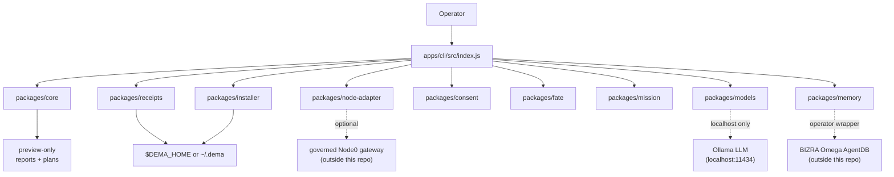

# Dema Architecture · Focused View

> **Purpose:** Dema-focused architectural view organized around the four roles Dema plays in the BIZRA ecosystem: **face · cockpit · consent layer · bridge**. The companion to [`docs/ARCHITECTURE.md`](ARCHITECTURE.md), which is the full system architecture with the complete command-to-surface map (75+ rows). This doc compresses the *Dema* slice for reviewers who want to understand Dema-as-product without parsing every command.
>
> **Why a separate file:** ARCHITECTURE.md is 40 KB and covers every surface in detail. New engineers need a focused entry that names Dema's load-bearing roles before they dive into the per-command schema. Per GTM Readiness Matrix row #7 DoD: *"Dema as face / cockpit / consent layer / bridge · separate file for focus"*.
>
> **Scope:** This doc covers Dema only. The BIZRA Omega substrate (Rust workspace inside `bizra-data-lake`, per [ADR-003](06-adr/ADR-003-core-truth-lives-in-bizra-omega.md)) is referenced by boundary, not described.
>
> **Last verified:** 2026-05-24 GST against `main @ 549b05d`.

---

## The four roles

Dema is intentionally small. It plays exactly four roles in the BIZRA stack — no more.

### Role 1 · Face

> *"Dema is the One Face"* — [ADR-001](06-adr/ADR-001-dema-is-one-face.md)

Dema is the **sole product-facing surface** of the BIZRA ecosystem. Specialist systems (BIZRA Omega substrate · Rust workspace · governed gateway · mint pipeline · agent runtime) do not bind to users directly. Users see Dema. Dema talks to the substrate.

Translation: when a reviewer asks *"what does the user actually run?"* — the answer is `node bin/dema <subcommand>`, full stop. There is no parallel user-facing surface.

### Role 2 · Cockpit

Dema is the **read-only state cockpit** for Node0:

- `dema status` — readiness snapshot (Identity · Readiness · Findings · Boundary)
- `dema doctor` — row-by-row predicates with fix hints · exits 1 honestly
- `dema receipts` — list local receipts (read/list only, NO mint)
- `dema memory` — operator memory inspection
- `dema audit` — system organ checks

The cockpit's whole product property is **Verified Refusal**: it refuses cleanly, names the gap, and prints the fix. See [`THIRD_FACT_CURRENT_STATE_DELTA.md`](THIRD_FACT_CURRENT_STATE_DELTA.md) TF-004 — promoted as the strongest MEASURED product behavior.

### Role 3 · Consent Layer

> *"Operator Actions Require Explicit Consent"* — [ADR-005](06-adr/ADR-005-operator-actions-require-explicit-consent.md)

Dema is where the operator's **typed-GO consent is bound to a narrow ConsentPlan** before any action crosses into the governed runtime:

- `dema consent plan "<intent>"` — produces a ConsentPlan with permissions, actuator classes, policy-preview decisions, commitment_hash, and self-proactive harness
- `dema mission draft "<intent>"` — drafts an intent into mission shape
- `dema mission propose` — previews ARTIFACT-011 readiness only
- `packages/fate/src/fate.js` — exact-string consent gate · strict `===` byte match · fail-closed · 16 dedicated tests

Consent is **exact**, **narrow**, and **action-specific**. The commitment_hash binds the intent — change one byte and the hash changes, forcing a fresh review.

### Role 4 · Bridge

Dema is the bridge between three things that are otherwise siloed:

| Bridge endpoint A | Bridge endpoint B | How Dema bridges them |
|---|---|---|
| Local operator (human at terminal) | Governed Node0 runtime (separate process · separate repo) | `dema mission propose` + Node0 adapter (`DEMA_NODE0_STATUS_COMMAND` env var · or future bizra-cognition-gateway HTTP surface per [ADR-003](06-adr/ADR-003-core-truth-lives-in-bizra-omega.md)) |
| Local operator | BIZRA Omega AgentDB memory store | `dema memory query "<query>"` MC-A v0.1 · JS→Python wrapper bridge · localhost-only · ADR-022 substrate-out doctrine |
| Local operator | Local LLM (Ollama) | `dema model-broker route --invoke` · ADR-018 · 6 sequential safety gates · localhost-bound · exact-string consent |

Dema does **not** own the substrate, the gateway, the AgentDB, or the LLM. It owns the **contract** with each — the schema-tagged envelope, the consent gate, the boundary keys.

---

## Position relative to BIZRA Omega

```text
┌────────────────────────────────────────────────────────────────┐
│  BIZRA ECOSYSTEM                                                 │
│                                                                  │
│  ┌────────────────────────┐         ┌──────────────────────────┐ │
│  │   DEMA (this repo)      │         │   BIZRA OMEGA            │ │
│  │   Product face          │ ──────▶ │   (bizra-data-lake)      │ │
│  │   Node.js · stdlib      │ adapter │   Rust · 27+ crates      │ │
│  │   Local · read-only     │ contract│   Governed runtime       │ │
│  │   Receipt viewer        │ ◀────── │   Mint authority         │ │
│  │   Consent gate          │ receipt │   Agent runtime          │ │
│  │                          │   path  │   Chain authority        │ │
│  └────────────────────────┘         └──────────────────────────┘ │
│         ▲                                                          │
│         │ user types here                                          │
└─────────┼──────────────────────────────────────────────────────────┘
          │
        operator
```

**Read this as:** Dema sits between the operator and the substrate. It can preview, list, and propose. It cannot mint, federate, execute, or sign — those live in the substrate per [ADR-003](06-adr/ADR-003-core-truth-lives-in-bizra-omega.md).

Per [ADR-022](06-adr/) (substrate-out doctrine — operator-side memory holds the reference): the Omega substrate is **not** in this repo. It lives at `/data/bizra/dema-runtime-arch-wt/` for the operator and is referenced by path, never imported.

---

## Core shape



The 12 internal packages map to the four roles:

| Role | Packages | Purpose |
|---|---|---|
| **Face** | `apps/cli/src/index.js` · `packages/core` | The CLI entrypoint + shared core primitives |
| **Cockpit** | `packages/node-adapter` · `packages/receipts` · `packages/memory` · `packages/verifier` | State reading from adapter · receipt list · memory inspection · invariant checks |
| **Consent Layer** | `packages/fate` · `packages/consent` · `packages/mission` | Constitutional gate · ConsentPlan draft · Mission draft |
| **Bridge** | `packages/installer` · `packages/models` · `packages/tasks` | Local-skeleton install · model broker · task scheduling |

---

## Runtime boundary

```text
Operator
  ↓ types command in terminal
Dema CLI
  ↓ local preview / status / consent draft / mission draft
Node0 adapter (optional connection)
  ↓ governed runtime call (outside this repo)
Governed runtime
  ↓ produces receipt
Local receipt handoff
  ↓ written to $DEMA_HOME/receipts/
Dema receipt viewer
  ↑ reads back
Operator
```

**Dema does not own dangerous execution.** It talks to adapters. Adapters talk to governed runtime. Receipts decide what can be inspected after the fact. See [`docs/ARCHITECTURE.md`](ARCHITECTURE.md) §"Runtime boundary" for the canonical text.

---

## Local state

All Dema-managed local state lives under `$DEMA_HOME` (default `~/.dema/`):

```text
~/.dema/
├── profile.json         # operator profile (created by `dema setup`)
├── config.local.json    # local config (created by `dema setup`)
├── receipts/            # receipts received from governed gateway
├── memory/              # operator-side memory store
├── logs/                # Dema activity logs
└── skills/              # operator-installed skills
```

**No hidden state.** Per [ADR-002](06-adr/ADR-002-no-shadow-state.md), Dema never holds state outside `$DEMA_HOME`. Per [ADR-004](06-adr/ADR-004-local-first-memory.md), memory is on-disk and operator-inspectable, never opaque cloud embeddings.

For the full operator's daily-ops reference, see [`docs/NODE0_OPERATOR_GUIDE.md`](NODE0_OPERATOR_GUIDE.md).

---

## Adapter model

The Node0 adapter (`packages/node-adapter`) defaults to **blocked**. If no governed Node0 runtime is connected, Dema reports `BLOCKED` honestly rather than pretending readiness. Two adapter paths:

1. **Current**: shell-out via `DEMA_NODE0_STATUS_COMMAND` env var (operator-side)
2. **Future** (per [ADR-003](06-adr/ADR-003-core-truth-lives-in-bizra-omega.md)): `bizra-cognition-gateway` HTTP surface inside the BIZRA substrate

**Adapter input is untrusted.** Normalization coerces values and preserves unknowns safely. See `packages/node-adapter/src/` for the implementation.

---

## Consent model

> *"Consent is exact, narrow, and action-specific."*

The consent flow:

1. Operator types intent: `dema consent plan "<intent>"`
2. Dema emits a `ConsentPlan` envelope with:
   - Proposed permissions (per-file · per-service · scoped)
   - Actuator classes (none · file · network · process · gui)
   - Policy preview (allowed · blocked · requires-narrowing)
   - `commitment_hash` (sha256 of intent + scope)
   - Self-proactive harness (recommended micro-action)
3. The ConsentPlan is **preview-only** — not approval.
4. Approval requires an exact-string typed GO matching a phrase template (e.g., `GO: invoke local LLM at <model_id>`).
5. FATE (`packages/fate/src/fate.js`) does strict byte-match validation, fail-closed.

The `commitment_hash` makes consent **non-fungible** — changing the intent by one byte produces a different hash, invalidating the prior plan.

Anchors: [ADR-005](06-adr/ADR-005-operator-actions-require-explicit-consent.md) · [ADR-006](06-adr/ADR-006-continuous-assurance-and-no-mint-verification.md) · TF-007 in [`THIRD_FACT_CURRENT_STATE_DELTA.md`](THIRD_FACT_CURRENT_STATE_DELTA.md).

---

## Receipt model

Dema reads receipts from local files. The governed runtime path creates receipt handoffs. This distinction is **binding**:

```text
Dema lists and shows.
Governed runtime issues.
```

The first canonical receipt — ARTIFACT-011 — is issued by the governed gateway and written to `~/.dema/receipts/artifact-011.json` (chain length 8 · admissibility verdict `Permit`).

Anchors: [ADR-006](06-adr/ADR-006-continuous-assurance-and-no-mint-verification.md) (verify is state-read-only · mint is bifurcated) · [ADR-007](06-adr/ADR-007-multi-session-chain-policy.md) (multi-session chain mutation policy · Accepted · A/B/C deferred).

---

## Multi-node boundary

Dema includes Node1/Node2 readiness primitives **as preview only**:

- `dema network blueprint` — readiness map
- `dema network fixture preview` — offline 5-slot schematic · 0 live nodes
- `dema network refusal preview` — partition/rejoin refusal matrix

These commands describe future federation contracts but must **not**:
connect nodes · open sockets · perform handshakes · start federation · issue identity artifacts · mint receipts · execute runtime work.

Per [`THIRD_FACT_CURRENT_STATE_DELTA.md`](THIRD_FACT_CURRENT_STATE_DELTA.md) TF-012: federation is `DESIGNED_NOT_LIVE`. Per [`docs/CURRENT_LIMITS.md`](CURRENT_LIMITS.md) "Hard non-claims": "Nodes are synchronized → status today: DESIGNED_NOT_LIVE".

---

## Engineering constraints

| Constraint | Source |
|---|---|
| Node.js ≥ 20 | `package.json` engines |
| ESM modules | `package.json` `"type": "module"` |
| Zero runtime dependencies | `package.json` (no `dependencies`) |
| Zero dev dependencies | `package.json` (no `devDependencies`) |
| No build step | `node bin/dema` runs from source |
| No npm workspaces | Package imports use relative paths |
| Tests use `node:test` | `node --test tests/*.test.js` · 2618/2618 PASS |
| Stdlib-only posture | No `node_modules` directory at all |

These are **invariants**, not preferences. The smoke matrix and the test surface verify them on every CI run.

---

## Verification commands

```bash
npm test                 # 2618/2618 PASS · ~7.7s · no deps · stdlib only
npm run check            # aggregator (env-hygiene + coverage + ~40 CLI subcalls)
npm run llm:guidance     # 7/7 router/canon checks
npm run release:readiness # 0 risks · score 100/100
git diff --check         # whitespace + conflict markers
```

See [`docs/RELEASE_PROCESS.md`](RELEASE_PROCESS.md) §2 for the full 3-layer gate chain (local pre-commit · pre-push μ-layer · remote CI).

---

## What this doc deliberately does NOT cover

| Topic | Where it lives |
|---|---|
| Per-command schema detail (75+ subcommands) | [`docs/ARCHITECTURE.md`](ARCHITECTURE.md) §"Command-to-surface map" |
| BIZRA Omega substrate (Rust workspace) | [ADR-003](06-adr/ADR-003-core-truth-lives-in-bizra-omega.md) · operator-side at `/data/bizra/dema-runtime-arch-wt/` |
| PAT-7 / SAT-5 agent designs | Third Fact §III · ROADMAP §220+ · TF-008 in [`THIRD_FACT_CURRENT_STATE_DELTA.md`](THIRD_FACT_CURRENT_STATE_DELTA.md) |
| Receipt mint flow | [ADR-006](06-adr/ADR-006-continuous-assurance-and-no-mint-verification.md) · governed gateway (separate repo) |
| First-runner walkthrough | [`docs/QUICKSTART.md`](QUICKSTART.md) |
| Daily operator ops | [`docs/NODE0_OPERATOR_GUIDE.md`](NODE0_OPERATOR_GUIDE.md) |
| Demo flow | [`docs/DEMO_SCRIPT.md`](DEMO_SCRIPT.md) |
| CI workflow internals | [`docs/CI_CD_PIPELINE.md`](CI_CD_PIPELINE.md) |
| Release lifecycle | [`docs/RELEASE_PROCESS.md`](RELEASE_PROCESS.md) |

This doc is a focused architectural overview, not a comprehensive reference. Use the links above when you need the detail.

---

## Related

- [`docs/ARCHITECTURE.md`](ARCHITECTURE.md) — full system architecture · canonical
- [`docs/THIRD_FACT_CURRENT_STATE_DELTA.md`](THIRD_FACT_CURRENT_STATE_DELTA.md) — doctrine-to-disk classification
- [`docs/CURRENT_LIMITS.md`](CURRENT_LIMITS.md) — labeled truth boundaries
- [`docs/06-adr/INDEX.md`](06-adr/INDEX.md) — ADR map (18 records)
- [`docs/GTM_READINESS_MATRIX.md`](GTM_READINESS_MATRIX.md) — this doc closes Tier-2 row #7
- [`docs/00_START_HERE.md`](00_START_HERE.md) — reviewer routing entry point

---

## Update protocol

Re-refresh this doc when:
- A new top-level role emerges in Dema's design (currently 4 · Face · Cockpit · Consent · Bridge).
- A new package lands in `packages/` and changes the role mapping table.
- An ADR materially shifts Dema's relationship to the substrate (e.g., bizra-cognition-gateway promotion from future to current adapter path).
- The 4-role framing is challenged by a new requirement that doesn't fit.

Update the **Last verified** line and `main @ <sha>` reference on every refresh.
