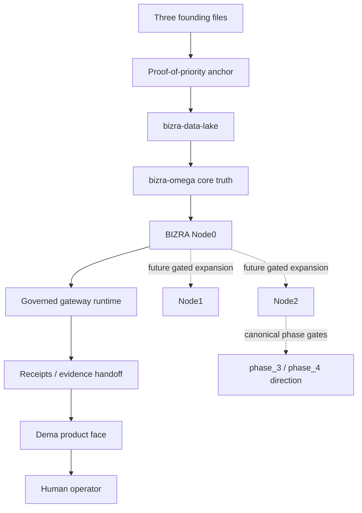

# BIZRA Ecosystem Map

Dema is one visible face of a larger BIZRA system. This file names the parts without claiming that every part is public, shipped, or connected from this repo.

## High-level map

## The seed documents

The repo carries three founding files:

| File                              | Role                                             |
| --------------------------------- | ------------------------------------------------ |
| `themassage.pdf`                  | Personal letter from 2023.                       |
| `bizra.pdf`                       | Seed document from 2023.                         |
| `BIZRA_Third_Fact_v0_1_FINAL.pdf` | Third Fact v0.1, current-state public manifesto. |

The proof-of-priority pin is [../proof-of-priority/PIN.md](../proof-of-priority/PIN.md). It records the deterministic Merkle root and the OpenTimestamps upgrade status.

## Components

| Component             | Role                                                      | Boundary in this repo                                                    |
| --------------------- | --------------------------------------------------------- | ------------------------------------------------------------------------ |
| Dema                  | Human-facing local product shell.                         | Setup, status, previews, receipt reading.                                |
| Node0                 | First governed BIZRA node.                                | Reached through adapter/gateway boundaries; not owned as runtime here.   |
| bizra-data-lake       | Wider substrate that contains bizra-omega.                | Named by ADR-003; not duplicated here.                                   |
| bizra-omega           | Core truth workspace inside the data lake.                | Source of truth direction; Dema consumes via gateway.                    |
| FATE                  | Consent and admissibility boundary.                       | Exact consent and preview gates are reflected here.                      |
| RECEIPTS              | Evidence and handoff records.                             | Dema lists and reads local receipt files.                                |
| URP / SAT / PAT / POI | Broader BIZRA reasoning/proof components.                 | Referenced as architecture context, not claimed as shipped Dema runtime. |
| Node1 / Node2         | Future handoff expansion.                                 | Preview-only blueprint; no connection or federation.                     |
| phase_3 / phase_4     | Canonical multi-node pilot and public-network directions. | Directional preview only; blocked until proof gates pass.                |

## What is current

- Dema can create local state under `~/.dema`.
- Dema can show status through a Node0 adapter.
- Dema can draft consent and mission previews.
- Dema can show local receipt handoffs.
- The proof-of-priority root can be reproduced from this repo.

## What remains gated

- Runtime execution.
- EffectCap minting.
- Node1/Node2 connection.
- phase_3/phase_4 multi-node pilot or public-network activation.
- Federation.
- Public network claims.
- Release publishing.
- Identity-bound artifacts.

## Design principle

Dema should make the ecosystem understandable without pretending to be the whole ecosystem.

If a feature belongs to governed runtime, Dema may preview the boundary and show a receipt handoff, but it must not silently perform the effect.
