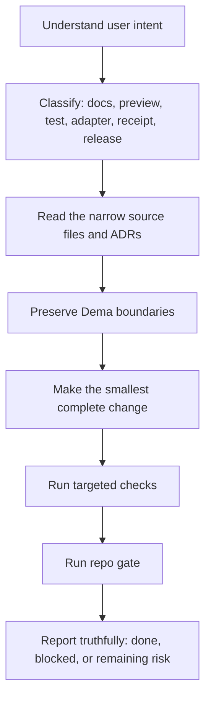

# LLM System Flow Contract

This is the canonical repo-local contract for any LLM, agent, or assistant working inside Dema.

Purpose: make the signal path obvious, reduce duplicated guidance, and stop connected models from inventing a different system flow.

## Read order

1. [README.md](../README.md) for the human-facing product promise.
2. This file for the model-facing execution flow.
3. [INDEX.md](INDEX.md) for the docs map.
4. [THREE_REPO_PRODUCT_STACK_CANON_v0_1.md](THREE_REPO_PRODUCT_STACK_CANON_v0_1.md) for the three-repo product stack canon.
5. [NODE0_DEMA_COMPLETE_COMPONENT_DNA_v0_1.md](NODE0_DEMA_COMPLETE_COMPONENT_DNA_v0_1.md) for the complete Node0 + Dema component DNA and per-layer status labels.
6. [DELIVERY_SPINE_v0_1.md](DELIVERY_SPINE_v0_1.md) for canonical delivery gates, authority table, claim gate, and release receipt template.
7. [ARCHITECTURE.md](ARCHITECTURE.md) for component boundaries.
8. [ENGINEERING_DISCIPLINE.md](ENGINEERING_DISCIPLINE.md) for engineering rules.
9. [06-adr/](06-adr/) before changing anything covered by an ADR.
10. [TESTING.md](TESTING.md) before changing tests or gates.

When uncertain whether a feature belongs in Node0, Dema, URP, UKE, pilot, or future forest, consult the Component DNA document before proposing implementation.

When changing delivery, release, CI/CD, quality gates, claim boundaries, or public launch readiness, consult DELIVERY_SPINE_v0_1.md before proposing implementation.

## System identity

```text
BIZRA is the ecosystem.
Dema is the local product face.
Node0 is the governed runtime boundary.
bizra-data-lake / bizra-omega is the deeper truth substrate.
```

Dema helps a human see local state, preview safe next steps, draft consent, draft missions, and read receipts. Dema is not the whole BIZRA system and must not pretend to be.

## Golden path for connected LLMs



## Safe local lifecycle

```text
dema welcome
-> dema onboard
-> dema setup
-> dema status
-> dema diagnostics plan
-> dema consent plan "<intent>"
-> dema mission draft "<intent>"
-> dema report safety
-> dema receipts
```

Preview commands stop at the boundary. Do not reinterpret a preview as permission to execute.

## Non-negotiable invariants

| Invariant | Source |
|---|---|
| Dema is one face, not the whole ecosystem. | [06-adr/ADR-001-dema-is-one-face.md](06-adr/ADR-001-dema-is-one-face.md) |
| No runtime execution in this repo. | [ARCHITECTURE.md](ARCHITECTURE.md) |
| No hidden daemon. | [06-adr/ADR-002-no-shadow-state.md](06-adr/ADR-002-no-shadow-state.md) |
| Exact-string consent only. | [06-adr/ADR-005-operator-actions-require-explicit-consent.md](06-adr/ADR-005-operator-actions-require-explicit-consent.md) |
| All local Dema state is under `DEMA_HOME` or `~/.dema`. | [06-adr/ADR-004-local-first-memory.md](06-adr/ADR-004-local-first-memory.md) |
| Adapter input is untrusted. | [ARCHITECTURE.md](ARCHITECTURE.md) |
| Receipts are read/list here; governed runtime issues. | [RECEIPTS.md](RECEIPTS.md) |
| Node1 / Node2 are preview-only until proof gates pass. | [GTM.md](GTM.md) |

## Hard stop gates

Stop and require explicit user authorization before:

- pushing to `main` or a shared branch,
- force-pushing or destructive git,
- modifying CI workflows,
- posting to GitHub issues or PRs,
- publishing releases or installer endpoints,
- issuing identity-bound artifacts,
- starting runtime, daemon, federation, Node1, or Node2,
- stamping or upgrading public timestamp artifacts.

## Proof-safe language

Use clear, measured language.

Allowed:

```text
preview
local-first
consent-bound
receipt-aware
read-only audit
governed runtime handoff
blocked until proof gates pass
```

Forbidden as product claims:

```text
AGI
passive income
token rewards
guaranteed security
federation is live
Node1/Node2 connected
Dema minted the runtime receipt
```

It is acceptable to mention those phrases only when explicitly labeling them as forbidden or not claimed.

## Noise classification

Use [INDEX.md](INDEX.md) to decide what is authoritative.

| Area | Classification |
|---|---|
| `README.md` | Public front door. |
| `docs/INDEX.md` | Navigation source of truth. |
| `docs/06-adr/` | Binding decisions. |
| `docs/_absorbed/` | Historical, non-authoritative unless re-promoted. |
| `docs/superpowers/` | Working design artifacts, not public onboarding. |
| `proof-of-priority/` | Canonical proof-of-priority pin and artifacts. |
| `.artifacts/`, `.proof-forge/`, `.qodo/`, `.claude/` | Local/tool output ignored by git. |

Do not delete historical docs to reduce noise. Classify them and route readers to the current source.

## Change discipline

1. Search before adding new helpers.
2. Keep one concept per change.
3. Prefer pure functions and schema-tagged outputs.
4. Keep new files under 500 lines unless there is an explicit reason.
5. Do not add runtime dependencies without written justification.
6. Do not broaden consent, local state, adapter, receipt, or network boundaries.

## Verification ladder

Use the narrowest check first, then the full local gate.

```bash
node --test tests/<surface>.test.js
npm test
npm run check
npm run llm:guidance
npm run release:readiness
git diff --check
```

`npm run llm:guidance` enforces that root agent files and the docs map keep pointing back to this contract.

## Completion rule

Finish with a truthful state:

```text
done and verified
done with known remaining risk
blocked by explicit halt gate
blocked by failing check
```

Do not claim completion if tests, docs links, or guidance checks fail.
