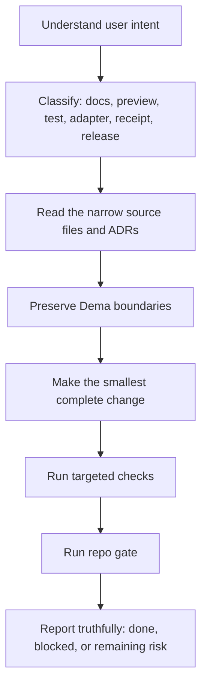

# LLM System Flow Contract

This is the canonical repo-local contract for any LLM, agent, or assistant working inside Dema.

Purpose: make the signal path obvious, reduce duplicated guidance, and stop connected models from inventing a different system flow.

## Read order

1. [README.md](../README.md) for the human-facing product promise.
2. This file for the model-facing execution flow.
3. [INDEX.md](INDEX.md) for the docs map.
4. [THREE_REPO_PRODUCT_STACK_CANON_v0_1.md](THREE_REPO_PRODUCT_STACK_CANON_v0_1.md) for the three-repo product stack canon.
5. [NODE0_DEMA_COMPLETE_COMPONENT_DNA_v0_1.md](NODE0_DEMA_COMPLETE_COMPONENT_DNA_v0_1.md) for the complete Node0 + Dema component DNA and per-layer status labels.
6. [DELIVERY_SPINE_v0_1.md](DELIVERY_SPINE_v0_1.md) for canonical delivery gates, authority table, claim gate, and release receipt template.
7. [CLAIM_REGISTER_v0_1.md](CLAIM_REGISTER_v0_1.md) for the public-face truth-label taxonomy, forbidden claims, and Claim Review Gate.
8. [BIZRA_AGENT_DNA_LAW_OF_ASSUMPTION_v0_1.md](BIZRA_AGENT_DNA_LAW_OF_ASSUMPTION_v0_1.md) for the agent DNA Law of Assumption — how every BIZRA agent handles uncertainty, disagreement, evidence, humility, and unavoidable assumptions (Arabic + English law text · 6-field Required Output Pattern · 12 forbidden behaviors).
9. [DEMA_AGENT_HARNESS_AND_SKILL_DNA_v0_1.md](DEMA_AGENT_HARNESS_AND_SKILL_DNA_v0_1.md) for the agent DNA acting layer — Harness Law + Skill Law · 10-step Dema agent loop · 6 runtime boundaries · 10-field Required Runtime Pattern · 12 forbidden behaviors.
10. [BIZRA_ROOT_SOURCE_OF_TRUTH_v0_1.md](BIZRA_ROOT_SOURCE_OF_TRUTH_v0_1.md) for the BIZRA origin chain, moral spine, and canonical public paragraph.
11. [BIZRA_ORIGIN_VIDEO_001_CANON_v0_1.md](BIZRA_ORIGIN_VIDEO_001_CANON_v0_1.md) for the first known BIZRA cinematic message, transcript, meaning, and timestamp-evidence status.
12. [NODE0_FOUNDER_PROOF_AND_HUMAN_CHOICE_v0_1.md](NODE0_FOUNDER_PROOF_AND_HUMAN_CHOICE_v0_1.md) for the first human proof path behind Node0 with truth-labeled evidence.
13. [BIZRA_2026_FIRST_LOOK_NARRATIVE_v0_1.md](BIZRA_2026_FIRST_LOOK_NARRATIVE_v0_1.md) for the claim-governed 2026 First Look narrative blueprint (origin chain, 7 scenes, public wording, visual/audio direction, verification checklist).
14. [BIZRA_2026_FIRST_LOOK_PRODUCTION_BRIEF_v0_1.md](BIZRA_2026_FIRST_LOOK_PRODUCTION_BRIEF_v0_1.md) for the expression-layer brief between canon and media (asset-family briefs, prompt packs, forbidden lists, production checklist, review gate).
15. [BIZRA_THIRD_PARTY_EVALUATION_PACK_v0_1.md](BIZRA_THIRD_PARTY_EVALUATION_PACK_v0_1.md) for the reviewer-facing evaluation pack (truth buckets, evaluation maps, reviewer checklist, risk register, evidence-request roadmap).
16. [BIZRA_MARKET_ANALYSIS_v0_1.md](BIZRA_MARKET_ANALYSIS_v0_1.md) for the market-comparison frame (5 patterns, comparator landscape, differentiation map, non-claims, risks, EXTERNAL_SOURCE_REQUIRED items).
17. [HOUSE_OF_WISDOM_UKE_URP_CANON_v0_1.md](HOUSE_OF_WISDOM_UKE_URP_CANON_v0_1.md) for the constitutional definition of UKE as the SAT-governed knowledge cortex inside the URP, the 8-tier promotion ladder ending in META_CANON (system-recursive canon), SAT/PAT/Dema/URP authority boundaries, consent and privacy rules, and the House-of-Wisdom forbidden-claims list.
18. [ARCHITECTURE.md](ARCHITECTURE.md) for component boundaries.
19. [ENGINEERING_DISCIPLINE.md](ENGINEERING_DISCIPLINE.md) for engineering rules.
20. [06-adr/](06-adr/) before changing anything covered by an ADR.
21. [TESTING.md](TESTING.md) before changing tests or gates.

When uncertain whether a feature belongs in Node0, Dema, URP, UKE, pilot, or future forest, consult the Component DNA document before proposing implementation.

When drafting or implementing anything about shared knowledge, UKE, URP sharing, SAT governance, PAT proposals, the promotion ladder, META_CANON, or House of Wisdom acceptance, consult HOUSE_OF_WISDOM_UKE_URP_CANON_v0_1.md and CLAIM_REGISTER_v0_1.md first. Never promote a claim across tiers without the gates this canon defines.

When changing delivery, release, CI/CD, quality gates, claim boundaries, or public launch readiness, consult DELIVERY_SPINE_v0_1.md before proposing implementation.

When drafting README, GTM, Canva, market, emulator, token, URP, PoI, or public-facing language, consult CLAIM_REGISTER_v0_1.md before proposing wording.

When drafting public-facing BIZRA origin, mission, GTM, visual emulator, README, or founder-proof language, consult BIZRA_ROOT_SOURCE_OF_TRUTH_v0_1.md and CLAIM_REGISTER_v0_1.md before proposing wording.

When drafting BIZRA origin video, 2026 First Look, founder proof, public launch story, or visual emulator language, consult BIZRA_ORIGIN_VIDEO_001_CANON_v0_1.md before proposing wording.

When drafting founder proof, one-human/one-node narrative, public first-look copy, visual emulator story, or GTM language, consult NODE0_FOUNDER_PROOF_AND_HUMAN_CHOICE_v0_1.md and CLAIM_REGISTER_v0_1.md before proposing wording.

When drafting BIZRA first-look copy, video scripts, visual emulator language, public launch teasers, Canva prompts, or founder-story material, consult BIZRA_2026_FIRST_LOOK_NARRATIVE_v0_1.md and CLAIM_REGISTER_v0_1.md before proposing wording.

When producing any Canva slide, video frame, website page, social teaser, visual-emulator screen, lighthouse-invitation packet, or founder-story artifact, consult BIZRA_2026_FIRST_LOOK_PRODUCTION_BRIEF_v0_1.md for the asset-family brief, prompt pack, forbidden visuals/wording, Production Checklist, and Review Gate before producing the artifact.

When preparing reviewer-facing material, due-diligence response, advisor briefing, lighthouse-candidate inspection package, or partner evaluation surface, consult BIZRA_THIRD_PARTY_EVALUATION_PACK_v0_1.md as the canonical reviewability surface; never substitute marketing copy for the truth-bucket structure.

When drafting GTM, pitch, landing page, investor/advisor material, competitor comparison, or public market positioning, consult BIZRA_MARKET_ANALYSIS_v0_1.md and CLAIM_REGISTER_v0_1.md first. Treat every unsourced market fact as EXTERNAL_SOURCE_REQUIRED until v0.2+ binds the citation.

When drafting market analysis, third-party evaluation responses, GTM claims, agent behavior rules, or public language under uncertainty, consult BIZRA_AGENT_DNA_LAW_OF_ASSUMPTION_v0_1.md and CLAIM_REGISTER_v0_1.md first. Never hide uncertainty behind confidence; never fabricate to fill a gap; label assumptions with `ASSUMED-WITH-IHSAN`.

When drafting or implementing Dema agent behavior, skills, local tool use, micro-consent flows, harness checks, receipt logic, or self-critique loops, consult DEMA_AGENT_HARNESS_AND_SKILL_DNA_v0_1.md, BIZRA_AGENT_DNA_LAW_OF_ASSUMPTION_v0_1.md, and CLAIM_REGISTER_v0_1.md first.

## System identity

```text
BIZRA is the ecosystem.
Dema is the local product face.
Node0 is the governed runtime boundary.
bizra-data-lake / bizra-omega is the deeper truth substrate.
```

Dema helps a human see local state, preview safe next steps, draft consent, draft missions, and read receipts. Dema is not the whole BIZRA system and must not pretend to be.

Node0 and Dema build and support the human's **habit**; they are not the human actor.
URP is that repeatable, receipt-bound practice: it can preserve context, make
the next safe step visible, and record evidence, but it cannot manufacture a
goal, consent, authority, or an effect on the human's behalf.

## Golden path for connected LLMs



## Safe local lifecycle

```text
dema welcome
-> dema onboard
-> dema setup
-> dema status
-> dema diagnostics plan
-> dema consent plan "<intent>"
-> dema mission draft "<intent>"
-> dema report safety
-> dema receipts
```

Preview commands stop at the boundary. Do not reinterpret a preview as permission to execute.

## Non-negotiable invariants

| Invariant                                               | Source                                                                                                                     |
| ------------------------------------------------------- | -------------------------------------------------------------------------------------------------------------------------- |
| Dema is one face, not the whole ecosystem.              | [06-adr/ADR-001-dema-is-one-face.md](06-adr/ADR-001-dema-is-one-face.md)                                                   |
| No runtime execution in this repo.                      | [ARCHITECTURE.md](ARCHITECTURE.md)                                                                                         |
| No hidden daemon.                                       | [06-adr/ADR-002-no-shadow-state.md](06-adr/ADR-002-no-shadow-state.md)                                                     |
| Exact-string consent only.                              | [06-adr/ADR-005-operator-actions-require-explicit-consent.md](06-adr/ADR-005-operator-actions-require-explicit-consent.md) |
| All local Dema state is under `DEMA_HOME` or `~/.dema`. | [06-adr/ADR-004-local-first-memory.md](06-adr/ADR-004-local-first-memory.md)                                               |
| Adapter input is untrusted.                             | [ARCHITECTURE.md](ARCHITECTURE.md)                                                                                         |
| Receipts are read/list here; governed runtime issues.   | [RECEIPTS.md](RECEIPTS.md)                                                                                                 |
| Node1 / Node2 are preview-only until proof gates pass.  | [GTM.md](GTM.md)                                                                                                           |

## Policy, boundary, and constitutional authority

Every agent must keep these three concepts separate:

```text
POLICY
  decides whether a requested route is eligible.
  Policy can narrow choices or refuse a request; it never creates authority.

BOUNDARY
  states which effects are actually possible or occurred in this operation.
  An all-false boundary means no execution, network, provider call, state change,
  consent consumption, receipt mint, or other consequential effect occurred.

CONSTITUTION
  binds who may authorize which class of consequence.
  The human grants exact consent; FATE/governed runtime enforces it; Dema presents
  it. A model, CLI, adapter, or deterministic harness cannot grant itself consent,
  expand authority, or convert a proposal into an effect.

HABIT, NOT ACTOR
  Node0/Dema and URP support a human's repeatable, evidence-bound practice.
  They may remind, preview, propose, verify, and record; they may not invent the
  human's intent, treat a routine as standing consent, or act as the human.
```

Operational rule:

```text
observe → validate → refuse or propose → independent verification →
human exact consent → governed authorization → bounded effect → receipt
```

Stop at `UNKNOWN` or `REFUSED`. Never use a fallback, environment variable,
native tool configuration, provider response, or self-critique result as hidden
permission. For external inference, classify the route as `EXTERNAL_PROCESSING`
before any prompt leaves the machine; an admission plan is not an invocation.

## Hard stop gates

Stop and require explicit user authorization before:

- pushing to `main` or a shared branch,
- force-pushing or destructive git,
- modifying CI workflows,
- posting to GitHub issues or PRs,
- publishing releases or installer endpoints,
- issuing identity-bound artifacts,
- starting runtime, daemon, federation, Node1, or Node2,
- stamping or upgrading public timestamp artifacts.

## Proof-safe language

Use clear, measured language.

Allowed:

```text
preview
local-first
consent-bound
receipt-aware
read-only audit
governed runtime handoff
blocked until proof gates pass
```

Forbidden as product claims:

```text
AGI
passive income
token rewards
guaranteed security
federation is live
Node1/Node2 connected
Dema minted the runtime receipt
```

It is acceptable to mention those phrases only when explicitly labeling them as forbidden or not claimed.

## Noise classification

Use [INDEX.md](INDEX.md) to decide what is authoritative.

| Area                                                 | Classification                                    |
| ---------------------------------------------------- | ------------------------------------------------- |
| `README.md`                                          | Public front door.                                |
| `docs/INDEX.md`                                      | Navigation source of truth.                       |
| `docs/06-adr/`                                       | Binding decisions.                                |
| `docs/_absorbed/`                                    | Historical, non-authoritative unless re-promoted. |
| `docs/superpowers/`                                  | Working design artifacts, not public onboarding.  |
| `proof-of-priority/`                                 | Canonical proof-of-priority pin and artifacts.    |
| `.artifacts/`, `.proof-forge/`, `.qodo/`, `.claude/` | Local/tool output ignored by git.                 |

Do not delete historical docs to reduce noise. Classify them and route readers to the current source.

## Change discipline

1. Search before adding new helpers.
2. Keep one concept per change.
3. Prefer pure functions and schema-tagged outputs.
4. Keep new files under 500 lines unless there is an explicit reason.
5. Do not add runtime dependencies without written justification.
6. Do not broaden consent, local state, adapter, receipt, or network boundaries.

## Verification ladder

Use the narrowest check first, then the full local gate.

```bash
node --test tests/<surface>.test.js
npm test
npm run check
npm run llm:guidance
npm run release:readiness
npm run gtm:readiness
npm run urp:discovery
npm run proof:room
npm run eval:layer1 -- --artifact <abs-path-to-artifact> [--json]
git diff --check
```

`npm run llm:guidance` enforces that root agent files and the docs map keep pointing back to this contract.

## Completion rule

Finish with a truthful state:

```text
done and verified
done with known remaining risk
blocked by explicit halt gate
blocked by failing check
```

Do not claim completion if tests, docs links, or guidance checks fail.
