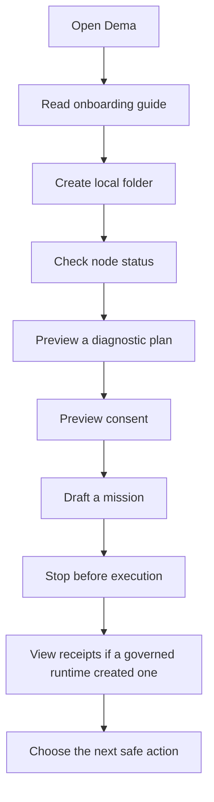

# Dema User Lifecycle

This guide is for a person with no technical background. It explains the safe local journey from "I opened Dema" to "I know the next safe step."

Scope note: this file is the user journey. [FIRST_RUN_WIZARD.md](FIRST_RUN_WIZARD.md) is the screen-by-screen product spec.

## One-sentence promise

Dema shows what is true on your computer, what is safe to preview, what is blocked, and what needs explicit consent before anything can act.

## The lifecycle



## Step 1: Welcome

Run:

```bash
dema welcome
```

You should see a short orientation:

```text
Welcome to Dema.
Dema -- Sovereign AI Node Companion

Local-first. Consent-bound. Receipt-aware.
```

Meaning: Dema starts by explaining boundaries instead of hiding them.

## Step 2: Read the guided onboarding

Run:

```bash
dema onboard
```

This shows the safe first-run path in plain language. It explains each command, the value for the user, and the guardrail that prevents hidden effects.

For machine-readable onboarding, use:

```bash
dema onboard --json
```

The JSON output is still preview-only. It does not create files, start runtime, mint receipts, connect Node1/Node2, or start a multi-node pilot.

## Step 3: Create your local Dema folder

Run:

```bash
dema setup
```

Dema creates:

```text
~/.dema/
  profile.json
  config.local.json
  receipts/
  memory/
  logs/
  skills/
```

This is your local Dema home. It stays on your computer unless you intentionally copy or sync it.

Dema does not overwrite an existing profile or config.

## Step 4: Check readiness

Run:

```bash
dema status
```

Read the output as a traffic light:

| Field | What it means |
|---|---|
| `Ready` | Whether Dema sees enough local Node0 readiness. |
| `Console ready` | Whether the operator console path appears ready. |
| `Activation gate` | Whether action is blocked or waiting for explicit GO. |
| `Daemon` | Must not show a hidden running daemon for the safe default. |
| `Findings` | Plain-language reasons for any blocked state. |

If readiness is blocked, that is not a failure. It is Dema refusing to pretend.

## Step 5: Preview diagnostics

Run:

```bash
dema diagnostics plan
```

This previews a self-check plan. It may mention checks such as local model inventory, `npm test`, `npm run check`, and safety posture.

It does not run those checks. It only tells you what a safe diagnostic mission would include.

## Step 6: Preview consent

Run:

```bash
dema consent plan "Check my local node health"
```

Dema converts your sentence into a proposed permission scope. It shows what files, commands, or services would be involved if the intent later moved into governed runtime.

Important: this does not approve consent. It is a draft for review.

## Step 7: Draft a mission

Run:

```bash
dema mission draft "Check my local node health"
```

This creates a mission draft from your intent and includes the matching consent preview.

The mission stays in draft state. Dema does not execute it.

## Step 8: Stop at the consent boundary

Runtime work requires exact consent and the governed Node0 path. The first bounded diagnostic phrase is:

```text
GO: Node0 bounded diagnostic activation only
```

Do not treat that phrase as a password or shortcut. It is a boundary marker for one specific action class.

## Step 9: View receipts

Run:

```bash
dema receipts
```

If a governed runtime has produced a local handoff, Dema can list it. To read one:

```bash
dema receipts ARTIFACT-011
```

A receipt should tell you:

```text
what happened,
what did not happen,
what evidence exists,
and what the next safe action is.
```

Dema reads receipts. It does not create runtime receipts from preview commands.

## Step 10: Decide the next safe action

Use:

```bash
dema report safety
dema network blueprint
```

`report safety` explains current safety posture. `network blueprint` explains Node1/Node2 handoff gates and phase-gated multi-node readiness.

Both are previews. They do not certify, connect, federate, or open sockets.

## Healthy local loop

For a normal local check, this sequence should complete without hidden effects:

```bash
dema welcome
dema onboard
dema setup
dema status
dema diagnostics plan
dema consent plan "Check my local node health"
dema mission draft "Check my local node health"
dema report safety
dema receipts
```

## What Dema never does silently

- It does not start a hidden daemon.
- It does not overwrite your profile.
- It does not run Bash from a preview command.
- It does not call a model from a preview command.
- It does not send your files to a cloud provider by default.
- It does not connect Node1, Node2, or any multi-node pilot.
- It does not mint a receipt inside this repo.

## Troubleshooting in plain language

| Message | Plain meaning | Safe response |
|---|---|---|
| `Node0 adapter not connected` | The deeper runtime is not connected. | Continue with previews or ask a technical operator to connect Node0. |
| `Activation gate: BLOCKED` | Dema will not act yet. | Read the findings and fix prerequisites first. |
| `No receipts found` | There are no local receipt files. | Run `dema setup`; then check whether a governed runtime produced a handoff. |
| `doctor` fails | Dema found a safety or readiness gap. | Treat the failure as useful protection. |

## If you need help

Share the output of:

```bash
dema status
dema report safety
dema receipts
```

Do not share private files, secrets, tokens, or personal data.
