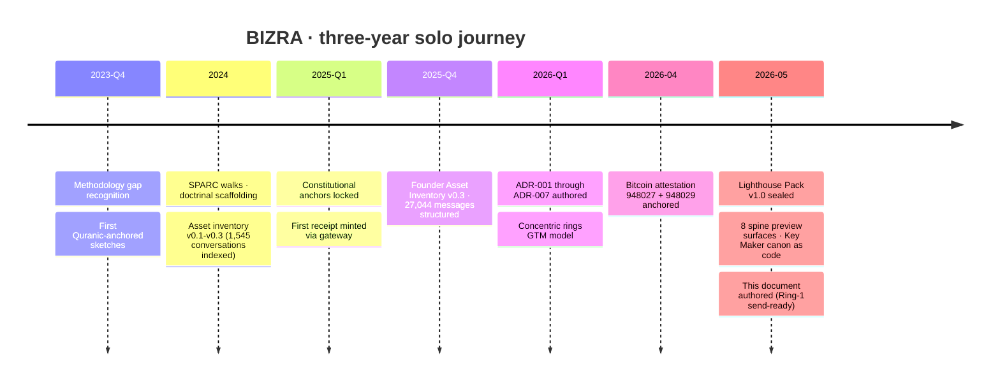
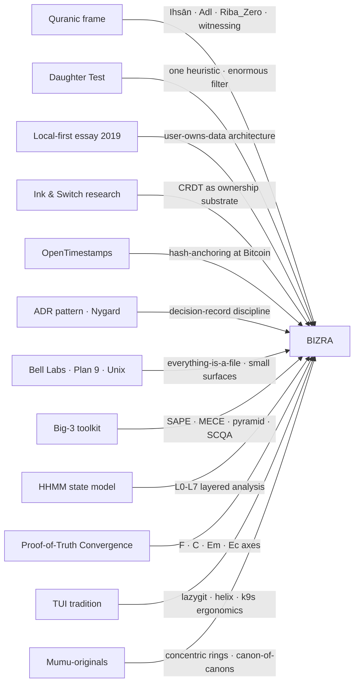
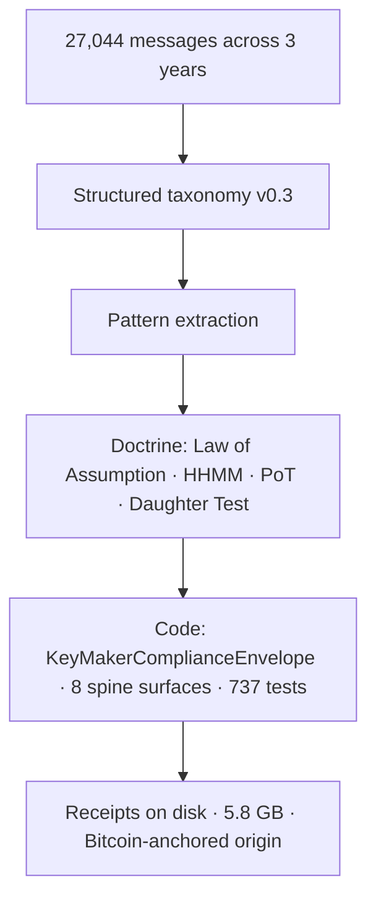

# Founder Field Notes · v0.1
## BIZRA · Three Years Solo with Peak Humanity Knowledge

**Status:** Proposed · for Ring-1 reviewer orientation + Ring-3 seed
**Authored:** 2026-05-18 GST
**Author voice:** First-person (Mohamed Beshr · "Mumu")
**Audience:** A future solo builder with technical rigor and time to read
**Length:** ~3,800 words

**Bound by** [CLAUDE.md](../../CLAUDE.md), [Key Maker Epistemic Conduct v0.1](../02-architecture/key-maker-epistemic-conduct-v0.1.md), [Node0 + DEMA Goal v0.2](../02-architecture/node0-dema-goal-v0.2.md).

---

## §0 · What this document is and is not

This is a field manual, not a memoir. It documents a three-year solo journey building [BIZRA](../../README.md) — a sovereign AI homebase — through LLM partnership. It is written for the kid five years from now who wants to walk a similar path and needs to know whether it is real.

**What this document IS:**

- Evidence-bound storytelling, with every load-bearing claim linking to a verifiable artifact (file path · SHA · Bitcoin block · memory anchor)
- A teachable extraction of the methodology patterns that emerged, written so another solo builder can apply them
- An honest catalog of the twelve giants whose work moved BIZRA materially, regardless of fame
- The first articulation of what I call the empowerment thesis: *peak human methodology, previously gated to elite consulting clients, is now accessible to anyone with discipline and LLM partnership*

**What this document is NOT:**

- Not marketing. There is no product launch behind this document. BIZRA is at Ring 0 (founder-verified) and Ring 1 (single external reviewer) is unearned at the time of writing
- Not memoir. Personal narrative serves only to anchor methodology
- Not a manifesto. Every claim is V (verified), D (derived), A (assumed with Ihsān), or U (named ignorance), per the [Key Maker canon §3](../02-architecture/key-maker-epistemic-conduct-v0.1.md)
- Not a how-to-build-BIZRA tutorial. This is a how-to-walk-the-path manual
- Not a claim about scale. Solo dev + LLM ≠ team of 50. The empowerment thesis is about access, not magnitude

Reading note: when I write *verified*, the evidence is reachable; when I write *assumed-with-Ihsān*, the assumption is declared.

---

## §1 · The realization (the McKinsey moment)

For most of human history, the world-class methodology for thinking through hard problems — the Big-3 consulting frameworks (SAPE · MECE · 80/20 · SCQA · pyramid principle), the Bell Labs engineering tradition, the Quranic ethical frame, the rigorous research-design protocols of academic labs — was gated.

Not by IQ. Not by talent. By **access**.

If you wanted McKinsey-grade analysis applied to your problem, you paid $500K minimum for a 50-person engagement, and you needed to be running a Fortune 500 division to be a customer. If you wanted the structured decomposition that a partner at BCG applies to a market entry question, you needed to BE BCG or work for someone who hired them. If you wanted the multi-disciplinary synthesis that a senior Bell Labs researcher could give a problem — the kind that produced UNIX, the transistor, information theory — you needed to be at Bell Labs or in its diaspora.

The methodology existed. The methodology was teachable in principle. But for almost all solo builders in almost all contexts, the methodology was unreachable in practice.

What changed around 2022 is precise and limited: **LLMs cannot replace 50 senior consultants, but they can apply the same methodology to one solo founder's specific problem at the moment that founder needs it.**

That is the realization that started BIZRA.

I noticed I could run my problem through SAPE on a Tuesday afternoon, get genuine structured decomposition, push back on it, refine it, and arrive at an answer of comparable quality to what a junior associate at McKinsey would produce — in 40 minutes instead of 4 weeks, for the cost of an LLM subscription instead of $50,000.

I am not claiming this is the same as having McKinsey. I am claiming the **methodology gap closed**, even when the manpower gap did not.

The rest of this document is what I did once I noticed.

---

## §2 · What I could not afford

To be precise about what closed: here are the things three years ago that I could not afford, and what they would have cost.

| Service | Pre-LLM cost | What it produced | Solo-with-LLM access? |
|---|---:|---|---|
| McKinsey strategic engagement | ~$1M / 3 months | Multi-framework analysis · executive deliverable · slide-bound | Methodology yes · slides no · staff no |
| Senior architect (FAANG-tier) review | $300K/yr × 0.25 | Architecture critique · pattern catalog · trade-off analysis | Mostly yes (with discipline) |
| Big-4 audit-style readiness review | ~$250K | Findings · risk classification · remediation map | Mostly yes (smaller scope) |
| Senior tech writer | $200K/yr | Specs · ADRs · runbooks · documentation | Yes |
| Peer Ph.D. researcher | varies | Literature synthesis · citation map · framing | Yes |
| Constitutional / ethics review | $50K/engagement | Values mapping · refusal taxonomy · gates | Yes (the doctrinal kind) |
| **Total** | **~$2M / project** | The package | **Available now to anyone with discipline** |

I built BIZRA at roughly $30/month in LLM subscriptions plus three years of personal time.

I did not build a $2M product. I built one founder's sovereign-AI-homebase research-and-doctrine artifact. The relevant claim is not about magnitude. It is about access: **the methodology that produced it would have been unreachable to me five years ago.**

That is what democratized.

---

## §3 · What I built instead

[BIZRA / Dema](https://github.com/BizraInfo/Dema) is a sovereign AI homebase. Local-first. Preview-only. Consent-bound. Receipt-aware. The system refuses runtime · refuses federation · refuses mint · until specific named gates are passed.

At the time of this writing (HEAD `616e533` on `season-gap2-summary-flag`), the system has:

| Surface | State | Reachable |
|---|---|---|
| 8 spine preview commands | All emit canonical 16-key boundary all-false | `dema state` · `dema profiles` · `dema consent-card` · `dema mission-loop` · `dema evidence-event` · `dema llm-router` · `dema process-mining` · `dema key-maker-check` |
| Test surface | 737/737 PASS (up from 663 at session entry) | `npm test` |
| Schema discipline | ~75 unique `bizra.dema.*.vN.M` declarations | grep packages/ |
| Local state | 5.8 GB persisted at `~/.dema/` | 24 memory entries · 3 receipts |
| Cryptographic anchor | Bitcoin block headers 948027 & 948029 | proof-of-priority/manifest.json |
| Three founding documents | `themassage.pdf` · `bizra.pdf` · `BIZRA_Third_Fact_v0_1_FINAL.pdf` | hash-bound · OpenTimestamps-anchored |
| Doctrine layer | Key Maker Epistemic Conduct v0.1 (418 lines · canonical) | docs/02-architecture/ |
| Measurement substrate | L1 baseline capture + diff tools | scripts/baseline-l1*.mjs |

Most of this is structure, not function. The system **does not act**. By design. The architecture proves the discipline; the runtime activation is deferred to a separate governed gateway not in this repository.

This is what most "is BIZRA real?" reviewers miss on first read: at Ring 0, *correct behavior looks like correct refusal*. The 16-key boundary all pinned `false` is not a failure to execute. It is the architecture telling the truth about its own scope.

The Lighthouse Pack v1.0 at `/tmp/bizra-overnight/lighthouse-pack/` packages this into 10 files (160KB) for an external technical reviewer to inspect in 10-15 minutes and try to falsify.



---

## §4 · The twelve giants

In BIZRA's economy, **giants are not famous names**. A giant is whatever moved BIZRA's performance materially, regardless of fame or stars. Here are the twelve.



### G1 · The Quranic frame
The constitutional anchor: Quran → Hadith → البذرة → الرسالة → Spine → Invariants → Specs → Code. From this descends Ihsān (≥0.95 floor), Adl (bounded inequality), Riba_Zero (no time-decay extraction), and the ethical refusal logic that underwrites everything. *Verified:* [reference_bizra_constitutional_anchors](../../../.claude/projects/-home-bizra-operating-system-Downloads-Dema/memory/reference_bizra_constitutional_anchors.md).

### G2 · The Daughter Test
A single ethical heuristic: *Would I be willing to subject my own daughter to this output?* It is the most powerful filter in BIZRA. Applied honestly, it eliminates most decisions that pretend to be okay because they are profitable.

### G3 · Local-first essay (Kleppmann · 2019)
One ~7,000-word essay seeded an entire architectural axis: user owns data, sync is conflict-free, the cloud is one client among many. ADR-001 ("Dema is one face · local product") descends directly from this work.

### G4 · Ink & Switch research
The continuing CRDT/local-first research lab. Their work made it intellectually safe to assume that a serious technical product could refuse the cloud. The 2026 Berlin Local-First Conf (July 12-14) is where Ring-2+ outreach lives.

### G5 · OpenTimestamps
A small project. A 1000-line C library and a Bitcoin attestation protocol. It became BIZRA's cryptographic backbone for the three founding documents: their SHA-256s are anchored to Bitcoin block headers 948027 and 948029, verifiable on any block explorer in the world, forever.

### G6 · The ADR pattern (Michael Nygard, ~2011)
A 1,000-word blog post. Architecture Decision Records. BIZRA has 7 of them (ADR-001 through ADR-007) and every one of them prevented a future re-litigation of a settled question. The ADR pattern is what makes a solo project hold its line.

### G7 · Bell Labs · Plan 9 · Unix philosophy
"Everything is a file." Small, composable surfaces. Namespaces. Refusal to add features without removing complexity. The 8 spine preview commands (`dema state` · `dema profiles` · ...) are designed in this lineage.

### G8 · The Big-3 consulting toolkit
SAPE (Signal-Abstraction-Probe-Elevation). MECE (Mutually Exclusive, Collectively Exhaustive). 80/20 (Pareto). SCQA (Situation-Complication-Question-Answer). The Minto Pyramid Principle. These are 20th-century methodological tools, gated for 70 years, now applicable to a solo founder's problem in real time via LLM partnership.

### G9 · The HHMM state model
Hierarchical Hidden Markov Model · L0-L7 layered analysis. Used dozens of times in this very document and across the BIZRA work. A discipline for separating doctrine from constitution from ADRs from code from verified state from held state from unearned state.

### G10 · The Proof-of-Truth Convergence
F (Formal) ∥ C (Cryptographic) ∥ Em (Empirical) ∥ Ec (Economic). A claim must hold across the axes that apply. Honestly named when an axis is out-of-scope (most claims at Ring 0 are economically out-of-scope by design).

### G11 · The TUI tradition
lazygit · k9s · helix · gitui · bottom. Tools that prove a terminal interface can be a beautiful product, not a fallback. The [Homebase TUI v0.1 spec](../02-architecture/homebase-tui-v0.1.md) descends from this lineage.

### G12 · Mumu-originals
The frameworks I authored myself, mostly synthesized from the prior eleven. **Not because I'm a giant.** Because the frameworks needed to exist and nobody else was going to write them: the concentric-rings GTM model · the canon-of-canons Law of Assumption · the peak-implementation register · the refusal-as-product pattern. Each of these is named with the date it became canonical in [MEMORY.md](../../../.claude/projects/-home-bizra-operating-system-Downloads-Dema/memory/MEMORY.md).

**Twelve giants. Three famous (Kleppmann, Bell Labs, ADRs). Nine quiet. Stars do not appear on this list. Impact does.**

---

## §4.5 · The hidden giant — 27,000 messages as substrate

The twelfth giant ("Mumu-originals") understates one specific thing: most of those frameworks were not authored from scratch. They were **extracted** from the corpus of LLM conversations themselves.

Per the Founder Asset Inventory v0.3 (`sha256 36c2e591` · memory anchor `project_founder_asset_inventory_v0_3_shipped`), I have:

- **27,044 messages** structured across 6 LLM platforms (Claude · ChatGPT · Gemini · Copilot · others)
- **1,545 conversations** with formal taxonomy applied
- **3 years** of timestamp continuity from start to present

This corpus is not a transcript. It is **the methodology substrate**. The Law of Assumption canon was extracted from these conversations. The Proof-of-Truth Convergence framework was extracted. The HHMM state model was extracted. The Daughter Test was applied across these conversations and only after thousands of applications did it codify into a single sentence.

What this means for a future solo builder: **your conversations matter. Keep them. Pattern-extract them.** Most academic labs of human-AI collaboration would consider a 27,000-message single-builder corpus a publishable dataset. You probably already have something similar without realizing it.

The corpus does not have to be public. It does not have to be perfect. It has to **exist on your disk**, accumulate over time, and be structurable.



The kid reading this five years from now should know: **the conversations are your library. The library is your curriculum.**

---

## §5 · The discipline patterns (teachable methods)

Across 1,545 conversations, fifteen patterns emerged that work for a solo founder + LLM. Each is teachable in a single sentence.

1. **Verify before asserting (V/D/A/U)** — every claim labeled as Verified · Derived · Assumed-with-Ihsān · Unknown. No mixed claims. ([Key Maker canon §3](../02-architecture/key-maker-epistemic-conduct-v0.1.md))

2. **The peak-implementation register** — broad authorization tokens like "proceed with peak ultra micro implementation" are high-trust action tokens; trust dies on concept-hygiene slip. ([feedback_peak_implementation_register](../../../.claude/projects/-home-bizra-operating-system-Downloads-Dema/memory/feedback_peak_implementation_register.md))

3. **Refusal-as-product** — what the system refuses is part of the product, not a defect. Document refusals as load-bearing features. ([feedback_refusal_as_product_proven](../../../.claude/projects/-home-bizra-operating-system-Downloads-Dema/memory/feedback_refusal_as_product_proven.md))

4. **The doctrine-catch pattern** — when your own doctrine catches its author in real time, that catch is the most valuable evidence the doctrine is real. ([project_doctrine_catches_author](../../../.claude/projects/-home-bizra-operating-system-Downloads-Dema/memory/project_doctrine_catches_author.md))

5. **Halt gates** — destructive or shared-state actions never auto-execute. Always typed scoped GO. Re-typed "proceed" is weaker than a scoped GO.

6. **Concept hygiene** — pick one thing, do it cleanly, don't sprawl. A 5-file slice is better than a 50-file slice that integrates poorly.

7. **The Mirror key** (from Key Maker §7) — when the user's own assumption is the obstacle, reflect the assumption back without judgment.

8. **The Boundary Marker key** — mark where evidence ends and judgment begins. "I cannot tell you X from current evidence."

9. **Concentric rings GTM** — Ring 0 (founder) → Ring 1 (single technical lighthouse) → Ring 2 (5-10 daily users) → Ring 3 (design partner cohort) → Ring 4 (public). Never claim a ring not earned. Never skip a ring.

10. **Constitutional anchors** — Quran → Hadith → البذرة → الرسالة → Spine → Invariants → Specs → Code. Every line of code is downstream of an ethical anchor. Without the anchor, code drifts.

11. **The ADR pattern** — when a non-obvious decision is made, write an ADR. ADR-001 through ADR-007 prevented dozens of re-litigations.

12. **HHMM state lens** — separate L0 (doctrine) from L1 (constitution) from L2 (ADRs) from L3 (code) from L4 (sealed proof) from L5 (verified state) from L6 (held state) from L7 (unearned state). Argue at the right layer.

13. **Proof-of-Truth Convergence** — name which axis (F/C/Em/Ec) the proof binds to. Honestly name when an axis is out-of-scope.

14. **Cross-session continuity via memory** — write durable memory entries at the moment of decision. Three years from now, those entries are your only honest history.

15. **The Daughter Test** — would you be willing to subject your own family to this output? If no, refuse. This is the strongest single filter in the canon.

These patterns are not slogans. They are testable: every one of them has produced a verifiable artifact in this repository at a specific timestamp.

---

## §6 · The empowerment thesis (1 page · grounded · falsifiable)

```
World-class methodology was gated to elite clients before 2022.
LLM partnership reopened the gate.
The doctrine, the discipline, the structured analysis — all of it —
is now accessible to any solo builder with three things:
  1. Patience to apply it over years, not hours.
  2. Discipline to label every claim V/D/A/U.
  3. A corpus of conversations they treat as a substrate, not as logs.
```

**Falsification test:** if this thesis is true, we should see — over 5-10 years — a cohort of solo builders producing **doctrinally coherent** artifacts at quality previously reserved for $1M+ engagements, with conversations as their methodology substrate, and receipts as their evidence trail.

If this thesis is false, we will see solo builders producing more output than before but **without doctrinal coherence** — more code, more docs, more startups, but no improvement in the underlying methodology quality.

The way to know which is happening is to look for **receipts.** A doctrine-coherent solo builder leaves a trail of hash-anchored, schema-tagged, test-backed, ADR-documented decisions. A doctrine-incoherent solo builder leaves a trail of features.

BIZRA, as of HEAD `616e533`, leaves receipts.

This thesis can be tested against my work specifically: read the [Lighthouse Pack v1.0](#) (`/tmp/bizra-overnight/lighthouse-pack/`), reproduce the 6-command demo, verify the OpenTimestamps anchors at Bitcoin blocks 948027 + 948029, audit the 737 passing tests, run `dema key-maker-check`, and decide for yourself whether the doctrinal coherence is real or theatrical.

**The thesis is not a claim about me. It is a claim about access.**

---

## §7 · For the kid reading this

This section is for you. You are probably one of:

- A solo founder trying to build something the old gatekeepers would not have let you build
- A student who reads a lot and writes a lot and wonders if the writing is producing anything
- A working engineer thinking about whether your side project could be more than a hobby
- A learner outside the West who has no access to elite advisors but has internet and time

Here is what to do.

### Step 1 — Start keeping your conversations

Open your LLM tool of choice. Use it for hard problems. **Save every conversation.** Most platforms export. Whatever you save is the seed of your methodology corpus.

You do not need to be systematic at first. Five years of unsystematic conversations is more valuable than five months of perfectly tagged ones.

### Step 2 — Learn three giants first

If you can only learn three things from this document, learn:

1. **The Law of Assumption (V/D/A/U)** — label every claim. This will change how you reason in 30 days.
2. **The ADR pattern** — write a 1-page record every time you make a non-obvious decision. Re-read your ADRs every 6 months.
3. **The Daughter Test** — apply it to every external-facing output before you ship it.

You can learn the other nine giants later.

### Step 3 — Build something the old system would have gated

Pick a problem that required Big-3 methodology to solve well. A real strategic problem. A regulated industry. An ethics-sensitive product. A field where credentials gated access.

Apply Big-3 methodology + LLM partnership + the three giants from Step 2 + your accumulating conversation corpus.

Do this for **three years**. Not three months. Not three weeks. Three years of consistent, disciplined application.

### Step 4 — Document everything as you go

Every meaningful artifact gets:
- A schema-tagged identifier (`yourorg.yourproject.thing.v0.1`)
- A truth label (what kind of claim it is)
- A hash anchor (SHA-256 minimum; OpenTimestamps if possible)
- A memory entry (a short prose record of what it is and when it was created)
- A boundary marker (what it does NOT prove)

This is exhausting at first. After a year it becomes automatic. After three years you have a verifiable trail nobody can falsify because the cryptographic anchors are real.

### Step 5 — Find one external reviewer (the Ring-1 act)

After three years of work, you will be tempted to launch publicly. **Do not.** Launches are Ring-3+ acts.

Find ONE person. A technical-rigor stranger who will spend 4-8 hours inspecting your work and trying to falsify it. Pay them if needed. Trade work if needed. But find ONE person.

This is the act I have not yet done at the time of writing this document. The Lighthouse Pack v1.0 is sealed and send-ready. The act of finding the reviewer and inviting them is **the only door I have not yet walked through.**

You will face the same door eventually. The Field Notes will help you prepare. They will not turn the key for you.

---

## Closing law

```text
The methodology gap closed in 2022.
The discipline gap did not.

What separates a kid in 2031 from a kid in 2021 is not capability.
It is access to peak methodology, gated by nothing but discipline.

Discipline means:
  Verify before asserting.
  Declare uncertainty.
  Search before dismissing.
  Craft keys, not verdicts.
  Boundary before confidence.

This is your inheritance.
Use it well.
```

---

## Memory anchors

This document binds to operator-memory entries:

- `project_founder_asset_inventory_v0_3_shipped` — the 27,044-message corpus inventory
- `feedback_dema_dna_three_founding_docs` — the three founding documents and their Bitcoin anchors
- `project_two_dema_canonical` — the canonical Dema repo location
- `reference_bizra_constitutional_anchors` — the Quranic anchor chain
- `feedback_law_of_assumption_canon_of_canons` — the canon-of-canons claim discipline
- `project_giants_integration_map` — the giants integration documentation
- `feedback_evidence_first_gtm_concentric_rings` — the concentric-rings GTM model
- `feedback_peak_implementation_register` — the peak-implementation token discipline
- `feedback_refusal_as_product_proven` — refusal-as-product pattern (N=2 proof)
- `project_doctrine_catches_author` — doctrine catching its own author as operational signature

---

## Verification path for the reviewer

If you are reading this as a Ring-1 candidate:

```bash
# 1. Verify the three founding documents are hash-bound + Bitcoin-anchored
ls -la *.pdf
npm run priority-anchor:verify
ots info proof-of-priority/merkle-root.txt.ots

# 2. Run the 6-command preview demo
node apps/cli/src/index.js state
node apps/cli/src/index.js profiles --summary
node apps/cli/src/index.js consent-card
node apps/cli/src/index.js mission-loop --summary
node apps/cli/src/index.js evidence-event
node apps/cli/src/index.js llm-router
node apps/cli/src/index.js process-mining --summary
node apps/cli/src/index.js key-maker-check --door "verify the field notes"

# 3. Run the test suite + gates
npm test
npm run check
npm run smoke-boundary
npm run llm:guidance

# 4. Compare baselines (the discipline trend made measurable)
npm run baseline:l1:diff -- d60767a e436b7c
```

If any of those steps fails to produce the expected output, **that is a Ring-1 falsification finding** — the most valuable thing you can return to me.

---

**End of v0.1 · Founder Field Notes**
**Author:** Mohamed Beshr ("Mumu") · 2026-05-18 GST · Dubai
**Status:** Proposed · Ring-1 reviewer orientation · Ring-3 seed
**No public broadcast.** This document is for the reviewer first, the kid second, the broader world last.
